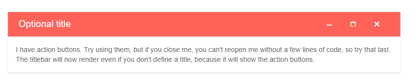
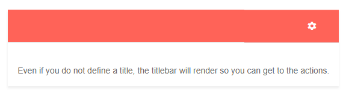

# Window Actions

The Window offers action buttons in its titlebar:

* built-in actions
    * `Maximize`
    * `Minimize`
    * `Close`
* custom action buttons

To define action buttons, populate the `WindowActions` tag of the Window with `WindowAction` instances.

Action buttons expose the following properties:

* `Name` - the name of the action. Can be one of the built-in actions (see above), or a custom action name.
* `Hidden` - a boolean property indicating whether the action button is rendered.
* `OnClick` - event handler so you can respond to custom action clicks. If you attach it to a built-in action, it will prevent it from executing.
* `Icon` - the CSS class name of the icon that will be rendered. You can use the [Telerik font icons]() directly, or your own font icon font class.
* `Title` - the `title` attribute of the action button.


>caption The built-in actions of a Window

````CSHTML
<TelerikWindow Visible="true">
	<WindowActions>
		<WindowAction Name="Minimize" />
		<WindowAction Name="Maximize" />
		<WindowAction Name="Close" />
	</WindowActions>
	<WindowTitle>
	    Optional title
	</WindowTitle>
	<WindowContent>
		I have action buttons. Try using them, but if you close me, you can't reopen me without a few lines of code, so try that last.
		<br />
		The titlebar will now render even if you don't define a title, because it will show the action buttons.
	</WindowContent>
</TelerikWindow>
````

>caption The result from the code snippet above



You can create a custom action icon and you must provide its `OnClick` handler.

>caption Handling a custom action

````CSHTML
Custom actions can call C# directly

<TelerikWindow Visible="true">
	<WindowActions>
		<WindowAction Name="MyAction" Icon="@IconName.Gear" OnClick="@MyCustomActionHandler" />
	</WindowActions>
	<WindowContent>
		@result
		<br />
		Even if you do not define a title, the titlebar will render so you can get to the actions.
	</WindowContent>
</TelerikWindow>

@code {
	string result;
	public void MyCustomActionHandler()
	{
		result = "custom action button clicked on: " + DateTime.Now.ToString();

		StateHasChanged();
	}
}
````

>caption The result from the code snippet above



You can mix custom actions with built-in actions, and you do not have to define all of the available ones.

>caption Mixing built-in actions with custom actions

````CSHTML
@* You can define any collection of actions. The second custom action shows all its features. *@

<TelerikWindow Visible="true">
    <WindowActions>
        <WindowAction Name="Minimize" />
        <WindowAction Name="MyAction" Icon="@IconName.Information" OnClick="@MyCustomActionHandler" />
        <WindowAction Name="Maximize" />
        <WindowAction Hidden="@( string.IsNullOrEmpty(result) )"
                      Icon="@IconName.ClearCss"
                      Name="CustomActionWithAllParameters"
                      Title="my custom title attribute that is a tooltip when you hover the action"
                      OnClick="@( () => result = string.Empty )" />
    </WindowActions>
    <WindowContent>
        @result
        <br />
        You can mix custom actions with the built-in ones in any order. If a custom action is used, its OnClick handler is mandatory.
    </WindowContent>
    <WindowTitle>Lorem ipsum</WindowTitle>
</TelerikWindow>

@code {
    string result;
    public void MyCustomActionHandler()
    {
        result = "custom action button clicked on: " + DateTime.Now.ToString();

        StateHasChanged();
    }
}
````

>caption The result from the code snippet above


## See Also

  * [Live Demo: Window Actions](https://demos.telerik.com/blazor-ui/window/actions)
