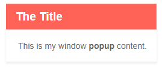
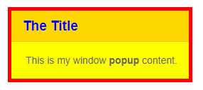

# Window Overview

This article provides basic information about the <a href="https://www.telerik.com/blazor-ui/window" target="_blank">Blazor Window component</a>.

In this article:

* [Create a Window](#create-a-window)
* [Show and Close](#show-and-close)
* [Styling](#styling)
* [Important Notes](#important-notes)

## Create a Window

To create a Telerik Window:

1. use the `TelerikWindow` tag
1. set its `Visible` property to `true` to see it (in the example below we will use a button to toggle it)
1. add some content to its `WindowContent` inner tag
1. optionally, add a title text in its `WindowTitle` tag
1. optionally, add the built-in [actions]() to its titlebar

>caption Basic example of showing content in a Window popup and allowing built-in actions

````CSHTML
<TelerikWindow @bind-Visible="@WindowIsVisible">
    <WindowTitle>
        <strong>The Title</strong>
    </WindowTitle>
    <WindowContent>
        This is my window <strong>popup</strong> content.
    </WindowContent>
    <WindowActions>
        <WindowAction Name="Minimize"></WindowAction>
        <WindowAction Name="Maximize"></WindowAction>
        <WindowAction Name="Close"></WindowAction>
    </WindowActions>
</TelerikWindow>

<TelerikButton OnClick="@( () => WindowIsVisible = !WindowIsVisible )">Toggle window</TelerikButton>

@code {
    bool WindowIsVisible { get; set; }
}
````

>caption The result from the code snippet above



>caption Component namespace and reference

````CSHTML
@using Telerik.Blazor.Components

<TelerikWindow Visible="true" Centered="true" @ref="@myWindowRef">
	<WindowTitle>
		<strong>The Title</strong>
	</WindowTitle>
	<WindowContent>
		This is my window <strong>popup</strong> content.
	</WindowContent>
</TelerikWindow>

@code {
    Telerik.Blazor.Components.TelerikWindow myWindowRef { get;set; }
}
````

## Show and Close

The `Visible` property lets you control whether the window component is shown (and rendered).

>caption Bind the visibility of the window

````CSHTML
@*Use property binding to control the state of the window programmatically*@

<button @onclick="ShowWindow">Show the Window</button>
<button @onclick="CloseWindow">Close the Window</button>

<TelerikWindow @bind-Visible="@isVisible">
    <WindowTitle>
        <strong>The Title</strong>
    </WindowTitle>
    <WindowContent>
        This is my window <strong>popup</strong> content.
    </WindowContent>
    <WindowActions>
        <WindowAction Name="Minimize"></WindowAction>
        <WindowAction Name="Maximize"></WindowAction>
        <WindowAction Name="Close"></WindowAction>
    </WindowActions>
</TelerikWindow>

@code {
    bool isVisible { get; set; }

    public void ShowWindow()
    {
        isVisible = true;
    }

    public void CloseWindow()
    {
        isVisible = false;
    }
}
````


## Styling

The `Class` property lets you define a CSS class that will be rendered on the popup element so you can cascade through it in order to change the appearane of both the content, and the built-in elements of the Window.

>caption Use a Class to change the appearance and style of the Window

````CSHTML
<TelerikWindow Class="MyClass" Visible="true">
	<WindowTitle>
		<strong>The Title</strong>
	</WindowTitle>
	<WindowContent>
		This is my window <strong>popup</strong> content.
	</WindowContent>
</TelerikWindow>

<style>
	.MyClass { /* targets the entire popup element */
		border: 5px solid red;
	}

	.MyClass .k-window-content { /* targets the content element */
		background: yellow;
	}

	.MyClass .k-window-title { /* targets the title container */
		color: blue;
	}

	.MyClass .k-window-titlebar { /* targets the entire titlebar */
		background: gold;
	}
</style>
````

>caption The result from the code snippet above



## Important Notes

The Telerik Window component renders as a child of the `TelerikRootComponent` at the root of your app. This is required so it can show up and have correct positions without being affected and broken by parent elements and their CSS rules.

In Blazor, however, the render tree structure may be important in some cases and the fact that the Window renders its contents in a different place may put you in one of the following situations:

* [Returning data from a window does not update the parent]()
* [CascadingParameter Value is null in Window]()
* [Using an EditContext for a form holding a window requires updating the EditContext]()

## See Also

  * [Live Demos: Window](https://demos.telerik.com/blazor-ui/window/index)
  * [Window Size, Maximize, Minimize]()
  * [Window Actions]()
  * [Window Events]()
  * [Window Position]()
  * [Modal Window]()
