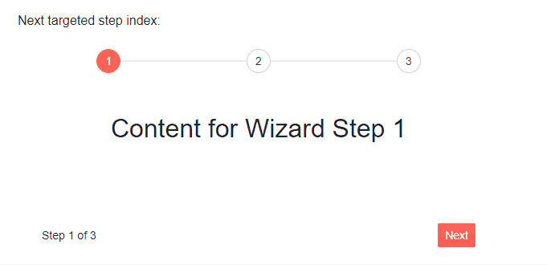
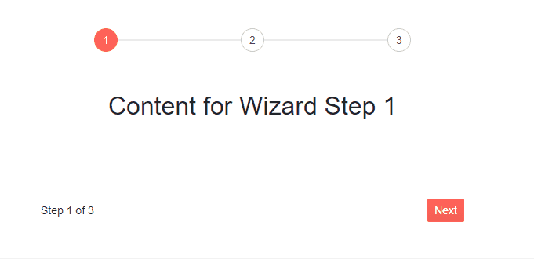
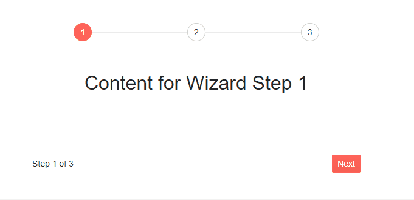

## Events

The available events in the Telerik Wizard for Blazor are:

* [OnChange](#onchange)
* [ValueChanged](#valuechanged)
* [OnFinish](#onfinish)

## OnChange

The OnChange event is triggered on the current step and fires before the step has changed. The handler receives an object of type `WizardStepChangeEventArgs` which exposes the following fields:

* `TargetIndex` - contains the index of the targeted new Wizard step.
* `IsCancelled` - specifies whether the event is canceled and the built-in action is prevented.

The OnChange event **does not fire** when clicking on [custom Wizard buttons](#custom-buttons). However, the event **will always fire** when clicking on the [Wizard Stepper](). This means that you may need to do one of the following:
* Execute business logic in both the step `OnChange` handler and the [button `OnClick` handler](#custom-buttons).
* Call the step `OnChange` handlers from the button `OnClick` handlers (example below).

The OnChange event handler is defined in the respective `<WizardStep>` tag.

>caption Handle the `OnChange` event of the first and second steps. The result from the snippet below.



````CSHTML
@* Handle the OnChange event of the steps *@

Next targeted step index: @TargetIndex

<div style="text-align:center">
    <TelerikWizard Width="600px" Height="300px">
        <WizardSteps>
            <WizardStep OnChange="@OnChangeHandler1" Text="1">
                <Content>
                    <h2>Content for Wizard Step 1</h2>
                </Content>
            </WizardStep>
            <WizardStep OnChange="@OnChangeHandler2" Text="2">
                <Content>
                    <h2>Content for Wizard Step 2</h2>
                </Content>
            </WizardStep>
            <WizardStep Text="3">
                <Content>
                    <h2>Content for Wizard Step 3</h2>
                </Content>
            </WizardStep>
        </WizardSteps>
    </TelerikWizard>
</div>

@code{
    public int? TargetIndex { get; set; } = null;

    async Task OnChangeHandler1(WizardStepChangeEventArgs args)
    {
        TargetIndex = args.TargetIndex;
    }

    async Task OnChangeHandler2(WizardStepChangeEventArgs args)
    {
        args.IsCancelled = true;

        await Dialog.AlertAsync("Please complete step 2 first", "You cannot proceed");

    }

    [CascadingParameter]
    public DialogFactory Dialog { get; set; }
}
````
>caption Handle OnChange and cancel the event when using custom Wizard buttons

````CHTML
@* Handle OnChange and cancel the event when using custom Wizard buttons *@

@if (ShowWizard)
{
    <TelerikWizard @bind-Value="@CurrentWizardStep" OnFinish="@OnWizardFinish">
        <WizardSettings>
            <WizardStepperSettings />
        </WizardSettings>
        <WizardSteps>
            <WizardStep Label="Step 1" OnChange="@OnStepChange">
                <Content>
                    <p>First Step</p>
                </Content>
            </WizardStep>
            <WizardStep Label="Step 2" OnChange="@OnStepChange">
                <Content>
                    <p>Second Step</p>
                </Content>
            </WizardStep>
            <WizardStep Label="Step 3" OnChange="@OnStepChange">
                <Content>
                    <p>Third Step</p>
                </Content>
            </WizardStep>
        </WizardSteps>
        <WizardButtons>
            @{
                var currentStepIndex = context;

                if (currentStepIndex > 0)
                {
                    <TelerikButton OnClick="@( () => PreviousClick(currentStepIndex) )">Back</TelerikButton>
                }
                if (currentStepIndex < 2)
                {
                    <TelerikButton Primary="true" OnClick="@( () => NextClick(currentStepIndex) )">Next</TelerikButton>
                }
                else
                {

                    <TelerikButton Primary="true" OnClick="@DoneClick">Done</TelerikButton>
                }
            }
        </WizardButtons>
    </TelerikWizard>
}
else
{
    <p>Wizard steps complete!</p>
}

@code {
    public int CurrentWizardStep { get; set; } = 0;
    public bool ShowWizard { get; set; } = true;

    private async Task NextClick(int currentStepIndex)
    {
        var args = new WizardStepChangeEventArgs() {
            IsCancelled = false,
            TargetIndex = currentStepIndex + 1
        };

        await OnStepChange(args);

        if (!args.IsCancelled)
        {
            CurrentWizardStep = currentStepIndex + 1;
        }
    }
    private async Task PreviousClick(int newStepIndex)
    {
        CurrentWizardStep = newStepIndex - 1;
    }
    private async Task DoneClick()
    {
        OnWizardFinish();
    }

    public async Task OnStepChange(WizardStepChangeEventArgs args)
    {
        @*
        if (true)
        {
            args.IsCancelled = true;
        }
        *@
    }

    private void OnWizardFinish()
    {
        ShowWizard = false;
    }
}
````

## ValueChanged

The `ValueChanged` event fires after the [OnChange](#onchange) event is triggered and the Step has been changed.

>caption Handle the `ValueChanged` event of the Wizard. The result from the snippet below.



````CSHTML
@* Handle the ValueChanged event of the Wizard *@

@Logger

<div style="text-align:center">
    <TelerikWizard ValueChanged="@ValueChangedHandler" Width="600px" Height="300px">
        <WizardSteps>
            <WizardStep Text="1">
                <Content>
                    <h2>Content for Wizard Step 1</h2>
                </Content>
            </WizardStep>
            <WizardStep Text="2">
                <Content>
                    <h2>Content for Wizard Step 2</h2>
                </Content>
            </WizardStep>
            <WizardStep Text="3">
                <Content>
                    <h2>Content for Wizard Step 3</h2>
                </Content>
            </WizardStep>
        </WizardSteps>
    </TelerikWizard>
</div>

@code{

    public string Logger { get; set; }

    void ValueChangedHandler()
    {
        Logger = "ValueChanged fired. You can perform the desired logic here.";
    }

}
````

## OnFinish

The `OnFinish` event fires when the Done button of the Wizard is clicked.

>caption Handle the `OnFinish` event of the Wizard. The result from the snippet below.





````CSHTML
@* Handle the OnFinish event of the Wizard *@

<div style="text-align:center">
    <TelerikWizard OnFinish="@OnFinishHandler" Width="600px" Height="300px">
        <WizardSteps>
            <WizardStep Text="1">
                <Content>
                    <h2>Content for Wizard Step 1</h2>
                </Content>
            </WizardStep>
            <WizardStep Text="2">
                <Content>
                    <h2>Content for Wizard Step 2</h2>
                </Content>
            </WizardStep>
            <WizardStep Text="3">
                <Content>
                    <h2>Content for Wizard Step 3</h2>
                </Content>
            </WizardStep>
        </WizardSteps>
    </TelerikWizard>
</div>

@code{

    async Task OnFinishHandler()
    {
        await Dialog.AlertAsync("You completed the Wizard!", "Congratulations!");
    }

    [CascadingParameter]
    public DialogFactory Dialog { get; set; }

}
````

## See Also

  * [Live Demos: Wizard Events](https://demos.telerik.com/blazor-ui/wizard/events)