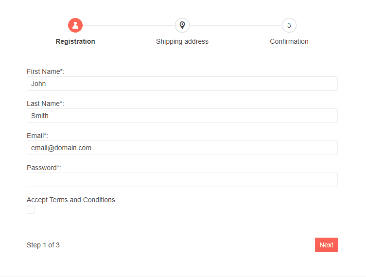

# Form Integration

The wizard component provides integration with the [Telerik Form]().

Each step of the Wizard can include an instance of Telerik Form inside its `Content` tag. You will be able to use all the built-in features of the Form including its [Validation]() to achieve the desired Wizard configuration.

If the Form validation is not satisfied, you can cancel the OnChange event of the step and prevent the user from moving to the next step until the Form is valid. To even improve the UX, you can also toggle the [`Valid`](#valid) or [`Disabled`](#disabled) parameters to add another visual aspect in the validation process.


>caption Integrate a Form component in the Telerik Wizard. Use its validation state to control the `Valid` parameter of the Steps. The result from the snippet.



````CSHTML
@* Integrate Form component in the Wizard *@

@using System.ComponentModel.DataAnnotations

@if (ShowWizard)
{
    <TelerikWizard @bind-Value="@Value" OnFinish="@OnFinishHandler" Width="700px">
        <WizardSteps>
            <WizardStep Label="Registration" Icon="user" OnChange="@OnRegistrationStepChange" Valid="@IsRegistrationValid">
                <Content>
                    <TelerikForm Model="@UserModel"
                                 @ref="@RegisterForm">
                        <FormValidation>
                            <DataAnnotationsValidator></DataAnnotationsValidator>
                        </FormValidation>
                        <FormItems>
                            <FormItem LabelText="First Name*:" Field="@nameof(User.FirstName)"></FormItem>
                            <FormItem LabelText="Last Name*:" Field="@nameof(User.LastName)"></FormItem>
                            <FormItem Field="@nameof(User.Email)">
                                <Template>
                                    <label for="mail" class="k-label k-form-label">Email*:</label>
                                    <TelerikTextBox Id="mail" @bind-Value="@UserModel.Email" InputMode="email" PlaceHolder="example@domain.com"></TelerikTextBox>
                                    <TelerikValidationMessage For="@(() => UserModel.Email)"></TelerikValidationMessage>
                                </Template>
                            </FormItem>
                            <FormItem Field="@nameof(User.Password)">
                                <Template>
                                    <label for="pass" class="k-label k-form-label">Password*:</label>
                                    <TelerikTextBox Id="pass" @bind-Value="@UserModel.Password" Password="true"></TelerikTextBox>
                                    <TelerikValidationMessage For="@(() => UserModel.Password)"></TelerikValidationMessage>
                                </Template>
                            </FormItem>
                            <FormItem Field="@nameof(User.AcceptTerms)" />
                        </FormItems>
                        <FormButtons></FormButtons>
                    </TelerikForm>
                </Content>
            </WizardStep>
            <WizardStep Label="Shipping address" Icon="marker-pin-target" OnChange="@OnShippingStepChange" Valid="@IsShippingValid">
                <Content>
                    <TelerikForm Model="@ShippingModel"
                                 @ref="ShippingForm">
                        <FormValidation>
                            <DataAnnotationsValidator></DataAnnotationsValidator>
                        </FormValidation>
                        <FormItems>
                            <FormItem LabelText="Country*: " Field="@nameof(ShippingDetails.Country)" ColSpan="1" />
                            <FormItem LabelText="City*: " Field="@nameof(ShippingDetails.City)" ColSpan="1" />
                            <FormItem LabelText="Address Line*: " Field="@nameof(ShippingDetails.AddressLine)" ColSpan="2" />
                            <FormItem LabelText="Second Address Line: " Field="@nameof(ShippingDetails.AddressLine2)" ColSpan="2" />
                        </FormItems>
                        <FormButtons></FormButtons>
                    </TelerikForm>
                </Content>
            </WizardStep>
            <WizardStep Label="Confirmation">
                <Content>
                    <h2>Registration completed.</h2>
                </Content>
            </WizardStep>
        </WizardSteps>
    </TelerikWizard>
}


@code {
    async Task OnFinishHandler()
    {
        ShowWizard = false;

        await Dialog.AlertAsync("The Registration was submitted successfully", "Done");
    }

    public bool? IsRegistrationValid { get; set; }

    public bool? IsShippingValid { get; set; }

    [CascadingParameter]
    public DialogFactory Dialog { get; set; }

    public bool ShowWizard { get; set; } = true;

    public int Value { get; set; }

    public TelerikForm RegisterForm { get; set; }
    public User UserModel { get; set; } = new User();

    public TelerikForm ShippingForm { get; set; }
    public ShippingDetails ShippingModel { get; set; } = new ShippingDetails();


    public void OnRegistrationStepChange(WizardStepChangeEventArgs args)
    {
        var isFormValid = RegisterForm.IsValid();
        if (!isFormValid)
        {
            IsRegistrationValid = false;
            args.IsCancelled = true;
        }
        else
        {
            IsRegistrationValid = true;
        }
    }

    public void OnShippingStepChange(WizardStepChangeEventArgs args)
    {
        var isPrevious = Value < args.TargetIndex;
        if (Value < args.TargetIndex)
        {
            var isFormValid = ShippingForm.IsValid();
            if (!isFormValid)
            {
                IsShippingValid = false;
                args.IsCancelled = true;
            }
            else
            {
                IsShippingValid = true;
            }
        }
    }

    public class User
    {
        [Required]
        public string FirstName { get; set; } = "John";

        [Required]
        public string LastName { get; set; } = "Smith";

        [Required]
        public string Email { get; set; } = "email@domain.com";

        [MinLength(3, ErrorMessage = "The password should be at least 3 characters.")]
        [Required]
        public string Password { get; set; }

        public DateTime? BirthDate { get; set; }

        [Range(typeof(bool), "true", "true", ErrorMessage = "You must agree with the terms.")]
        [Display(Name = "Accept Terms and Conditions")]
        public bool AcceptTerms { get; set; }
    }

    public class ShippingDetails
    {
        [Required]
        public string Country { get; set; }

        [Required]
        public string City { get; set; }

        [Required]
        public string AddressLine { get; set; }

        public string AddressLine2 { get; set; }
    }
}
````

## See Also

  * [Live Demos: Wizard Form](https://demos.telerik.com/blazor-ui/wizard/form)