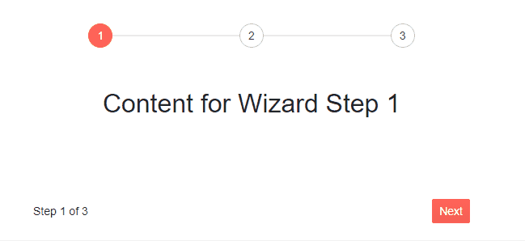
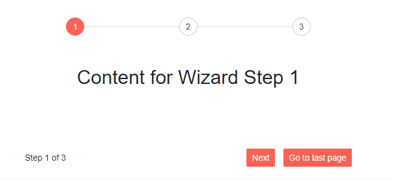

# Wizard Buttons

This article provides details on the buttons available in the Telerik Wizard.

By default the Wizard provides three buttons, however it also allows option to add custom buttons, so you can configure it to match your desired scenario.

In this article:
* [Default buttons](#default-buttons)
* [Custom buttons](#custom-buttons)


## Default buttons

The Wizard provides the following default buttons:

* `Next` - navigates to the next step of the Wizard. If the next step is <strong>disabled</strong>, the button will also appear as disabled. If the next step is <strong>enabled</strong> the following process will be triggered:
    * Invoke [`OnStepChange`](#onchange),
    * Go to the next page (if the event is not cancelled from `event args`)
    * Invoke [`ValueChanged`](#valuechanged) after the step is changed

* `Previous` - navigates to the previous step of the Wizard. If the previous step is <strong>disabled</strong>, the button will also appear as disabled. If the previous step is <strong>enabled</strong> the following process will be triggered:
    * Invoke [`OnStepChange`](#onchange),
    * Go to the previous page (if the event is not cancelled from `event args`)
    * Invoke [`ValueChanged`](#valuechanged) after the step is changed

* `Done` - allows the user to complete the wizard. Invokes the [OnFinish](#onfinish) event.

>caption Wizard with the default buttons. The result from the snippet.



````CSHTML
@* Wizard with default buttons *@

<div style="text-align:center">
    <TelerikWizard Width="600px" Height="300px">
        <WizardSteps>
            <WizardStep Text="1">
                <Content>
                    <h2>Content for Wizard Step 1</h2>
                </Content>
            </WizardStep>
            <WizardStep Text="2">
                <Content>
                    <h2>Content for Wizard Step 2</h2>
                </Content>
            </WizardStep>
            <WizardStep Text="3">
                <Content>
                    <h2>Content for Wizard Step 3</h2>
                </Content>
            </WizardStep>
        </WizardSteps>
    </TelerikWizard>
</div>
````

## Custom buttons

The Wizard component allows you to include your custom buttons. You can define the desired buttons under the `WizardButtons` tag of the `TelerikWizard`.

This configuration overrides the whole rendering of the bottom-right section of the Wizard, including the built-in buttons and thus provides a full control over it. If you want to include Next and Previous buttons as per the default setup of the Wizard, you need to also add them inside the `WizardButtons`.

>Custom Wizard buttons do not trigger the component [`OnChange`](#onchange) and [`OnFinish`](#onfinish) events. See section [Execute Business Logic With Custom Wizard Buttons](#execute-business-logic-with-custom-wizard-buttons) below.

>caption Wizard with custom buttons (code snippet below)



````CSHTML
@* Wizard with custom buttons *@

<div style="text-align:center">
    <TelerikWizard  @bind-Value="@Value" Width="600px" Height="300px">
        <WizardSteps>
            <WizardStep Text="1">
                <Content>
                    <h2>Content for Wizard Step 1</h2>
                </Content>
            </WizardStep>
            <WizardStep Text="2">
                <Content>
                    <h2>Content for Wizard Step 2</h2>
                </Content>
            </WizardStep>
            <WizardStep Text="3">
                <Content>
                    <h2>Content for Wizard Step 3</h2>
                </Content>
            </WizardStep>
        </WizardSteps>
        <WizardButtons>
            @{
                var index = context;

                if (index > 0)
                {
                    <TelerikButton OnClick="@(() => Value = 0)">Go to first page</TelerikButton>
                    <TelerikButton OnClick="@(() => Value -= 1)">Previous</TelerikButton>
                }
                if (index != 2)
                {
                    <TelerikButton ButtonType="ButtonType.Button" Primary="true" OnClick="@(() => Value += 1)">Next</TelerikButton>
                    <TelerikButton ButtonType="ButtonType.Button" Primary="true" OnClick="@(() => Value = 2)">Go to last page</TelerikButton>
                }
            }
        </WizardButtons>
    </TelerikWizard>
</div>

@code{

    public int Value { get; set; }
}
````

### Execute Business Logic With Custom Wizard Buttons

The built-in (default) Wizard buttons fire the Wizard [`OnChange`](#onchange) and [`OnFinish`](#onfinish) events. This allows the app to execute custom business logic and guide the user to the next or previous step under certain conditions.

Custom Wizard buttons cannot fire the `OnChange` and `OnFinish` events. As a result, custom business logic should be implemented in the `OnClick` events of the buttons. On the other hand, the [Wizard Stepper]() always fires the Wizard `OnChange` event. This creates a situation where user navigation can trigger different events. To execute business logic between steps, use one of the following options:

* [Disable all Stepper steps](#disabled). The user will still be able to navigate with the custom Wizard buttons.
* [Disable Stepper clicks with CSS](#disable-stepper-clicks-with-css). In this way, the Stepper will not look disabled. It is also possible to [hide the Stepper completely](#hide-the-stepper).
* [Call the `OnChange` and `OnFinish` handlers from the button `OnClick` handlers](#call-step-onchange-from-button-onclick), to avoid duplicate code.
* Execute the same code in both the step `OnChange` handlers and the button `OnClick` handlers.

### Disable Stepper Clicks with CSS

The code below shows will prevent clicks on all Stepper steps, without making the Stepper look disabled.

>caption Prevent clicks on the Wizard Stepper

````CSHTML
<TelerikWizard Class="disabled-stepper" />

<style>
    .disabled-stepper .k-stepper {
        pointer-events: none;
    }
</style>
````

### Hide the Stepper

`!important` is required to override an inline `display` style.

>caption Hide the Wizard Stepper completely

````CSHTML
<TelerikWizard Class="hidden-stepper" />

<style>
    .hidden-stepper .k-stepper {
        display: none !important;
    }
</style>
````

### Call Step OnChange From Button OnClick

>caption Handle OnChange and OnFinish events when using custom Wizard buttons. Cancel the OnChange event.

````CHTML
@* Handle OnChange and OnFinish events when using custom Wizard buttons. Cancel the OnChange event. *@

@if (ShowWizard)
{
    <TelerikWizard @bind-Value="@CurrentWizardStep" OnFinish="@OnWizardFinish">
        <WizardSettings>
            <WizardStepperSettings />
        </WizardSettings>
        <WizardSteps>
            <WizardStep Label="Step 1" OnChange="@OnStepChange">
                <Content>
                    <p>First Step</p>
                </Content>
            </WizardStep>
            <WizardStep Label="Step 2" OnChange="@OnStepChange">
                <Content>
                    <p>Second Step</p>
                </Content>
            </WizardStep>
            <WizardStep Label="Step 3" OnChange="@OnStepChange">
                <Content>
                    <p>Third Step</p>
                </Content>
            </WizardStep>
        </WizardSteps>
        <WizardButtons>
            @{
                var currentStepIndex = context;

                if (currentStepIndex > 0)
                {
                    <TelerikButton OnClick="@( () => PreviousClick(currentStepIndex) )">Back</TelerikButton>
                }
                if (currentStepIndex < 2)
                {
                    <TelerikButton Primary="true" OnClick="@( () => NextClick(currentStepIndex) )">Next</TelerikButton>
                }
                else
                {

                    <TelerikButton Primary="true" OnClick="@DoneClick">Done</TelerikButton>
                }
            }
        </WizardButtons>
    </TelerikWizard>
}
else
{
    <p>Wizard steps complete!</p>
}

@code {
    public int CurrentWizardStep { get; set; } = 0;
    public bool ShowWizard { get; set; } = true;

    private async Task NextClick(int currentStepIndex)
    {
        var args = new WizardStepChangeEventArgs() {
            IsCancelled = false,
            TargetIndex = currentStepIndex + 1
        };

        await OnStepChange(args);

        if (!args.IsCancelled)
        {
            CurrentWizardStep = currentStepIndex + 1;
        }
    }
    private async Task PreviousClick(int newStepIndex)
    {
        CurrentWizardStep = newStepIndex - 1;
    }
    private async Task DoneClick()
    {
        OnWizardFinish();
    }

    public async Task OnStepChange(WizardStepChangeEventArgs args)
    {
        @*
        if (true)
        {
            args.IsCancelled = true;
        }
        *@
    }

    private void OnWizardFinish()
    {
        ShowWizard = false;
    }
}
````

## See Also

  * [Live Demos: Wizard Buttons](https://demos.telerik.com/blazor-ui/wizard/buttons)