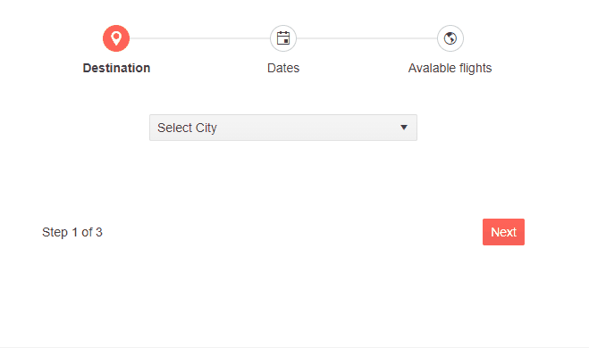

# Wizard Content

The `Content` of the Wizard is a `ChildContent` of the `WizardStep`. While it is a common use case to integrate a Form in the Wizard Content, it can also contain any type of HTML content including various Telerik components as needed to cover your desired scenario.

>caption Include your desired content in the Wizard Content tag. The result from the snippet.



````CSHTML
@* Include the desired content for the Wizard Steps *@

<div style="text-align:center" >
    <TelerikWizard Width="600px" Height="300px">
        <WizardSteps>
            <WizardStep Label="Destination" Icon="map-marker">
                <Content>
                    <TelerikDropDownList @bind-Value="@SelectedCity"
                                         Data="@Cities" DefaultText="Select City">
                    </TelerikDropDownList>
                </Content>
            </WizardStep>
            <WizardStep Label="Dates" Icon="calendar">
                <Content>
                        <TelerikDateRangePicker @bind-StartValue="@StartValue"
                                                @bind-EndValue="@EndValue">
                        </TelerikDateRangePicker>
                </Content>
            </WizardStep>
            <WizardStep Label="Avalable flights" Icon="globe-outline">
                <Content>
                    <div>
                        Checking if we can take you to <strong>@SelectedCity</strong> between <strong>@StartValue</strong> and <strong>@EndValue</strong>.
                    </div>
                    <br />
                    <TelerikProgressBar Indeterminate="true" Value="10" Max="100" />
                </Content>
            </WizardStep>
        </WizardSteps>
    </TelerikWizard>
</div>

@code {
    public string SelectedCity { get; set; }

    public List<string> Cities { get; set; } = new List<string>() { "New York", "Paris", "Rome", "Madrid" };

    public DateTime? StartValue { get; set; } = DateTime.Now.Date;

    public DateTime? EndValue { get; set; } = DateTime.Now.AddDays(10).Date;
}
````


## See Also

  * [Live Demos: Wizard Overview](https://demos.telerik.com/blazor-ui/wizard/overview)