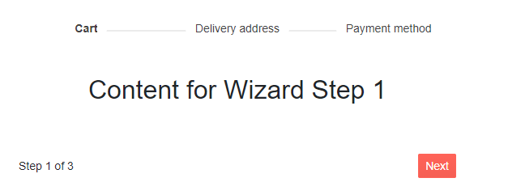
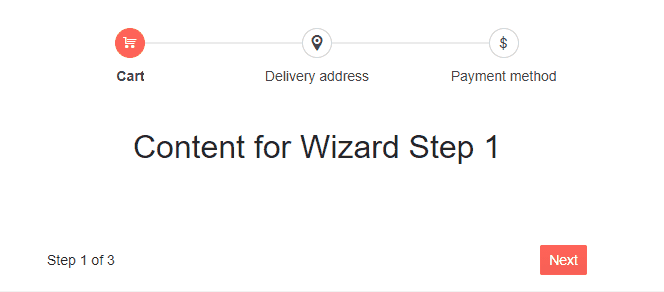
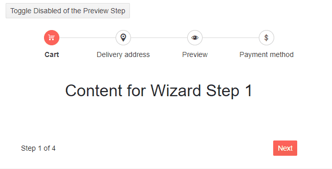
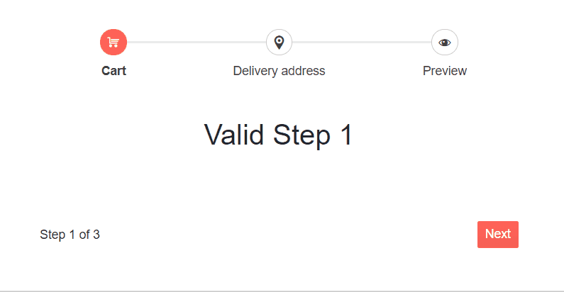

# Wizard Stepper

One of the main elements of the Wizard component is the Stepper. The Wizard component utilizes the [Telerik UI for Blazor Stepper]() internally.

You can use the parameters the `WizardStep` exposes to customize the following properties of the internal stepper:

* [General Stepper settings](#general-steper-settings)
    * [StepType](#steptype)
    * [Linear flow](#linear-flow)


* [Individual Steper settings](#individual-stepper-settings)
    * [Indicators](#indicators)
    * [Labels](#labels)
    * [Optional](#state)
    * [Disabled](#disabled)
    * [Valid](#valid)


## General Stepper settings

You can set the desired general settings of the internal Stepper through the parameters of the `WizardStepperSettings` tag under the `WizardSettings` tag including `StepType` and `Linear` flow.

## StepType

Much like the Stepper component, the internal Stepper of the Wizard provides two [display modes]() for the steps. You can configure the desired display mode through the `StepType` parameter of the `WizardStepperSettings` which takes a member of the `StepperStepType` enum:

* `Steps` (the default) - the Stepper will render both indicators and labels
* `Labels` - the Stepper will render only labels

>caption Set up the display mode:Labels. The result from the snippet below.




````CSHTML
@* Configure the StepType of the Wizard to display only labels *@

<div style="text-align:center">
    <TelerikWizard Width="600px" Height="250px">
        <WizardSettings>
            <WizardStepperSettings StepType="StepperStepType.Labels">
            </WizardStepperSettings>
        </WizardSettings>
        <WizardSteps>
            <WizardStep Label="Cart" Icon="cart">
                <Content>
                    <h2>Content for Wizard Step 1</h2>
                </Content>
            </WizardStep>
            <WizardStep Label="Delivery address" Icon="marker-pin-target">
                <Content>
                    <h2>Content for Wizard Step 2</h2>
                </Content>
            </WizardStep>
            <WizardStep Label="Payment method" Icon="dollar">
                <Content>
                    <h2>Content for Wizard Step 3</h2>
                </Content>
            </WizardStep>
        </WizardSteps>
    </TelerikWizard>
</div>
````

## Linear flow

The `Linear` flow property of the internal Stepper matches the functionality of the [Stepper component Linear flow](). It allows you to configure it, so that completion of the previous step is required before proceeding to the next step. The user will be able to go one step at a time (back or forth).

You can enable/disable the Linear flow of the Wizard Stepper through the `Linear` parameter of the `WizardStepperSettings`. It takes a `bool` and its default value is `true`.

>caption Disable the Linear flow of the Wizard Stepper. The result from the snippet below.




````CSHTML
@* Disable the Linear flow of the Wizard *@

<div style="text-align:center">
    <TelerikWizard Width="600px" Height="300px">
        <WizardSettings>
            <WizardStepperSettings Linear="false">
            </WizardStepperSettings>
        </WizardSettings>
        <WizardSteps>
            <WizardStep Label="Cart" Icon="cart">
                <Content>
                    <h2>Content for Wizard Step 1</h2>
                </Content>
            </WizardStep>
            <WizardStep Label="Delivery address" Icon="marker-pin-target">
                <Content>
                    <h2>Content for Wizard Step 2</h2>
                </Content>
            </WizardStep>
            <WizardStep Label="Payment method" Icon="dollar">
                <Content>
                    <h2>Content for Wizard Step 3</h2>
                </Content>
            </WizardStep>
        </WizardSteps>
    </TelerikWizard>
</div>
````


## Individual Stepper settings

### Indicators

You can configure the content that will be rendered in the step indicators of the internal Stepper through the following parameters the `WizardStep` exposes:

* `Text` - `string` - Specifies the step indicator text
* `Icon` - `string` - Specifies the icon which will be put inside the step indicator.
* `IconClass` - `string`- defines the CSS class of a desired third party font-icon.
* `ImageUrl`- `string` - defines the `url` of the desired raster image.

The priority and rules applied for their rendering is the same as for the [Stepper component indicators]().

>caption Set up the desired content for the Wizard Stepper indicators. The result from the snippet below.


````CSHTML
@* Configure the indicators of the Wizard Stepper *@

<div style="text-align:center">
    <TelerikWizard Width="600px" Height="300px">       
        <WizardSteps>
            <WizardStep Text="1" Label="Text" >
                <Content>
                    <h2>Content for Wizard Step 1</h2>
                </Content>
            </WizardStep>
            <WizardStep Icon="dictionary-add" Label="Icon" >
                <Content>
                    <h2>Content for Wizard Step 2</h2>
                </Content>
            </WizardStep>
            <WizardStep IconClass="k-icon k-i-music-notes" Label="IconClass" >
                <Content>
                    <h2>Content for Wizard Step 3</h2>
                </Content>
            </WizardStep>
            <WizardStep ImageUrl="https://docs.telerik.com/blazor-ui/images/star.png" Label="Image Url">
                <Content>
                    <h2>Content for Wizard Step 4</h2>
                </Content>
            </WizardStep>
        </WizardSteps>
    </TelerikWizard>
</div>
````

### Labels

The Wizard Stepper allows you to set labels for the corresponding step indicators following the [Stepper component Labels]() practice. You can define the desired labels through the `Label` parameter the `WizardStep` exposes. If you don't set value to the `Label` parameter, no label will be rendered for the corresponding step indicator.


>caption Set up the desired labels for the Wizard Stepper steps. The result from the snippet below.


````CSHTML
@* Configure the labels of the Wizard Stepper *@

<div style="text-align:center">
    <TelerikWizard Width="600px" Height="300px">
        <WizardSteps>
            <WizardStep Label="Cart" Icon="cart">
                <Content>
                    <h2>Content for Wizard Step 1</h2>
                </Content>
            </WizardStep>
            <WizardStep Label="Delivery address" Icon="marker-pin-target">
                <Content>
                    <h2>Content for Wizard Step 2</h2>
                </Content>
            </WizardStep>
            <WizardStep Label="Payment method" Icon="dollar">
                <Content>
                    <h2>Content for Wizard Step 3</h2>
                </Content>
            </WizardStep>
        </WizardSteps>
    </TelerikWizard>
</div>
````

### Optional

Likewise the [Stepper component Optional property](#optional), the Wizard Stepper also supports that.

To mark a Wizard step as optional, set the `Optional` parameter of the `WizardStep` to `true` (its default value is `false`). This configuration strives to visually notify the user that a certain step is not required by rendering "(Optional)" text underneath the corresponding step. It doesn't come with a built-in functionality to skip the Wizard step if a [linear flow](#linear-flow) is enabled.

>caption Set an optional step in the Wizard Stepper. The result from the snippet below.


````CSHTML
@* Set up an optional Wizard step *@

<div style="text-align:center">
    <TelerikWizard Width="600px" Height="300px">
        <WizardSteps>
            <WizardStep Label="Cart" Icon="cart">
                <Content>
                    <h2>Content for Wizard Step 1</h2>
                </Content>
            </WizardStep>
            <WizardStep Label="Delivery address" Icon="marker-pin-target">
                <Content>
                    <h2>Content for Wizard Step 2</h2>
                </Content>
            </WizardStep>
            <WizardStep Optional="true" Label="Preview" Icon="eye">
                <Content>
                    <h2>Content for Wizard Step 3</h2>
                </Content>
            </WizardStep>
            <WizardStep Label="Payment method" Icon="dollar">
                <Content>
                    <h2>Content for Wizard Step 4</h2>
                </Content>
            </WizardStep>
        </WizardSteps>
    </TelerikWizard>
</div>
````


### Disabled

The Wizard Stepper also allows you to mark a step as disabled following the functionality if the [Stepper component `Disabled` property](#disabled).

You can disable a step by setting the `Disabled` parameter of the the desired `WizardStep` to `true` (its default value is `false`). You can also toggle its value to conditionally enable/disable the Wizard steps based on your application logic.

This feature serves to mark the desired step as disabled, so users cannot click and select it. If [linear flow](#linear-flow) is enabled, users will not be able to skip the disabled step and click on the next enabled.

If the next step is disabled, the Next button on the current step will also be marked as disabled, so the user will not be able to click it.

Respectively, if the previous step is disabled, the Previous button will be disabled.


>caption Disable a Wizard step. The result from the snippet.



````CSHTMl
@* Set up a disabled Wizard step *@

<TelerikButton OnClick="@ToggleDisabled">Toggle Disabled of the Preview Step</TelerikButton>

<div style="text-align:center">
    <TelerikWizard Width="600px" Height="300px">
        <WizardSteps>
            <WizardStep Label="Cart" Icon="cart">
                <Content>
                    <h2>Content for Wizard Step 1</h2>
                </Content>
            </WizardStep>
            <WizardStep Label="Delivery address" Icon="marker-pin-target">
                <Content>
                    <h2>Content for Wizard Step 2</h2>
                </Content>
            </WizardStep>
            <WizardStep Disabled="@IsDisabled" Label="Preview" Icon="eye">
                <Content>
                    <h2>Content for Wizard Step 3</h2>
                </Content>
            </WizardStep>
            <WizardStep Label="Payment method" Icon="dollar">
                <Content>
                    <h2>Content for Wizard Step 4</h2>
                </Content>
            </WizardStep>
        </WizardSteps>
    </TelerikWizard>
</div>

@code{
    public bool IsDisabled { get; set; }

    void ToggleDisabled()
    {
        IsDisabled = !IsDisabled;
    }
}
````

### Valid

Likewise the [Stepper component validation feature](), the Wizard Stepper also provides an option to set validation logic for each step.

You can set a visual indication whether a step is valid or not through the `Valid` parameter of the `WizardStep`. It accepts `bool?` and its default value is `null`.

You can toggle the `Valid` parameter value based on your application logic to accordingly render success or error icon. Since it serves as a visual validity indicator it does not prevent the users from navigating between steps. You can use the `Valid` parameter value to perform logic to cover the desired scenario (for example preventing the user from navigating to the next step if the current one is invalid).

>caption Set up valid/invalid steps in the Wizard Stepper. The result from the snippet.



````CSHTMl
@* Wizard with valid and invalid steps *@

<div style="text-align:center">
    <TelerikWizard Width="600px" Height="300px">
        <WizardSteps>
            <WizardStep Valid="@IsStep1Valid"  OnChange="@OnChangeHandler1"  Label="Cart" Icon="cart">
                <Content>
                    <h2>Valid Step 1</h2>
                </Content>
            </WizardStep>
            <WizardStep Valid="@IsStep2Valid" OnChange="@OnChangeHandler2" Label="Delivery address" Icon="marker-pin-target">
                <Content>
                    <h2>Invalid step for Wizard Step 2</h2>
                </Content>
            </WizardStep>
            <WizardStep Label="Preview" Icon="eye">
                <Content>
                    <h2>Content for Step 3</h2>
                </Content>
            </WizardStep>
        </WizardSteps>
    </TelerikWizard>
</div>

@code{
    public bool? IsStep1Valid { get; set; }

    public bool? IsStep2Valid { get; set; }

    void OnChangeHandler1()
    {
        IsStep1Valid = true;
    }

    //prevent the user from going to the next/previous step if the current step is invalid
    void OnChangeHandler2(WizardStepChangeEventArgs args)
    {
        IsStep2Valid = false;

        if (IsStep2Valid == false)
        {
            args.IsCancelled = true;
        }
    }
}
````

## See Also

  * [Live Demos: Wizard Configuration](https://demos.telerik.com/blazor-ui/wizard/configuration)