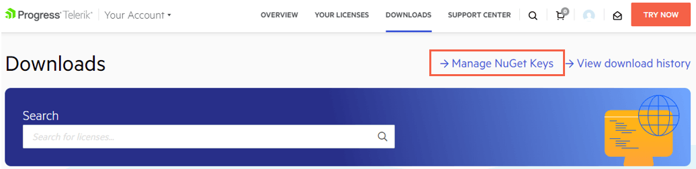
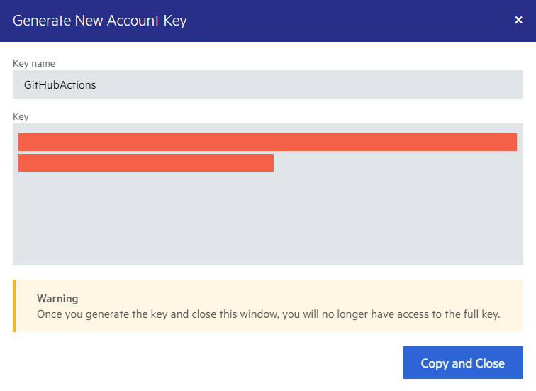

# Restoring NuGet Packages in Your CI Workflow

This article describes how to use token-based authentication for the Telerik NuGet feed. You will learn how to create and use NuGet API keys to restore Telerik NuGet packages in your Continuous Integration (CI) workflow.

The [Telerik NuGet server](slug://installation/nuget) provides two ways to authenticate:

* Basic authentication with your Telerik username and password.
* Token-based authentication with a NuGet API key.

When you need to restore the [Telerik NuGet packages](slug://getting-started/what-you-need#nuget-packages) as part of your CI, a NuGet API key is the more secure way to authenticate. This method does not require you to provide your Telerik credentials anywhere in the CI workflow. A NuGet Key has a limited scope and can be used only with the Telerik NuGet server. If any of your NuGet keys is compromised, you can quickly delete it and create a new one.


## Generating NuGet Keys

1. In your Telerik account, go to the [**Manage NuGet Keys**](https://www.telerik.com/account/downloads/nuget-keys) page.

    

1. Click **Generate New Key**.

1. Enter a name for the NuGet Key and click **Generate Key**.

1. To copy the key, click **Copy and Close**. Once you close the popup dialog, you can no longer copy the generated key. For security reasons, the **NuGet Keys** page displays only a portion of the key.

    


## Storing NuGet Keys

>warning Never check in Telerik account credentials or a NuGet API key with your source code or leave them publicly visible in plain text (for example, in a `NuGet.Config` file). A NuGet key is valuable and bad actors can use it to access the NuGet packages that are licensed under your account. A key abuse can lead to a review of the affected Telerik account.

To protect the NuGet Key, store it as a secret environment variable. The exact store steps depend on your workflow and environment:

* In GitHub Actions, save the key as a [GitHub Actions Secret](https://docs.github.com/en/actions/security-guides/using-secrets-in-github-actions).
* In Azure DevOps, save the key as a [secret Azure DevOps pipeline variable](https://learn.microsoft.com/en-us/azure/devops/pipelines/process/set-secret-variables). If you use an Azure DevOps Service connection instead of secret environment variables, enter `api-key` in the username field and the NuGet key as the password in the **New NuGet service connection** form editor.
* In Docker images, save the key as a [Docker secret](https://docs.docker.com/tags/secrets/).

For more details on storing and protecting your NuGet Key, check the [Announcing NuGet Keys](https://www.telerik.com/blogs/announcing-nuget-keys) blog post by Lance McCarthy.

The examples below assume that the secret environment variable name is `TELERIK_NUGET_KEY`.


## Using NuGet Keys

There are two common ways to use a [stored NuGet key](#storing-nuget-keys) with the Telerik NuGet server during a build:

* [Using a NuGet.Config file](#using-a-nuget-config-file)
* [Using only CLI commands](#using-net-cli-commands)

For more information on how to use NuGet keys in a build, check the [Announcing NuGet Keys](https://www.telerik.com/blogs/announcing-nuget-keys) blog post by Lance McCarthy.

### Using a NuGet.Config File

In your `NuGet.Config` file, set the `Username` value to `api-key` and the `ClearTextPassword` value to an environment variable name:

<div class="skip-repl"></div>

````XML
<?xml version="1.0" encoding="utf-8" ?>
<configuration>
  <packageSources>
    <clear />
    <add key="nuget.org" value="https://api.nuget.org/v3/index.json" protocolVersion="3" />
    <add key="TelerikOnlineFeed" value="https://nuget.telerik.com/v3/index.json" protocolVersion="3" />
  </packageSources>
  <packageSourceCredentials>
    <TelerikOnlineFeed>
      <add key="Username" value="api-key" />
      <add key="ClearTextPassword" value="%TELERIK_NUGET_KEY%" />
    </TelerikOnlineFeed>
  </packageSourceCredentials>
</configuration>
````

### Using .NET CLI Commands

You can use the .NET CLI `add source` or `update source` commands to set the credentials of a package source. This CLI approach is applicable if your CI system doesn't support [environment variable secrets](#storing-nuget-keys) or if you do not [use a custom `NuGet.Config`](#using-a-nuget-config-file).

* To set the credentials in Azure DevOps:

    ````SH.skip-repl
    dotnet nuget add source 'TelerikOnlineFeed' --source 'https://nuget.telerik.com/v3/index.json' --username 'api-key' --password '$(TELERIK_NUGET_KEY)' --configfile './NuGet.Config' --store-password-in-clear-text
    ````

* To set the credentials in GitHub Actions:

    ````SH.skip-repl
    dotnet nuget add source 'TelerikOnlineFeed' --source 'https://nuget.telerik.com/v3/index.json' --username 'api-key' --password '${{ "{{secrets.TELERIK_NUGET_KEY}}" }}' --configfile './NuGet.Config' --store-password-in-clear-text
    ````

> When restoring NuGet packages through the CLI, [use `dotnet restore` rather than `nuget restore` to avoid compatibility errors](slug://common-kb-package-telerik-pivot-not-compatible-with-netframework).


## See Also

* [Telerik NuGet Feed](slug://installation/nuget)
* [CI, CD, Build Server Setup](slug://deployment-ci-cd-build-pc)
* [Azure DevOps and Telerik NuGet Packages](https://www.telerik.com/blogs/azure-devops-and-telerik-nuget-packages)
* [Announcing NuGet Keys](https://www.telerik.com/blogs/announcing-nuget-keys)
