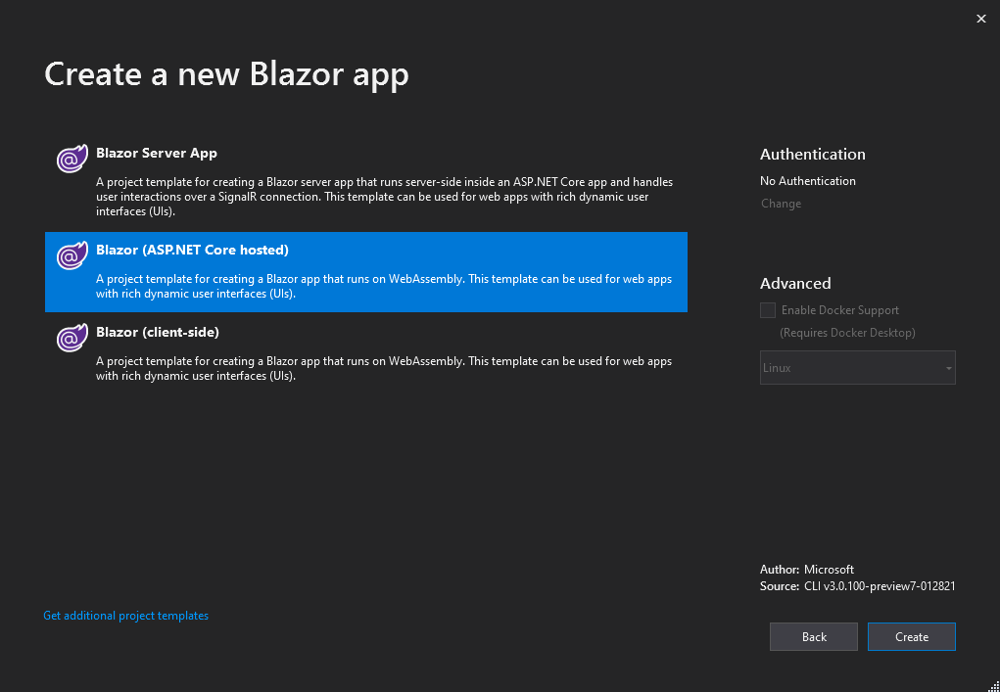
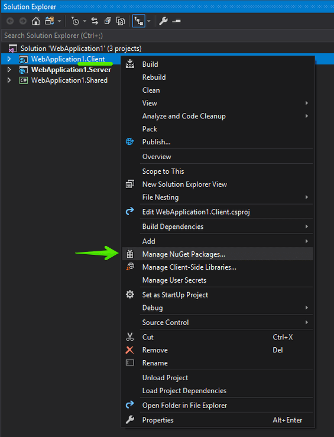
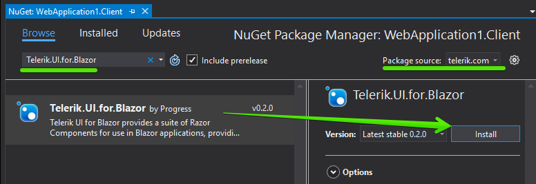

# First Steps with Client-side UI for Blazor

This article explains how to get the Telerik UI for Blazor components in your **Client-side** Blazor project and start using them quickly. The process consists of the following steps:

1. [Set Up a Blazor Project](#set-up-a-blazor-project)
1. [Add the Telerik NuGet Feed to Visual Studio](#add-the-telerik-nuget-feed-to-visual-studio)
1. [Add the Telerik Components to Your Project](#add-the-telerik-components-to-your-project)
1. [Add a Telerik Component to a View](#add-a-telerik-component-to-a-view)

@[template](/_contentTemplates/common/get-started.md#add-latest-ms-bits-client-side-link)

@[template](/_contentTemplates/common/get-started.md#add-nuget-feed)

## Add the Telerik Components to Your Project

For client-side Blazor, we recommend the usage of `Blazor (ASP.NET Hosted)` project. 
@[template](/_contentTemplates/common/get-started.md#project-creation-part-1)

1. Choose the `Blazor (ASP.NET Hosted)` project type and click `Create`.

    

### Add to Existing Project

@[template](/_contentTemplates/common/get-started.md#get-access)

    1. Right-click on the `Client` project in the solution and select `Manage NuGet Packages`:
    
       
    
    1. Choose the `telerik.com` feed, find the **`Telerik.UI.for.Blazor`** package and click `Install` (make sure to use the latest version). If you don't have a commercial license, you will only see `Telerik.UI.for.Blazor.Trial`. Use that instead.
    
         

        
1. Open the `~/wwwroot/index.html` file in the client web application and register the [Theme stylesheet]() (make sure to use the correct version that matches the official Kendo UI for jQuery release number):

    **HTML**
    
        <link rel="stylesheet" href="https://unpkg.com/@progress/kendo-theme-default@latest/dist/all.css" />
        

1. @[template](/_contentTemplates/common/js-interop-file.md#add-js-interop-file-to-getting-started-client)
        
1. Open the `~/Startup.cs` file in the client web application and register the Telerik Blazor service:

    **C#**
    
        namespace MyBlazorAppName.Client
        {
            public class Startup
            {
                public void ConfigureServices(IServiceCollection services)
                {
                    //more code may be present here
                    services.AddTelerikBlazor();
                }
                
                //more code may be present here
            }
        }

1. Open the Client `.csproj` file and ensure that the following switch is present. At the moment the IL Linker needs to be disabled because of [an issue in Mono](https://github.com/mono/mono/issues/12917).

    **.csproj**
    
        <PropertyGroup>
            <!-- there may be other elements here -->
            <BlazorLinkOnBuild>false</BlazorLinkOnBuild>
        </PropertyGroup>

    
Now your project can use the Telerik UI for Blazor components.

## Add a Telerik Component to a View

The final step is to actually use a component on a view and run it in the browser. For example:

1. **Add** a **Button** component to the `~/Pages/Index.cshtml` view:
@[template](/_contentTemplates/common/get-started.md#add-component-sample)

## See Also

* [Get Started with Server-side Blazor]()
* [Telerik Private NuGet Feed]()
