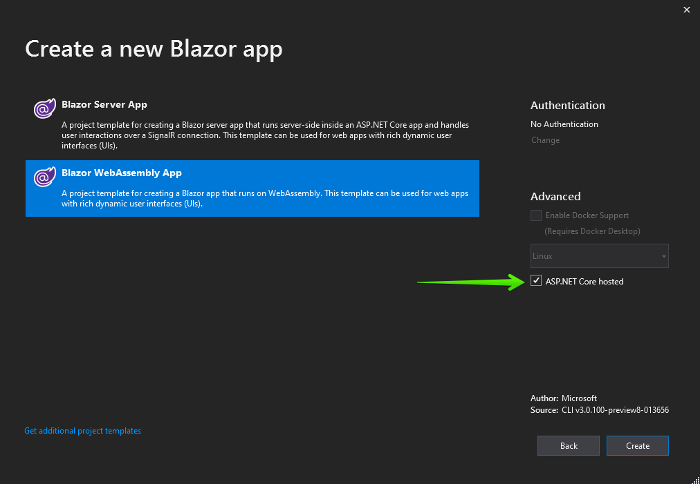

# First Steps with Client-side UI for Blazor

This article explains how to get the Telerik UI for Blazor components in your **Client-side** Blazor project and start using them quickly. The process consists of the following steps:

1. [Set Up a Blazor Project](#step-1---set-up-a-blazor-project)
1. [Enable the Telerik Components in the Project](#step-2---enable-the-telerik-components-in-an-existing-project)
    1. [Add the Telerik NuGet Feed to Visual Studio](#add-the-telerik-nuget-feed-to-visual-studio)
    1. [Enable the Components in the Project](#enable-the-components-in-the-project)
1. [Add a Telerik Component to a View](#step-3---add-a-telerik-component-to-a-view)

@[template](/_contentTemplates/common/get-started.md#download-intro-para-for-get-started)

@[template](/_contentTemplates/common/get-started.md#add-latest-ms-bits-client-side-link)

For client-side `Blazor App`, we recommend the usage of **`Blazor (ASP.NET Hosted)`** project. 
@[template](/_contentTemplates/common/get-started.md#project-creation-part-1)

1. Choose the `Blazor WebAssembly App` project type, select the `ASP.NET Core hosted` checkbox, and click `Create`.

    

## Step 2 - Enable the Telerik Components in an Existing Project

@[template](/_contentTemplates/common/get-started.md#add-nuget-feed)

@[template](/_contentTemplates/common/get-started.md#get-access)

    1. Right-click on the `Client` project in the solution and select `Manage NuGet Packages`:
    
       
    
    1. Choose the `telerik.com` feed, find the **`Telerik.UI.for.Blazor`** package and click `Install` (make sure to use the latest version). If you don't have a commercial license, you will only see `Telerik.UI.for.Blazor.Trial`. Use that instead.
    
         

1. @[template](/_contentTemplates/common/js-interop-file.md#add-js-interop-file-to-getting-started-client)

1. Open the `~/wwwroot/index.html` file in the client web application and register the [Theme stylesheet]():

@[template](/_contentTemplates/common/js-interop-file.md#theme-static-asset-snippet)

        
1. Open the `~/Program.cs` file in the client web application and register the Telerik Blazor service:

    **C#**
    
        using Microsoft.AspNetCore.Components.WebAssembly.Hosting;
        using Microsoft.Extensions.DependencyInjection;
        using System.Threading.Tasks;
        using System.Net.Http;
        using System;
        
        namespace ClientBlazorProject.Client // make sure this matches your actual WASM project namespace
        {
            public class Program
            {
                public static async Task Main(string[] args)
                {
                    // sample host builder for a WASM app, yours may differ
                    var builder = WebAssemblyHostBuilder.CreateDefault(args);
                    builder.RootComponents.Add<App>("app");
                    builder.Services.AddSingleton(new HttpClient { BaseAddress = new Uri(builder.HostEnvironment.BaseAddress) });
                    // there may be more code here
        
                    // register the Telerik services
                    builder.Services.AddTelerikBlazor();
        
                    // there may be more code here
                    // sample host builder for a WASM app, yours may differ
                    await builder.Build().RunAsync();
                }
            }
        }
         
1. Add the following to your **`~/_Imports.razor`** file so the project recognizes our components in all files:

    **_Imports.razor**
    
        @using Telerik.Blazor
        @using Telerik.Blazor.Components

1. @[template](/_contentTemplates/common/get-started.md#telerik-main-container-text)

    **MainLayout.razor**
    
        @[template](/_contentTemplates/common/get-started.md#telerik-main-container-snippet)

    
Now your project can use the Telerik UI for Blazor components.

## Step 3 - Add a Telerik Component to a View

The final step is to actually use a component on a view and run it in the browser. For example:

1. **Add** a **Button** component to the `~/Pages/Index.razor` view:
@[template](/_contentTemplates/common/get-started.md#add-component-sample)

## See Also

* [Get Started with Server-side Blazor]()
* [Telerik Private NuGet Feed]()
* [Getting Started Videos for Blazor](https://www.youtube.com/watch?v=aaRAZYaJ4xc&list=PLvmaC-XMqeBYPTwcm478vs8Rujq2tiVJo)

