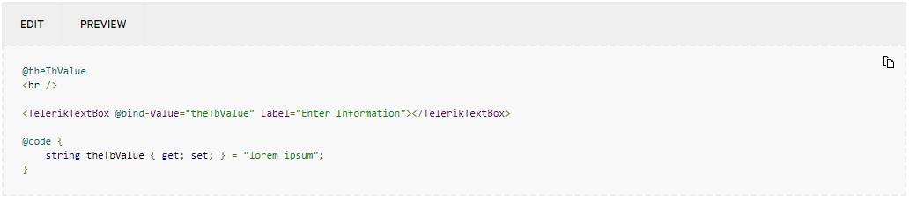
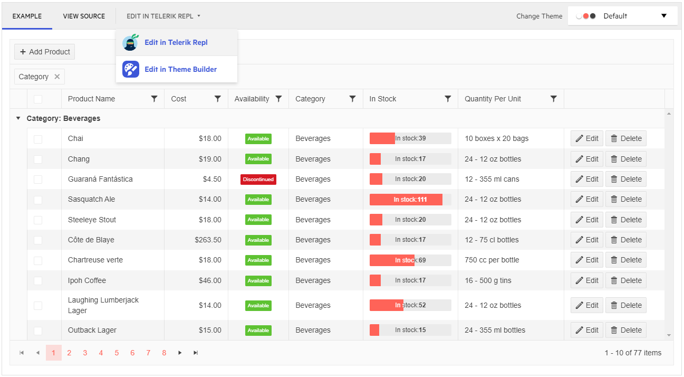
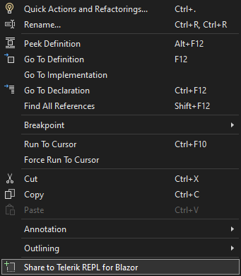
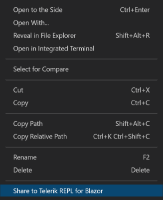
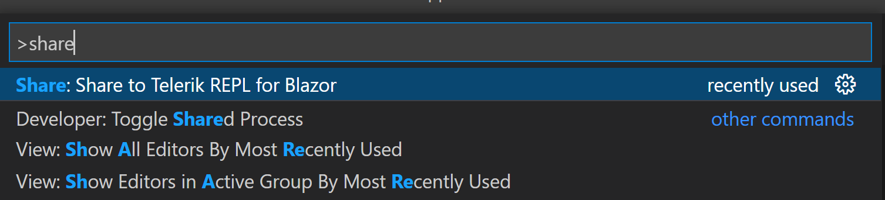

# Telerik REPL for Blazor

<a href = "https://telerik.com/blazor-ui/repl/getting-started" target = "_blank"> Progress Telerik REPL for Blazor </a> is innovative web-based application that allows you to write, compile, execute and share your rich UI Blazor components. You can write your code directly in the integrated editor and it in the browser security sandbox without any communication with a server. The code is compiled on top of Web Assembly which delivers near to native performance. With Telerik REPL for Blazor you can also easily edit, save and share your code.

In this article:

* [Getting Started](#getting-started)
* [Telerik UI for Blazor documentation Integration](#telerik-ui-for-blazor-documentation-integration)
* [Telerik UI for Blazor demos Integration](#telerik-ui-for-blazor-demos-integration)
* [Visual Studio and Visual Studio Code Integration](#visual-studio-and-visual-studio-code-integration)

## Getting Started

<a href = "https://blazorrepl.telerik.com/" target = "_blank">The Telerik REPL for Blazor application</a> is divided in five main elements:

* [Toolbar](#toolbar)
* [Sidebar - Drawer](#sidebar---drawer)
* [Editor](#editor)
* [Result View](#result-view)
* [Error List](#error-list)

### Toolbar

The Toolbar of Telerik REPL for Blazor contains the operations that can be performed:

* `Run` - executes the code from the editor and renders it in the [Result View](#result-view)

* `Get Started` - links the [getting started article](https://telerik.com/blazor-ui/repl/getting-started) for the product

* `Share` - allows you to share the snippet. The menu is divided in two sections:
    *  `Share` - In the popup, you will find a generated public link with the snippet will that you can share as desired. The menu also provides several options for direct sharing in social medias.
    * `Embed` - generates a link which you can use to embed the snippet in blog posts and other websites. Based on your use case, you can choose whether to embed only the Editor, the Result View, the Error Console or all three. A preview of the embed will be loaded in the popup upon selecting the desired option.
    
* `Feedback` - leads to the [public feedback portal for Telerik REPL for Blazor](https://feedback.telerik.com/repl) where you can share your enhancement requests and eventual bug reports. We use it to constantly monitor the community interest and demand and thus improve our products.

### Sidebar

The Sidebar provides the following functionalities:

* NuGet Package Manager - it allows you to install third party NuGet packages that are stored in the public `nuget.org` repository. If the published NuGet requires accepting license agreement, you will see a prompt for confirming your acceptance. Regarding `Telerik UI for Blazor` package, latest version is installed by default, so no further action is required form your side.

* Static Asset Manager - it allows you to add a CDN with your desired CSS or JavaScript files. Place the file URL in the input and click the download button. This automatically add references for the corresponding files. Once the desired asset is added, you can easily enable/disable it via a switch. In case some of the installed NuGet packages include CSS/JavaScript files, they will automatically be listed in this section, so you can manage them.

* Telerik UI Asset Manager - provides a summary of the installed Telerik UI package version and a dropdown for selecting one of the [built-in themes]() (Default, Material, Bootstrap) and some of their corresponding [color swatches](). By selecting different theme or swatch, you can immediately see the applied styles in the Results view.

* Startup Config  - by clicking the config icon at the bottom of the Sidebar, you can open the `Startup.cs` file of the project and modify it if desired. This way you you can configure services or other settings in the your code.

### Editor

The Editor allows you to type, paste and edit your code. It always contains `_Main.razor` file and you can also add other files to the project via the `+` button.

The newly added files could be `.razor`(pages, components) or `.cs`(models, code-behind files, services, etc.) All files of type `.razor` should be named with a capital letter.

### Result View

Once you click the Run button, the actual result of your code will be rendered in the Result View of the Telerik REPL for Blazor. To successfully run the code you need to make sure that no errors are thrown (if any, they will be listed in the [Error List](#error-list)).

### Error List

Telerik REPL for Blazor provides an Error List that displays details for the compile time errors and warnings (if any). It can be expanded/collapsed via arrow buttons.

The Error list is located at the bottom of the [Editor](#editor).

## Telerik UI for Blazor Documentation Integration

The Telerik UI for Blazor documentation supports integration with the Telerik REPL for Blazor. This provides interactive experience and easy to test snippets for the various components and scenarios. Above the code snippets listed in the documentation articles you will find a toolbar with the following options:

* `Edit` - click to open the source in the integrated the Telerik REPL for Blazor Editor.

* `Preview` - click to run the snippet in the integrated the Telerik REPL for Blazor Result View.

## Telerik UI for Blazor Demos Integration

The Telerik UI for Blazor demos support integration with the Telerik REPL for Blazor. In the demo window toolbar, along with the "Example" and "View Source" tabs, you will find a tab with dropdown that provides option for editing the demo in Telerik REPL for Blazor. Once you select that option, you will be redirected to the Telerik REPL for Blazor and its editor will contain the source code of the current demo, so you can directly edit and test it.

## Visual Studio and Visual Studio Code Integration

Telerik Extensions for [Visual Studio]() and [Visual Studio Code]() provide option to easily share your code to the Telerik REPL for Blazor in a couple clicks. You can share the whole file or just a selection.

The command can be used if more than 10 symbols are selected. If less symbols are selected, in Visual Studio it will appear as disabled and in Visual Studio Code you will get an error message ("Expected at least 10 characters"). In case of multiple selection every new piece will be concatenated on a new line.

If no selection is made, the whole file will be shared to Telerik REPL for Blazor. Only single files can be shared per command and not the whole application. Once the share to REPL process is triggered, notifications will appear in the bottom right corner for about 2 to 3 seconds to indicate the status, after that the default browser opens with the uploaded snippet.

The sharing option is served as follows:

#### Visual Studio (you can get the extension [here](https://marketplace.visualstudio.com/items?itemName=TelerikInc.TelerikBlazorVSExtensions)):
* Context Menu option - select a section that you want to share, right click on it to open the context menu and click "Share to Telerik REPL for Blazor" option.
    

#### Visual Studio Code (you can get the extension [here](https://marketplace.visualstudio.com/items?itemName=TelerikInc.blazortemplatewizard)):

* Context Menu option - select a section that you want to share, right click on it to open the context menu and click "Share to Telerik REPL for Blazor" option.`

* Command in the command palette - select a section that you want to share, search for "Share to Telerik REPL for Blazor" in the command palette and choose it.

