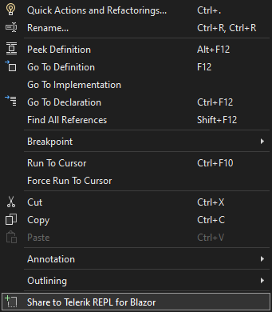
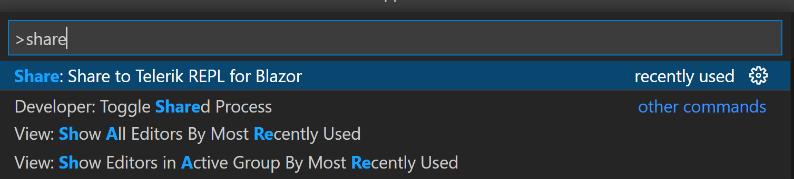

# Telerik REPL for Blazor Integration

Telerik REPL for Blazor is integrated in our resources (documentation and demos), as well as Visual Studio and Visual Studio Code.

In this article:

* [Telerik UI for Blazor documentation Integration](#telerik-ui-for-blazor-documentation-integration)
* [Telerik UI for Blazor demos Integration](#telerik-ui-for-blazor-demos-integration)
* [Visual Studio and Visual Studio Code Integration](#visual-studio-and-visual-studio-code-integration)

## Telerik UI for Blazor Documentation Integration

The Telerik UI for Blazor documentation supports integration with the Telerik REPL for Blazor. This provides interactive experience and easy to test snippets for the various components and scenarios. Above the code snippets listed in the documentation articles you will find a toolbar with the following options:

* `Edit` - click to open the source in the integrated the Telerik REPL for Blazor Editor.

* `Preview` - click to run the snippet in the integrated the Telerik REPL for Blazor Result View.

## Telerik UI for Blazor Demos Integration

The Telerik UI for Blazor demos support integration with the Telerik REPL for Blazor. In the demo window toolbar, along with the "Example" and "View Source" tabs, you will find a tab with dropdown that provides option for editing the demo in Telerik REPL for Blazor. Once you select that option, you will be redirected to the Telerik REPL for Blazor and its editor will contain the source code of the current demo, so you can directly edit and test it.

## Visual Studio and Visual Studio Code Integration

Telerik Extensions for [Visual Studio]() and [Visual Studio Code]() provide option to easily share your code to the Telerik REPL for Blazor with a few clicks. You can share the whole file or just a selection.

The command can be used if more than 10 symbols are selected. If less symbols are selected, in Visual Studio it will appear as disabled and in Visual Studio Code you will get an error message ("Expected at least 10 characters"). In case of multiple selection every new piece will be concatenated on a new line.

If no selection is made, the whole file will be shared to Telerik REPL for Blazor. Only single files can be shared per command and not the whole application. Once the share to REPL process is triggered, notifications will appear in the bottom right corner for about 2 to 3 seconds to indicate the status, after that the default browser opens with the uploaded snippet.

The `Share to Telerik REPL for Blazor` command can be accessed as follows:

#### Visual Studio (you can get the extension [here](https://marketplace.visualstudio.com/items?itemName=TelerikInc.TelerikBlazorVSExtensions)):
* Context Menu option - select a section that you want to share, right click on it to open the context menu and click "Share to Telerik REPL for Blazor" option.
    

#### Visual Studio Code (you can get the extension [here](https://marketplace.visualstudio.com/items?itemName=TelerikInc.blazortemplatewizard)):

* Context Menu option - select a section that you want to share, right click on it to open the context menu and click "Share to Telerik REPL for Blazor" option.`

* Command in the command palette - select a section that you want to share, search for "Share to Telerik REPL for Blazor" in the command palette and choose it.

