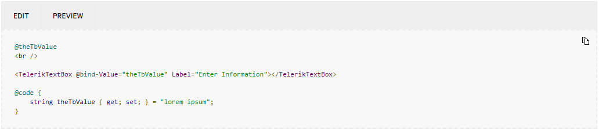

# Telerik REPL for Blazor Integration

Telerik REPL for Blazor is integrated in the UI for Blazor resources (documentation and demos), as well as Visual Studio and Visual Studio Code.

In this article:

- [Telerik REPL for Blazor Integration](#telerik-repl-for-blazor-integration)
  - [Documentation Integration](#documentation-integration)
  - [Demos Integration](#demos-integration)
  - [Visual Studio and Visual Studio Code Integration](#visual-studio-and-visual-studio-code-integration)
    - [Sharing to REPL in Visual Studio](#sharing-to-repl-in-visual-studio)
    - [Sharing to REPL Visual Studio Code](#sharing-to-repl-visual-studio-code)
  - [See Also](#see-also)

## Documentation Integration

Most code examples in the Telerik UI for Blazor documentation are directly runnable in Telerik REPL for Blazor. This provides interactive experience, as the snippets are easy to test and edit. The toolbar above each runnable code snippet contains the following options:

* **Edit**&mdash;Opens the source in the integrated Telerik REPL for Blazor Editor.

* **Preview**&mdash;Runs the snippet in the integrated Telerik REPL for Blazor Result View.

## Demos Integration

[The Telerik UI for Blazor demos](https://demos.telerik.com/blazor-ui) support integration with Telerik REPL for Blazor. The demo window toolbar provides option for editing the demo in Telerik REPL for Blazor. Once you select that option, you will be redirected to the Telerik REPL for Blazor and its editor will contain the source code of the current demo, so you can directly edit and test it.

## Visual Studio and Visual Studio Code Integration

Telerik Extensions for [Visual Studio](slug://getting-started-vs-integration-overview) and [Visual Studio Code](slug://getting-started-vs-code-integration-overview) provide option to easily share your code to the Telerik REPL for Blazor with a few clicks. You can share the whole file or just a selection.

The command can be used if more than 10 symbols are selected. Otherwise Visual Studio will disable the command, and Visual Studio Code will show an error message ("Expected at least 10 characters"). In case of multiple selection, every new piece will be concatenated on a new line.

If no selection is made, the whole file will be shared to Telerik REPL for Blazor. Only single files can be shared per command and not the whole application. Once the share to REPL process is triggered, status notifications will appear in the bottom-right corner for a few seconds. After that, the default browser will open with the uploaded snippet.

### Sharing to REPL in Visual Studio

1. Get the extension from the Visual Studio Marketplace:

   * <a href="https://marketplace.visualstudio.com/items?itemName=TelerikInc.ProgressTelerikBlazorVSExtensions" target="_blank">Extension for Visual Studio 2022 for Windows</a>
   * <a href="https://marketplace.visualstudio.com/items?itemName=TelerikInc.TelerikBlazorVSExtensions" target="_blank">Extension for Visual Studio 2019 for Windows</a>

1. Access the command through the Context Menu:

   1. Select a section that you want to share.
   1. Right-click the selection to open the context menu.
   1. Click the **Share to Telerik REPL for Blazor** option.
    

### Sharing to REPL Visual Studio Code

1. [Get the Visual Studio Code extension](slug://getting-started-vs-code-integration-overview) from the [Visual Studio Marketplace](https://marketplace.visualstudio.com/items?itemName=TelerikInc.blazortemplatewizard).

1. Access the command using either the context menu or the command palette:

    * To use the context menu option, select a section that you want to share, right-click the selection, and then click **Share to Telerik REPL for Blazor**.

        

    * To use the command palette, select a section that you want to share, search for **Share to Telerik REPL for Blazor** in the command palette and select it.

        

## See Also

* [User Snippets in Telerik REPL for Blazor](slug://blazor-repl-user-snippets)
* [Predefined Editor Snippets and Scaffolders in Telerik REPL for Blazor](slug://blazor-repl-snippets-scaffolders)