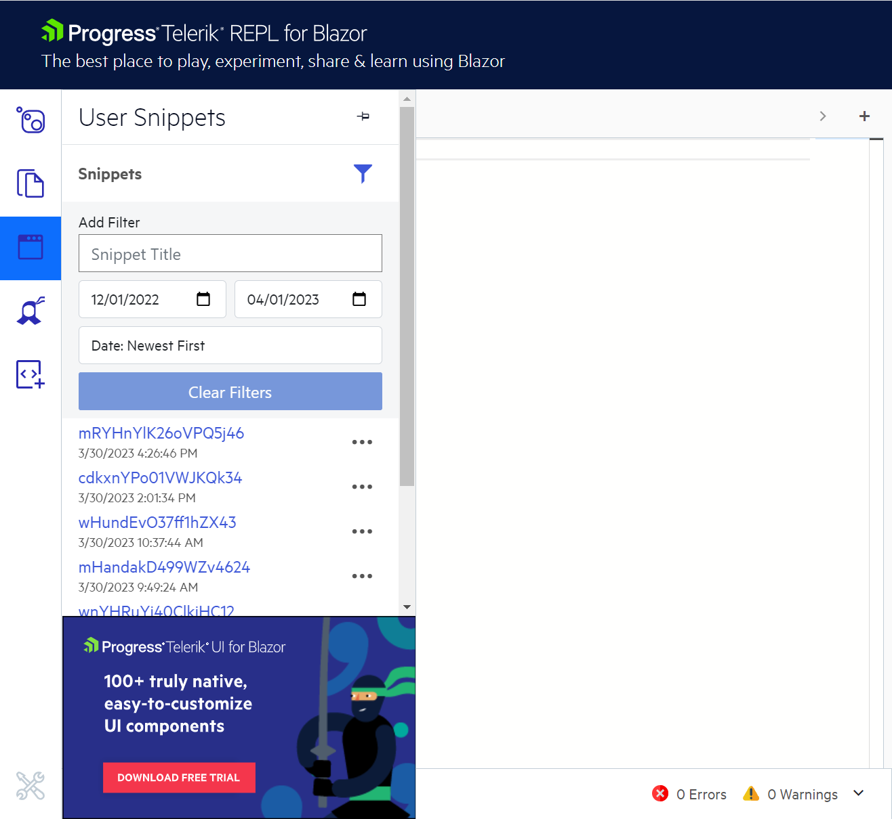

# Saving Your User Snippets in Telerik REPL for Blazor

Once you log in, [Telerik REPL for Blazor](https://www.telerik.com/blazor-ui/repl) automatically saves every code snippet you create from your account. To create a code snippet, enter the desired code and click the **Share** button in the toolbar.

To log into [Telerik REPL for Blazor](https://www.telerik.com/blazor-ui/repl), use your existing Telerik account or register as a new user by clicking the user icon in the toolbar. You will be prompted to the Telerik login page where you can enter your credentials.

You can manage the saved code snippets in the **User Snippets** section of the sidebar:

The **User Snippets** menu allows you to review and manage your code snippets:

* **Open**—Clicking a snippet will automatically populate it in the editor. You can run it or make changes. To save the changed snippet, click the **Share** button—the updated snippet will be saved as a new one.

* **Filter**—You can filter the snippets by name or creation date.

* **Sort**—You can sort the snippets by name or date of creation in ascending or descending order.

* **Rename**—Telerik REPL for Blazor automatically generates a name when saving the snippet. You can change that default name to something meaningful.

* **Delete**—While you are logged in, Telerik REPL for Blazor automatically saves each snippet you generate. The **User Snippets** menu allows you to delete the snippets you no longer need.

## See Also

* [Predefined Editor Snippets and Scaffolders in Telerik REPL for Blazor](slug://blazor-repl-snippets-scaffolders)