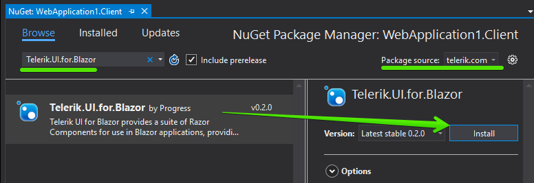

# First Steps with Server-side UI for Blazor

This article explains how to get the Telerik UI for Blazor components in your **Server-side** Blazor project and start using them quickly. The process consists of the following steps:

1. [Set Up a Blazor Project](#set-up-a-blazor-project)
1. [Add the Telerik NuGet Feed to Visual Studio](#add-the-telerik-nuget-feed-to-visual-studio)
1. [Add the Telerik Components to Your Project](#add-the-telerik-components-to-your-project)
1. [Add a Telerik Component to a View](#add-a-telerik-component-to-a-view)

@[template](/_contentTemplates/common/get-started.md#add-latest-ms-bits-server-side-link)

@[template](/_contentTemplates/common/get-started.md#add-nuget-feed)

## Add the Telerik Components to Your Project

To use Blazor server-side, you need to use the `Razor Components` type of project. If you have one, go to the [Add to Existing Project](#add-to-existing-project) section below.

If you don't have a Blazor project set up, first you need to create one:

1. Open Visual Studio 2019

1. Create a New Project

1. Choose `ASP.NET Core Web Application` and click `Next`. Then, choose a name and location for the project and click `Create`.

    

1. Choose the `Razor Components` project type and click `Create`.

    

### Add to Existing Project

To get access to the UI for Blazor components, follow these steps:

1. Activate a trial by visiting the following link: [https://www.telerik.com/download-trial-file/v2-b/ui-for-blazor](https://www.telerik.com/download-trial-file/v2-b/ui-for-blazor). This activates a UI for Blazor preview in your account and enables the [Telerik private NuGet feed](#add-the-telerik-nuget-feed-to-visual-studio) for you, so you can install our components. Make sure that you have configured [our NuGet feed](#add-the-telerik-nuget-feed-to-visual-studio).

1. Install the `Telerik.UI.for.Blazor` NuGet package to your Blazor project. If you do not see it in the `telerik.com` feed, wait for a about 20-30 minutes after activating the trial:

    1. Right-click on the project in the solution and select `Manage NuGet Packages`:
    
       
    
    1. Choose the `telerik.com` feed, find the `Telerik.UI.for.Blazor` package and click `Install`:
    
         

1. Open the `~/Components/_ViewImports.cshtml` file and add the following line to register the Telerik components for all component files:

    **CSHTML**
    
        @addTagHelper *,Telerik.Blazor
        
1. Open the `~/Pages/Index.cshtml` and register the [Theme stylesheet]() (note the escaping for the `@` symbol):

    **HTML**
    
        <link id="kendoCss" rel="stylesheet" href="https://unpkg.com/@@progress/kendo-theme-default@@latest/dist/all.css" />

    
Now your project can use the Telerik UI for Blazor components in all its component files.

## Add a Telerik Component to a View

The final step is to actually use a component on a view and run it in the browser. For example:

1. **Add** a **Button** component to the `~/Components/Pages/Index.cshtml` view:

    **CSHTML**
    
        <TelerikButton>Say Hello</TelerikButton>
        
1. Optionally, hook up a click handler that will show a message. The resulting view should look like this:

    **CSHTML**
    
        @page "/"
        @using Microsoft.AspNetCore.Components
        
        <TelerikButton OnClick="@SayHelloHandler" Class="k-primary">Say Hello</TelerikButton>
        
         
        
        @helloString
        
        @functions {
           MarkupString helloString;
        
           void SayHelloHandler()
           {
               string msg = string.Format("Hello from <strong>Telerik Blazor</strong> at {0}.  Now you can use C# to write front-end!", DateTime.Now);
               helloString = new MarkupString(msg);
           }
        }

1. **Run the app** in the browser by pressing `F5`. You should see something like this:

    

Now you have the Telerik components running in your Blazor app.

Next, you can explore the [live demos](https://demos.telerik.com/blazor) and the rest of the documentation.
