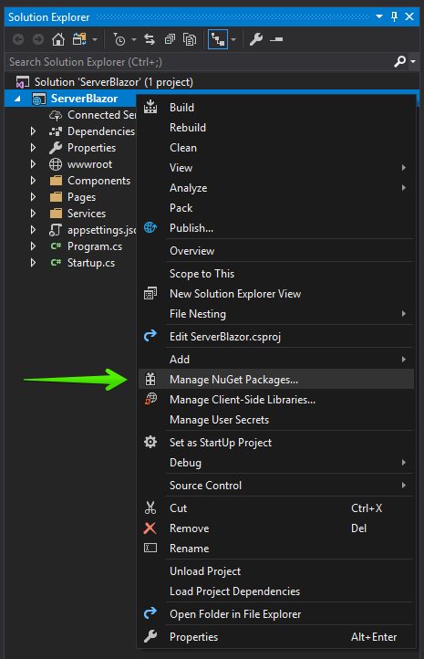

# First Steps with Server-Side UI for Blazor

This article explains how to get the Telerik UI for Blazor components in your <a href = "https://www.telerik.com/faqs/blazor-ui/what-is-the-difference-between-blazor-webassembly-vs-server" target="_blank">**Server-side** Blazor</a> project and start using them quickly. The process consists of the following steps:

1. [Set Up a Blazor Project](#step-1---set-up-a-blazor-project)
    * [Create a Project with the Telerik VS Extensions](#create-a-project-with-the-telerik-vs-extensions)
    * [Create a Project with the CLI](#create-a-project-with-the-cli)
    * [Create a Project with Visual Studio](#create-a-project-with-visual-studio)
1. [Add the Telerik Blazor Components to an Existing Project](#step-2---add-the-telerik-blazor-components-to-an-existing-project)
    1. [Add the Telerik NuGet Feed to Visual Studio](#add-the-telerik-nuget-feed-to-visual-studio)
    1. [Enable the Components in the Project](#enable-the-components-in-the-project)
1. [Add a Telerik Component to a View](#step-3---add-a-telerik-component-to-a-view)

@[template](/_contentTemplates/common/get-started.md#download-intro-para-for-get-started)

@[template](/_contentTemplates/common/get-started.md#blazor-tutorial-intro)

To create a server-side Blazor app, use a **Blazor Server App** project:

@[template](/_contentTemplates/common/get-started.md#project-creation-part-1)

1. Choose the **Blazor Server App** project type and click **Create**.

    

@[template](/_contentTemplates/common/get-started.md#project-creation-cli)

## Step 2 - Add the Telerik Blazor Components to an Existing Project

@[template](/_contentTemplates/common/get-started.md#add-nuget-feed)

@[template](/_contentTemplates/common/get-started.md#get-access)

1\. Manage NuGet Packages

Right-click the project in the solution and select `Manage NuGet Packages`:

2\. Install the Telerik Package

Choose the `telerik.com` feed, find the **`Telerik.UI.for.Blazor`** package and click `Install` (make sure to use the latest version). If you don't have a commercial license, you will only see `Telerik.UI.for.Blazor.Trial`. Use that instead.

3\. Add the JavaScript File

Add the `telerik-blazor.js` file to your main index file:
 
 * `~/Pages/_Host.cshtml` for .NET 3.x and .NET 5
 * `~/Pages/_Layout.cshtml` for .NET 6

**HTML**

@[template](/_contentTemplates/common/js-interop-file.md#js-interop-file-snippet)

To enable the use of static assets in your project, add the following line to the startup file of your **Server** project:

 * `Startup.cs` for .NET 3.x and .NET 5
 * `Program.cs` for .NET 6

**C#**
@[template](/_contentTemplates/common/js-interop-file.md#enable-static-assets-snippet)

4\. Add the Stylesheet

Register the [Theme stylesheet]() in your main index file:
 
 * `~/Pages/_Host.cshtml` for .NET 3.x and .NET 5
 * `~/Pages/_Layout.cshtml` for .NET 6

@[template](/_contentTemplates/common/js-interop-file.md#theme-static-asset-snippet)

5\. Register the Telerik Blazor Service

Open the startup file of your **Server** project and register the Telerik Blazor service:

* `Startup.cs` for .NET 3.x and .NET 5
* `Program.cs` for .NET 6

**C#**
@[template](/_contentTemplates/common/js-interop-file.md#register-telerik-service-server)

6\. Add Usings

Add the following to your **`~/_Imports.razor`** file so the project recognizes our components in all files:

**_Imports.razor**
    
    @using Telerik.Blazor
    @using Telerik.Blazor.Components

7\. @[template](/_contentTemplates/common/get-started.md#root-component-telerik-layout)

8\. @[template](/_contentTemplates/common/get-started.md#root-component-main-layout)

    
Now your project can use the Telerik UI for Blazor components.

## Step 3 - Add a Telerik Component to a View

The final step is to use a component in a view and run it in the browser. For example:

1. **Add** a **Button** component to the `~/Components/Pages/Index.razor` view:
@[template](/_contentTemplates/common/get-started.md#add-component-sample)

## See Also

* [Get Started with Client-side Blazor]()
* [Telerik Private NuGet Feed]()
* [Getting Started Videos for Blazor](https://www.youtube.com/watch?v=aaRAZYaJ4xc&list=PLvmaC-XMqeBYPTwcm478vs8Rujq2tiVJo)

