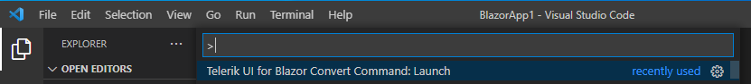
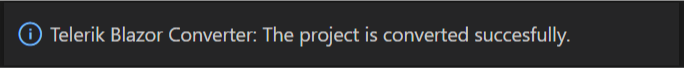
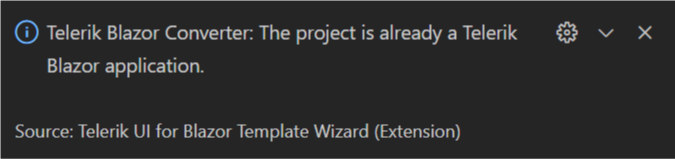
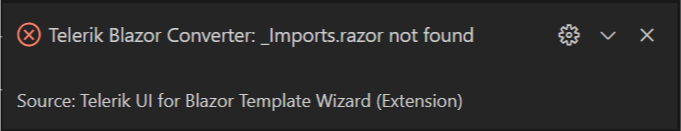
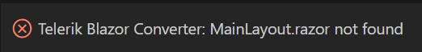
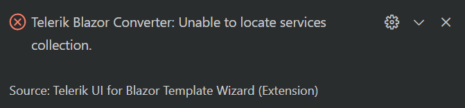
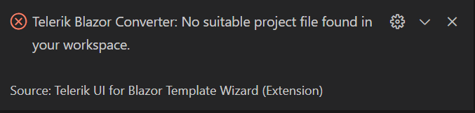

# Convert to Telerik Application

This article demonstrates how to enable the Progress&reg; Telerik&reg; UI for Blazor components in your existing Blazor app with a single VS Code command.

To add the Telerik Components to your existing Blazor application, use the `Convert Command` in the Telerik UI for Blazor Visual Studio Code Extension.

In this article:
* [Get the Extension](#get-the-extension)

* [Convert your project](#convert-your-project)

* [Troubleshooting](#troubleshooting)

## Get the Extension

@[template](/_contentTemplates/common/general-info.md#vs-code-x-download)

## Convert your project

1. Press `Ctrl`+`Shift`+`P` on Windows/Linux or `Cmd`+`Shift`+`P` on Mac to open the VS Code extension launcher.

   

1. Type/Select `Telerik UI for Blazor Convert Command: Launch` and press `Enter` to launch the convert command. This will start the conversion process. The following notification will appear in the bottom right corner of the VS Code window to indicate that the conversion has successfully passed:

   

If the Telerik components are already enabled in the project, you will see the following notification:

You have successfully enabled the Progress&reg; Telerik&reg; UI for Blazor components in your Blazor app!

## Troubleshooting

There are a few common problems that might occur when converting a project:

* [_Imports.razor not found](#_importsrazor-not-found)
* [MainLayout.razor not found](#mainlayoutrazor-not-found)
* [_Host.cshtml or index.html is malformed, doesn't exist, or doesn't contain a head element](#_hostcshtml-or-indexhtml-is-malformed-doesnt-exist-or-doesnt-contain-a-head-element)
* [Unable to locate services collection](#unable-to-locate-services-collection)
* [No suitable project to convert](#no-suitable-project-to-convert)

### _Imports.razor not found

The Telerik Extension searches for the default `_Imports.razor` file in order to add the `Telerik.Blazor` and `Telerik.Blazor.Components` namespaces. If you don't have a `_Imports.razor` file in your project or if you have renamed it, you will get the following error when trying to convert the project:

To fix this, make sure you have the `_Imports.razor` file with its default name.

### MainLayout.razor not found

The Telerik Extension searches for the default `MainLayout.razor` file in order to add the `TelerikLayout`. If you don't have a `MainLayout.razor` file in your project or if you have renamed it, you will get the following error when trying to convert the project:

To fix this, make sure you have the `MainLayout.razor` file with its default name.

### _Host.cshtml or index.html is malformed, doesn't exist, or doesn't contain a head element

The Telerik Extension searches for the default main index file of the application in order to add the Telerik UI for Blazor CSS and JavaScript files in its `<head>` tag:

* `wwwroot/index.html` for a WebAssembly Blazor app
* `~/Pages/_Host.cshtml` for a Server-Side Blazor app using .NET 3.x or .NET 5
* `~/Pages/_Layout.cshtml` for a Server-Side Blazor app using.NET 6

If you have renamed or deleted the `_Host.cshtml`/`_Layout.cshtml`/`index.html` file, or removed its `<head>` tag, you will get the following error when trying to convert the project:

To fix this, make sure you have the `_Host.cshtml`/`_Layout.cshtml`/`index.html` file with its default name and it contains a `<head>` tag.

### Unable to locate services collection

The Telerik Extension searches for the default `Startup.cs` and `Program.cs` files to make the changes necessary for the conversion. If you have renamed them, the extension will not find them and you will get the following error:

To fix this, make sure you have the `Startup.cs` and `Program.cs` files with their default name.

### No suitable project to convert

If you are trying to invoke the `Telerik UI for Blazor Convert Command` on a project other than Blazor, you will get the following error:

The `Telerik UI for Blazor Convert Command` is applicable only to Blazor Server or WASM applications. To achieve a successful conversion, make sure you are applying the command to a Blazor project.
