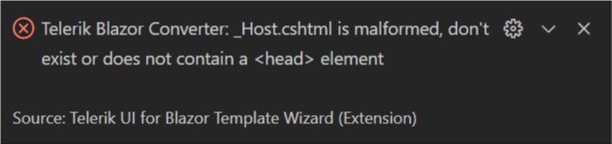

# Convert to Telerik Application

This article demonstrates how to enable the Progress&reg; Telerik&reg; UI for Blazor components in your existing Blazor app with a few mouse clicks.

To add the Telerik Components to your existing Blazor application, use the **Convert Command** of the Telerik UI for Blazor Visual Studio Code Extension.

## Get the Extension

@[template](/_contentTemplates/common/general-info.md#vs-code-x-download)

## Convert your project

1. Press `Ctrl`+`Shift`+`P` in Windows/Linux or `Cmd`+`Shift`+`P` on Mac to open VSCode's extension launcher

1. Type/Select `Telerik UI for Blazor Convert Command: Launch` and press `Enter` to launch the convert command

1. The conversion process will start

1. The following notification will appear in the bottom right corner of the VS Code to indicate that the conversion has successfully passed.

  * If the Telerik components are already enabled in the project you will see the following notification:

1. You now have enabled the Progress&reg; Telerik&reg; UI for Blazor components in your Blazor app!

## Troubleshooting

There are a few common problems that might occur when converting a project:

### `_Imports.razor` not found

The Telerik extension searches for the default `_Imports.razor` file in order to add the `Telerik.Blazor` and `Telerik.Blazor.Components` namespaces. If you don't have a `_Imports.razor` file in your project or if you have renamed it, you will get the following error when trying to convert the project:

In order to fix this, double check to make sure you have the `_Imports.razor` file with its default naming.

### `MainLayout.razor` not found

The Telerik extension searches for the default `MainLayout.razor` file in order to add the `TelerikLayout`. If you don't have a `MainLayout.razor` file in your project or if you have renamed it, you will get the following error when trying to convert the project:

In order to fix this, double check to make sure you have the `MainLayout.razor` file with its default naming.

### `_Host.cshtml` is malformed, don't exist or does not contain a `<head>` element

The Telerik extension searches for the default `_Host.cshtml` file in order to add the Telerik UI for Blazor CSS and JavaScript files in its `<head>` tag. In case you have renamed the `_Host.cshtml` file, you have deleted it or removed its `<head>` tag you will get the following error when trying to convert the project:

In order to fix this, double check to make sure you have the `_Host.cshtml` file with its default naming and it contains a `<head>` tag.

### Unable to locate services collection

The Telerik extension searches for the default `Startup.cs` and `Program.cs` files to make the necessary for the conversion changes. In case you have renamed them, the extension will not be able to find them and you will get the following error:

In order to fix this, double check to make sure you have the `Startup.cs` and `Program.cs` files with their default naming.

### No suitable project to convert

If you are trying to invoke the `Telerik UI for Blazor Convert Command` on a project other than Blazor, you will get the following error:

The `Telerik UI for Blazor Convert Command` is only applicable on Blazor Server or WASM applications and in order to achieve successful conversion, double check to make sure you are applying the command on a Blazor project.