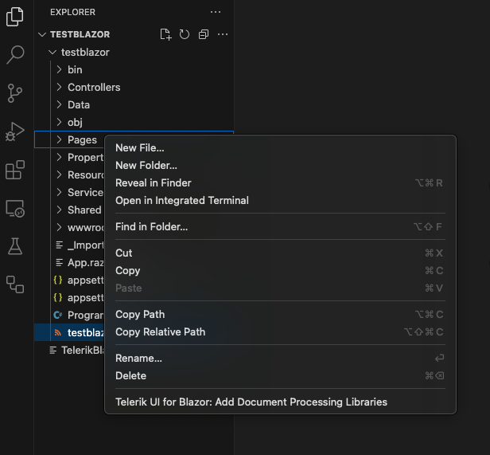
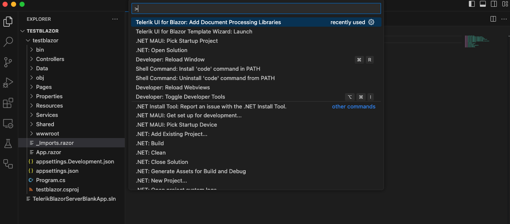
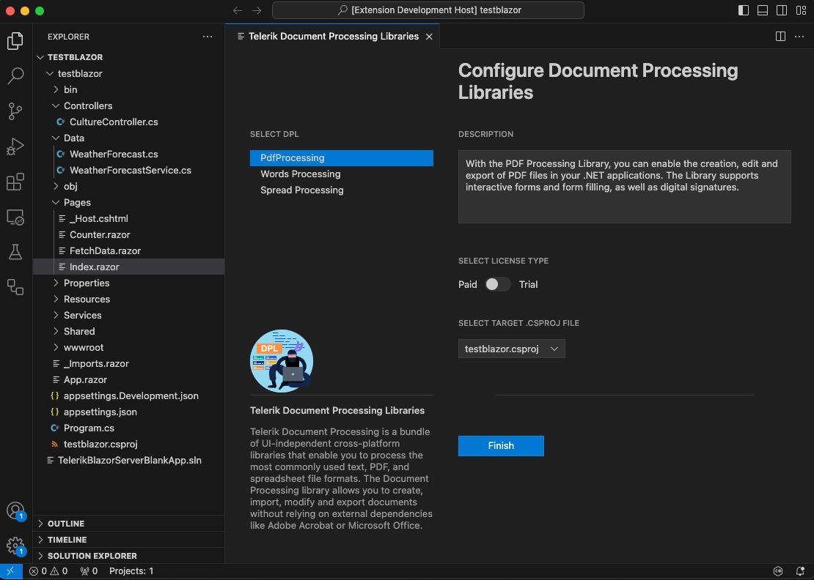

# Telerik Document Processing Libraries

The [Telerik Document Processing Libraries (DPL)](https://www.telerik.com/document-processing-libraries) are UI-independent and cross-platform libraries which enable you to process content between different formats and work with archive files. This article demonstrates how to add a reference to the DPL packages in an existing Telerik UI for Blazor application using the Document Processing Libraries Wizard. The wizard is included in the extension [Telerik UI for Blazor Productivity Tools for Visual Studio Code](https://marketplace.visualstudio.com/items?itemName=TelerikInc.blazortemplatewizard) and enables you to easily add the required packages when working with the Telerik Document Processing Library.

## Getting the Wizard

To use the Document Processing Libraries Wizard, install the [Telerik UI for Blazor Visual Studio Code extension](https://marketplace.visualstudio.com/items?itemName=TelerikInc.blazortemplatewizard).

## Starting the Wizard

There are a couple of ways to start the Document Processing Libraries Wizard.

### Using the File Explorer Context Menu

1. Right-click on a file in the **VS Code** file explorer.
1. Select **Telerik UI for Blazor: Add Document Processing Libraries**.

### Using the Code Editor Command Palette

1. Open a `.razor` file or a `Razor` language in the code editor.
1. Select **Telerik UI for Blazor: Add Document Processing Libraries** in the **VS Code** command palette.

## Using the Wizard

Upon successful completion of the above steps, the wizard must appear like this:

The Telerik Document Processing Configuration wizard allows you to:

* Select which libraries to use.
* Use the commercial or trial versions of the libraries.
* Select the project (`.csproj` file), in which you want to install the libraries. This option is useful when the user has many open projects in the workspace. If a library has any dependencies, they are automatically checked.

The table below lists the assemblies that will be selected for each library:

| Library | Packages |
| --- | --- |
| [RadPdfProcessing](slug://dpl-in-blazor) | Documents.Core   Documents.Fixed   Zip   Documents.ImageUtils   Documents.Fixed.FormatProviders.Image.Skia   Documents.CMapUtils |
| [RadSpreadProcessing](slug://dpl-in-blazor) | Documents.Core   Documents.Fixed   Documents.Spreadsheet   Documents.SpreadSheet.FormatProviders.OpenXml   Documents.SpreadSheet.FormatProviders.Pdf   Documents.Spreadsheet.FormatProviders.Xls   Documents.ImageUtils   Zip |
| [RadWordsProcessing](slug://dpl-in-blazor) | Documents.Core   Documents.Fixed   Documents.Flow   Documents.Flow.FormatProviders.Pdf   Documents.ImageUtils   Documents.Flow.FormatProviders.Doc   Documents.DrawingML   Zip |

## See Also

* [Telerik Document Processing Overview](slug://dpl-in-blazor)
* [Visual Studio Code Integration for Telerik UI for Blazor Overview]({% slug getting-started-vs-code-integration-overview )
