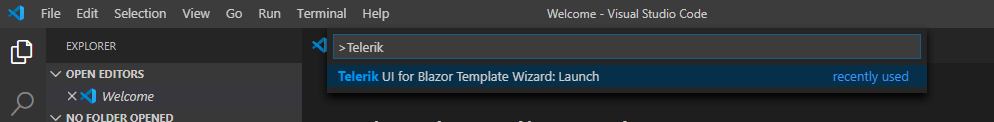

# Visual Studio Code Integration Overview

The **Telerik UI for Blazor Template Wizard** Extension for [Visual Studio Code](https://code.visualstudio.com/) enhances the experience in developing Blazor web applications with Telerik UI for Blazor.





The extension for Visual Studio Code provides the following advantages:

* It facilitates the [creation of projects]().

* It allows you to [add the Telerik Components to an existing project]() with a few clicks.

## Get the Extension

@[template](/_contentTemplates/common/general-info.md#vs-code-x-download)

To access the VS Code extension, press `Ctrl`+`Shift`+`P` on Windows/Linux or `Cmd`+`Shift`+`P` on Mac to open the VS Code extension launcher.

