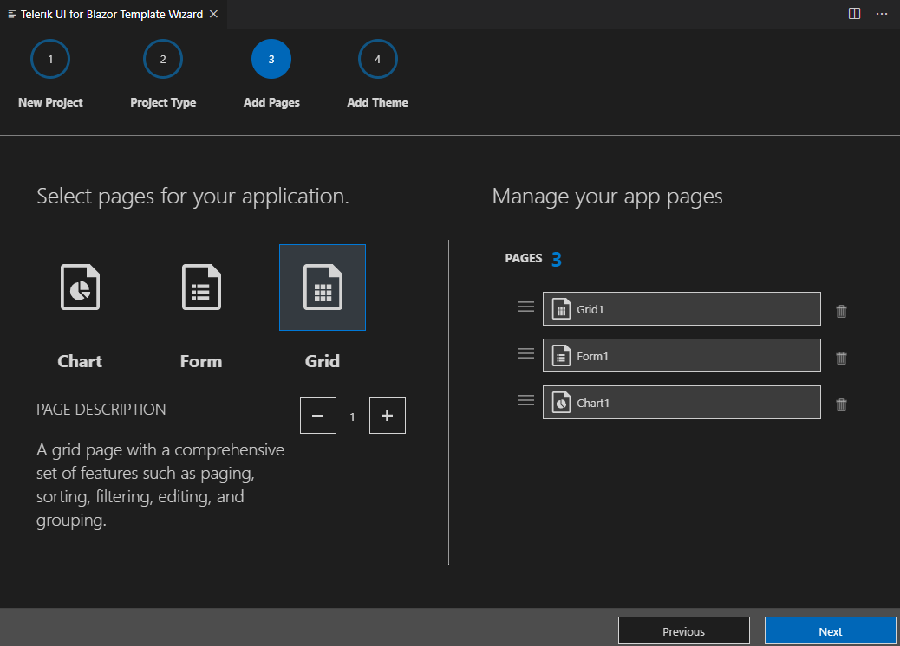

# Visual Studio Code Integration Overview

The **Telerik UI for Blazor Template Wizard** [Visual Studio Code](https://code.visualstudio.com/) Extension enhances the experience in developing Blazor web applications with Telerik UI for Blazor.

As its primary advantage, the VS Code extension facilitate the creation of projects through a wizard directly in Visual Studio Code.

## Get the Extension

You can get the extention:

* from the [Visual Studio Marketplace](https://marketplace.visualstudio.com/items?itemName=TelerikInc.blazortemplatewizard)

* by opening the **Extensions** tab in Visual Studio Code, then searching for **Telerik UI for Blazor Template Wizard** and clicking **Install**

## Create a Telerik Project

To create a Telerik-enabled Blazor project:

1. Press `Ctrl`+`Shift`+`P` in Windows/Linux or `Cmd`+`Shift`+`P` on Mac to open VSCode's extension launcher

    

1. Type/Select `Telerik UI for Blazor Template Wizard: Launch` and press `Enter` to launch the extension

1. The wizard will now guide you through the project creation steps:
    1. choose a project name and location,
    
        
        
    1. the type of project (WASM or Server-side) and your Telerik license (trial or commercial, depending on what you have),
    
        
    
    1. add some sample pages to get you started (a grid with CRUD operations form a service, a form, charts),
    
        
    
    1. choose a Theme.
    
        

1. When you open the project, to run it:

    1. Open the Terminal and navigate to the `Server` project folder. For a server project this is the folder with the project name, for a WASM project it will be the `Server` folder.

    1. Execute `dotnet run` and navigate your browser to the link you see in the console output.

1. You now have a Blazor SPA app running!

## Troubleshooting

If the extension does not work right (missing pages, does not start, etc.), you can try the following to clean up cache files and get it working again:

1. Uninstall the extension from VS Code.
2. Go to `%localappdata%` and delete the `BlazorT` and `KendoT` folders - they are where caches for the Telerik extensions are kept.
3. [Install](https://marketplace.visualstudio.com/items?itemName=TelerikInc.blazortemplatewizard) the extension again.
