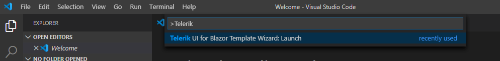

# Create New Projects

This article demonstrates how to use the Telerik Extension for Visual Studio Code to create a new project that is pre-configured for the Progress&reg; Telerik&reg; UI for Blazor components.

## Getting the Extension

To use the **Telerik UI for Blazor Template Wizard**, install the Telerik UI for Blazor Visual Studio Code Extension. @[template](/_contentTemplates/common/general-info.md#vs-code-x-download)

## Starting the Wizard

To create a Telerik-enabled Blazor project:

1. Press `Ctrl`+`Shift`+`P` in Windows/Linux or `Cmd`+`Shift`+`P` on Mac to open the VS Code extension launcher.

    

1. Type/Select `Telerik UI for Blazor Template Wizard: Launch` and press `Enter` to launch the extension.

## Creating the Project

The **Create New Project** wizard provides two options to start you project:

* **Start from Blank Project** - allows you to create a blank project that is pre-configured for the Progress® Telerik® UI for Blazor components. You can select and add sample pages to get started (a Grid with CRUD operations form a service, a Form, Charts).

* **Start from a Template** - the wizard provides a set of predefined project templates:
    * **CRUD, Form, Chart**&mdash;A small app that showcases the Telerik UI Data Grid, Chart, and forms validation. The Grid also uses a basic CRUD service which is a common pattern for data updates in real applications.
    * **Dashboard**&mdash;A basic dashboard layout that uses the TileLayout component for customizable dashboards, and showcases several ways individual blocks (tiles) can fetch data.
    * **Admin**&mdash;A small app that shows a dashboard for admin. The app uses some of the main Telerik UI components like the [Data Grid](), [Chart](), [TileLayout](), [Form](), and more.

## Configuring the Project

The wizard allows you to configure the following options:

* Location and name for your app.
* Hosting model type - WebApp, WebAssembly, Server-Side Blazor or hybrid Blazor MAUI app.
* Your Telerik license (trial or commercial, depending on what you have). 
* Whether to use localization in the project or not.
* Whether to use font icons in the project or not.
* The .NET version you want to use.
* The Telerik UI for Blazor version.
* Sample pages that you can add to get started (available for `Start from Blank Project` option).
* The theme you want to apply - the main window provides a list of the [built-in (base) themes]() (Default, Bootstrap and Material). The `See All Swatches` button opens a separate menu with a list of [color swatches]() under the corresponding base theme.

>caption Create New Project wizard

>caption See All Swatches menu

@[template](/_contentTemplates/common/general-info.md#vs-code-nuget-note)
