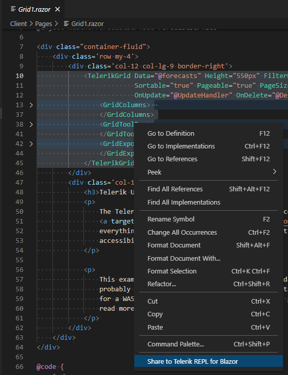
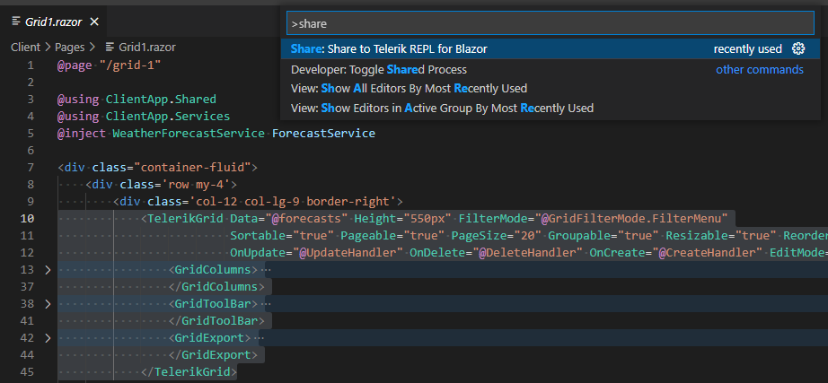
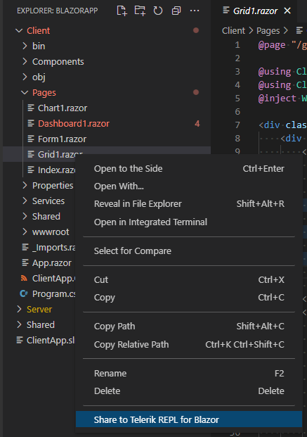

# Share to Telerik REPL

[Progress Telerik REPL for Blazor]((https://www.telerik.com/blazor-ui/repl)) is a browser-based playground for creating, saving, running, and sharing Blazor code snippets.

The [Telerik UI for Blazor Productivity Tools for Visual Studio Code](https://marketplace.visualstudio.com/items?itemName=TelerikInc.blazortemplatewizard) extension provides integration with Telerik REPL for Blazor. It allows you to export your code snippet and share the generated URL to social media, community forums, or with a team member.

## Get the Extension

To use the **Share to Telerik REPL for Blazor** option, install the Telerik UI for Blazor Visual Studio Code Extension. 
@[template](/_contentTemplates/common/general-info.md#vs-code-x-download)

## Share a Code Snippet

To share a code snippet to the Telerik REPL for Blazor you have the following options:

* [Share Using the Code Editor Context Menu](#share-using-the-code-editor-context-menu)

* [Share Using the Code Editor Command Palette](#share-using-the-code-editor-command-palette)

* [Share Using the File Explorer Context Menu](#share-using-the-file-explorer-context-menu)

### Share Using the Code Editor Context Menu

To share your code by using the code editor's context menu:

* Open a `.razor` file in the code editor.
* Select code to share:
    * To send the whole file, clear any existing selection.
    * To send a part of the file, select the desired part of the code.
* Right-click over the code editor.
* In the context menu click **Share to Telerik REPL for Blazor**.

### Share Using the Code Editor Command Palette

To share your code by using the command palette:

* Open a `.razor` file or a Razor language in the code editor.
* Select code to share:
    * To send the whole file, clear any existing selection.
    * To send a part of the file, select the desired part of the code.
* Open the Command Palette (Ctrl+Shift+P in Windows/Linux or Cmd+Shift+P on Mac) and type `Share to Telerik REPL for Blazor`.

### Share Using the File Explorer Context Menu

To share an entire file by using the VS Code file explorer context menu:

* Right-click a `.razor` file in the files tree.
* Select the **Share to Telerik REPL for Blazor**.

>Multiple selection is not supported when using the file explorer context menu. Only the file that you have right-clicked will be sent.
