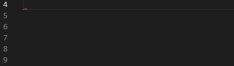

# Code Snippets

The Telerik Visual Studio Code extension provides a handy feature for increased developer productivity – code snippets for fast UI component reference and configuration. 

## Get the Extension

To use the **Telerik UI for Blazor Code Snippets**, install the Telerik UI for Blazor Visual Studio Code Extension. @[template](/_contentTemplates/common/general-info.md#vs-code-x-download)

## Add a Code Snippet to a .razor page

1. Use the `tb` shortcut that stands for Telerik Blazor and select a snippet from the dropdown menu.
    1. Alternatively, you can type the name of the component and the available snippets will appear in a dropdown menu. 
1. Use a `Tab` sequence to populate the available attributes of the component

>caption Add a code snippet to your .razor page

## Available Code Snippets

| Code Snippet               | Component                                |
|----------------------------|------------------------------------------|
| tb-autocomplete            | [AutoComplete]() |
| tb-autocomplete-filterable | [AutoComplete with Filtering]() |
| tb-barcode                 | [Barcode]()     |
| tb-breadcrumb              | [Breadcrumb]() |
| tb-button                  | [Button]() |
| tb-button-settings         | [Button with Appearance Settings]() |
| tb-calendar                | [Calendar]() |
| tb-carousel                | [Carousel]()   |
| tb-checkbox                | [Checkbox]()   |
| tb-checkbox-tristate       | [Checkbox in Indeterminate State]() |
| tb-chunkprogressbar        | [ChunkProgressBar]() |
| tb-colorgradient           | [ColorGradient]() |
| tb-colorpalette            | [ColorPalette]()    |
| tb-colorpicker             | [ColorPicker]() |
| tb-combobox                | [ComboBox]() |
| tb-combobox-filterable     | [ComboBox with Filtering]() |
| tb-contextmenu             | [ContextMenu]() |
| tb-dateintput              | [DateInput]() |
| tb-datepicker              | [DatePicker]() |
| tb-daterangepicker         | [DateRangePicker]() |
| tb-datetimepicker          | [Date-Time Picker]() |
| tb-dialog                  | [Dialog]()       |
| tb-drawer                  | [Drawer]()       |
| tb-dropdownlist            | [DropDownList]() |
| tb-dropdownlist-filterable | [DropDownList with Filtering]() |
| tb-editor                  | [Editor]()       |
| tb-fileselect              | [FileSelect]() |
| tb-filter                  | [Filter]()       |
| tb-flatcolorpicker         | [FlatColorPicker]() |
| tb-form                    | [Form]()           |
| tb-gantt                   | [Gantt]()         |
| tb-gantt-editable          | [Gantt with Editing]() |
| tb-ganttcolumn             | [Gantt - Databound Column]() |
| tb-grid                    | [Grid]()           |
| tb-grid-editable           | [Grid with Editing]() |
| tb-gridcolumn              | [Grid - Databound Column]() |
| tb-gridcolumn-locked       | [Grid with Frozen Column]() |
| tb-gridlayout              | [GridLayout]() |
| tb-listview                | [ListView]()   |
| tb-listview-editable       | [ListView with Editing]() |
| tb-loader                  | [Loader]()       |
| tb-loadercontainer         | [LoaderContainer]() |
| tb-maskedtextbox           | [Masked Textbox]() |
| tb-menu                    | [Menu]() |
| tb-multiselect             | [MultiSelect]() |
| tb-multiselect-filterable  | [MultiSelect with Filtering]() |
| tb-numerictextbox          | [Numeric Textbox]() |
| tb-pager                   | [Pager]()         |
| tb-panelbar                | [PanelBar]()   |
| tb-progressbar             | [ProgressBar]() |
| tb-qrcode                  | [QRCode]()       |
| tb-radiogroup              | [RadioGroup]() |
| tb-rangeslider             | [RangeSlider]() |
| tb-scheduler               | [Scheduler]() |
| tb-scheduler-editable      | [Scheduler with Editing]() |
| tb-slider                  | [Slider]()       |
| tb-splitter                | [Splitter]()   |
| tb-stacklayout             | [StackLayout]() |
| tb-stepper                 | [Stepper]()     |
| tb-switch                  | [Switch]()       |
| tb-tabstrip                | [TabStrip]() |
| tb-textarea                | [TextArea]()   |
| tb-textbox                 | [Textbox]() |
| tb-tilelayout              | [TileLayout]() |
| tb-timepicker              | [Time Picker]() |
| tb-togglebutton            | [ToggleButton]() |
| tb-tooltip                 | [Tooltip]()     |
| tb-treelist                | [TreeList]()   |
| tb-treeList-editable       | [TreeList with Editing]() |
| tb-treelistcolumn          | [TreeList - Databound Column]() |
| tb-treelistcolumn-locked   | [TreeList with Frozen Column]() |
| tb-treeview                | [TreeView]()   |
| tb-upload                  | [Upload]()       |
| tb-window                  | [Window]() |
| tb-wizard                  | [Wizard]()       |