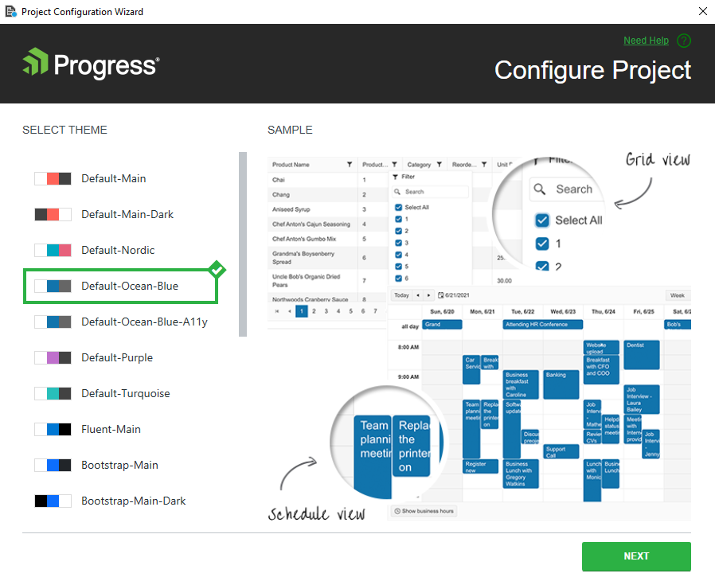
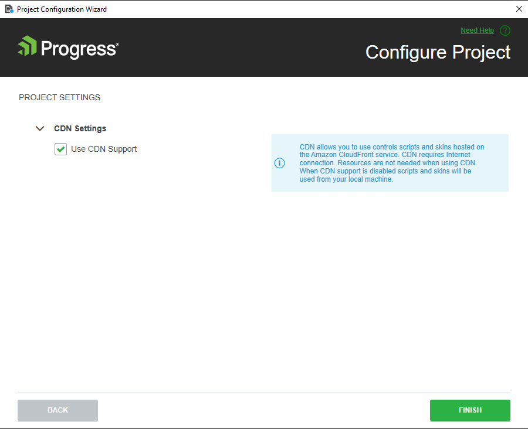

# Configuring Existing Telerik UI for Blazor Projects

This article demonstrates how to configure an existing Telerik UI for Blazor application by using the **Project Configuration Wizard**. The wizard comes with the Telerik UI for Blazor VS extension and helps you to modify settings like visual theme, use of CDN, and localization configuration in an already existing project.

To use the wizard, your project must be already [configured as a Telerik UI for Blazor application]() and be able to use the Telerik UI components.

To open the **Project Configuration Wizard**, click **Extensions** > **Telerik** > **Telerik UI for Blazor** > **Configure Project**.

The configuration wizard handles the following tasks:  
- [Theme selection](#theme-selection)
- [Project settings configuration](#project-settings)

## Theme Selection

The **Theme Selection** page enables you to change the [visual theme](https://docs.telerik.com/blazor-ui/styling-and-themes/overview#built-in-themes) of your Telerik UI for Blazor application.

After selecting the desired theme, click **Next** to navigate to the [Project settings](#project-settings) page.

## Project Settings

The **Project Settings** page allows you to enable/disable the [Telerik UI CDN support](https://docs.telerik.com/blazor-ui/getting-started/what-you-need#using-cdn).

## See Also

* [Visual Studio Integration Overview]()
* [Convert to Telerik Project]()
