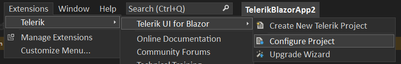

# Configuring Existing Telerik UI for Blazor Projects

This article demonstrates how to configure an existing Telerik UI for Blazor application by using the Project Configuration Wizard. The wizard comes with the Telerik UI for Blazor VS extensions and helps you to modify settings like the visual theme, CDN utilization, and configuration for content localizing in existing projects.

To use the wizard, your project must be already [configured as a Telerik UI for Blazor application](slug://getting-started-vs-integration-convert-project) and be able to use the Telerik UI components.

To open the Project Configuration Wizard, click **Extensions** > **Telerik** > **Telerik UI for Blazor** > **Configure Project**.

The configuration wizard handles the following tasks:  
- [Theme selection](#theme-selection)
- [Project settings configuration](#project-settings)

## Theme Selection

The **Theme Selection** page enables you to change the [CSS theme](slug://themes-overview) of your Telerik UI for Blazor application.

After selecting the desired theme, click **Next** to navigate to the [Project Settings](#project-settings) page.

## Project Settings

The **Project Settings** page allows you to enable or disable:

* The [Telerik UI CDN support](slug://common-features-cdn). Note that this can affect the future [upgrade process of the theme](slug://upgrade-tutorial#upgrade-process).
* The [Font Icons](slug://common-features-icons) in the project.

## See Also

* [Visual Studio Integration for Telerik UI for Blazor Overview](slug://getting-started-vs-integration-overview)
* [Converting to Telerik Projects](slug://getting-started-vs-integration-convert-project)
