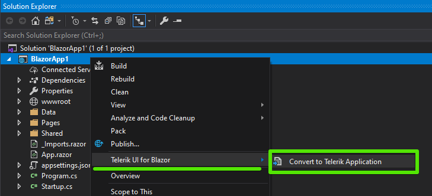
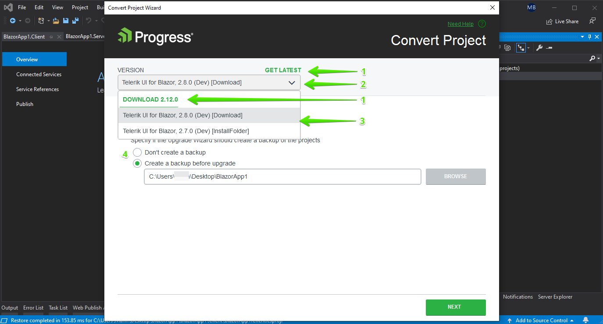
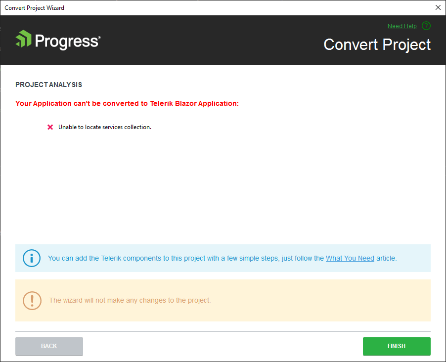

# Convert to Telerik Application

This article demonstrates how to enable the Progress&reg; Telerik&reg; UI for Blazor components in your existing Blazor app with a few mouse clicks. This can be helpful if you already have a substantial app, or you want to use the Microsoft templates to start with features like authentication and add UI components later.

To add the Telerik Components to your existing Blazor application, use the **Convert Project Wizard**. The wizard detects all installed versions of Telerik UI for Blazor and lists them in the **Version** combobox&mdash;this enables you to start your project with the desired version. You can also [get the latest version]() to make sure you are up to date.

## Get the Wizard

To use the **Convert Project Wizard**, install the Telerik UI for Blazor Visual Studio Extensions. @[template](/_contentTemplates/common/general-info.md#vsx-download)

## Start the Wizard

You have two options to start the wizard:

* [The Project Context Menu](#project-context-menu)
* [The VS Extensions Menu](#extensions-menu)

### Project Context Menu

1. In the **Solution Explorer**, select the Blazor app you want to add the Telerik components to (either WebAssembly, or Server-side Blazor)
1. **Right click** the **project file** and select **Telerik UI for Blazor** > **Convert to Telerik Application**.
1. Follow the wizard.

>caption Start the Convert Wizard from the project context menu

### Extensions Menu

Alternatively, instead of the context menu, you can use the Visual Studio extensions menu at the top:

1. In the **Solution Explorer**, select the Blazor app you want to add the Telerik components to (either WebAssembly, or Server-side Blazor)
1. Open the **Extensions** menu.
1. Click **Telerik** > **Telerik UI for Blazor** > **Convert to Telerik Application**.
1. Follow the wizard.

>caption Start the wizard from the Extensions menu
    

## Features

The wizard provides you with the following options:

1. The ability to download the latest available version.
1. A version selector so you can choose a particular version to add to the project.
1. A list with the versions found on your machine that you can choose from.
1. Whether to back up the project state before the conversion (in a folder called `<ProjectName>_Backup>_<timestamp>`).

The wizard automates several steps for you, that you can also perform manually. To get a better understanding of what the wizard does for you, see either of the following articles (they provide the same information in different formats):

* [Getting Started with Client-side apps]()
* [Getting Started with Server-side apps]()
* [Overview of what you need]()

## Troubleshooting

There are three common problems when converting a project:

* The convertion wizard fails with an [error screen](#error-screen)
* The [Telerik components do not work](#components-fail) after you run the converted project
* [An Extra Shared Folder Appears](#extra-shared-folder)

### Error Screen

If you see an error screen similar to the one below, make sure that the actual Blazor application is selected in the Solution Explorer. This is most common with WebAssembly types of applications as they consist of a Server and Shared projects by default, and only the Client project is the actual Blazor app that needs the Telerik components.

In case the automation fails for other reasons and you see an exception dialog message from the Telerik extensions, it is likely that something a bit peculiar is happening with the particular project and you would have to perform the steps by hand. There are only three, and you can find them in the [What You Need]() article.

>caption Error screen when the project can't be converted

### Components Fail

The issue can manifest in a couple of ways:

* The components have no styling
* There are JavaScript errors that Telerik objects cannot be found

The most common reason for this problem is a mismatch between the installed version and the actual license that you have. For example, the wizard did not properly detect it, or there is only a Trial version installed, but you already have a commercial license, yet you never installed the commercial version.

At its root, the problem stems from wrong paths to the needed web assets and you can easily fix it by opening your index file (`wwwroot/index.html` for a WebAssembly app, and `Pages/_Host.cshtml` for a server-side Blazor app) - the wizard has left comments in the `<head>` near the Telerik assets that show the correct paths for a trial and commercial license.

### Extra Shared Folder

You may get a `Shared` folder that contains a file `TelerikLayout.razor` in an unexpected place in the project. This can happen when a folder in the project was selected instead of the project itself, when running the convert wizard.

The fix is to simply move the `TelerikLayout.razor` file to the original `Shared` folder of your project, next to the `MainLayout.razor` file.

## See Also

* [Visual Studio Extensions Overview]()
* [Downloading the Latest Telerik UI for Blazor Versions]()
* [Getting Started with Client-side apps]()
* [Getting Started with Server-side apps]()
* [Overview of what you need]()

