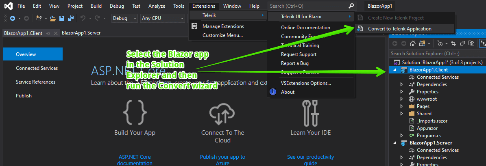

# Convert to Telerik Application

This article demonstrates how to enable the Progress&reg; Telerik&reg; UI for Blazor components in you existing Blazor app with a few mouse clicks.

To add the Telerik Components to you existing Blazor application, use the use the **Convert Project Wizard**. The wizard detects all installed versions of Telerik UI for Blazor and lists them in the **Version** combobox&mdash;this enables you to start your project with the desired version. You can also [get the latest version]() to make sure you are up to date.

## Get the Wizard

To use the **Convert Project Wizard**, install the Telerik UI for Blazor Visual Studio Extensions. @[template](/_contentTemplates/common/general-info.md#vsx-download)

## Start the Wizard

To start the wizard, do the following:

1. In the **Solution Explorer**, select the Blazor app you want to add the Telerik components to (either WebAssembly, or Server-side Blazor)
1. Open the **Extensions** menu.
1. Click **Telerik** > **Telerik UI for Blazor** > **Concert to Telerik Application**.
1. Follow the wizard.

The wizard, basically, adds the information from the [What You Need]() article to your project.
    

The wizard provides you with the following options:

1. The ability to download the latest available version.
1. A version selector so you can choose a particular version to add to the project.
1. A list with the versions found on your machine that you can choose from.
1. Whether to back up the project state before the conversion (in a folder called `<ProjectName>_Backup>_<timestamp>`).

To get a better understanding of what the wizard does for you, see either of the following articles:

* [Getting Started with Client-side apps]()
* [Getting Started with Server-side apps]()
* [Overview of what you need]()

## Troubleshooting

There are two common problems when converting a project:

* The convertion wizard fails with an [error screen](#error-screen)
* The [Telerik components do not work](#components-fail) after you run the converted project

### Error Screen

If you see an error screen similar to the one below, make sure that the actual Blazor application is selected in the Solution Explorer. This is most common with WebAssemly types of applications as they consist of a Server and Shared projects by default, and only the Client project is the actual Blazor app that needs the Telerik components.

In case the automation fails for other reasons and you see an exception dialog message from the Telerik extensions, it is likely that something a bit peculiar is happening with the particular project and you would have to perform the steps by hand. There are only three, and you can find them in the [What You Need]() article.

>caption Error screen when the project can't be converted

### Components Fail

The issue can manifest in a couple of ways:

* The components have no styling
* There are JavaScript errors that Telerik objects cannot be found

The most common reason for this problem is a mismatch between the installed version and the actual license that you have. For example, the wizard did not properly detect it, or there is only a Trial version installed, but already have a license, but simply never installed the new version.

At its root, the problem stems from wrong paths to the needed web assets and you can easily fix it by opening your index file (`wwwroot/index.html` for a WebAssembly app, and `Pages/_Host.cshtml` for a server-side Blazor app) - the wizard has left comments in the `<head>` near the Telerik assets that show the correct paths for a trial and commercial license.

## See Also

* [Visual Studio Extensions Overview]()
* [Downloading the Latest Telerik UI for Blazor Versions]()
* [Getting Started with Client-side apps]()
* [Getting Started with Server-side apps]()
* [Overview of what you need]()

