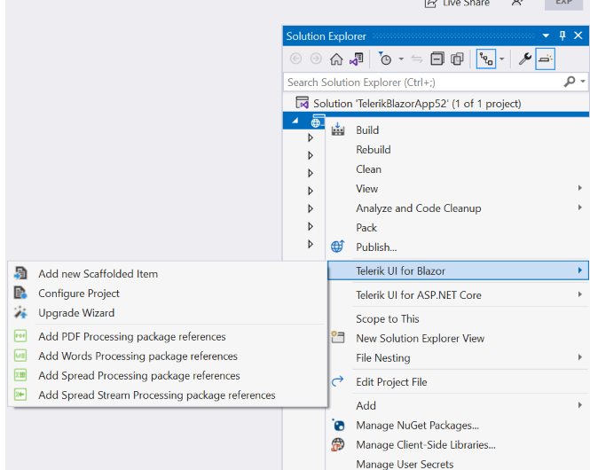
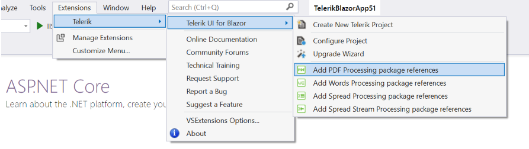
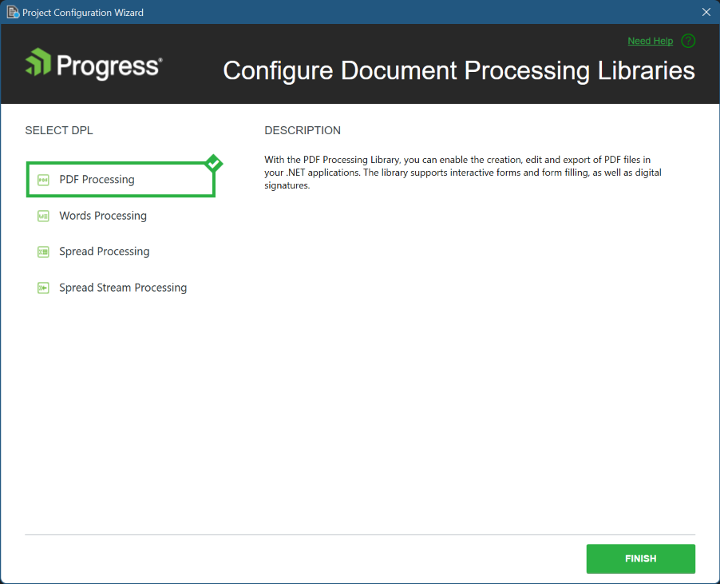

# Configuring Document Processing Libraries

This article demonstrates how to add a reference to the [Telerik Document Processing Libraries (DPL)](https://www.telerik.com/document-processing-libraries) packages in an existing Telerik UI for Blazor application using the Document Processing Libraries Wizard. The wizard is included in the [Telerik UI for Blazor Visual Studio extensions](https://marketplace.visualstudio.com/items?itemName=TelerikInc.TelerikBlazorVSExtensions) and enables you to easily add the required packages when working with the Telerik Document Processing Library.

## Getting the Wizard

To use the Document Processing Libraries Wizard, install the Telerik UI for Blazor Visual Studio (VS) extensions. @[template](/_contentTemplates/common/general-info.md#vsx-download)

## Starting the Wizard

To start the wizard, use either of the following options:

* [The Project Context Menu](#project-context-menu)
* [The VS Extensions Menu](#extensions-menu)

### Project Context Menu

1. In the **Solution Explorer**, right-click the Blazor app in which you want to add a Telerik DPL package.
1. Right-click the project node and select **Telerik UI for Blazor**.
1. Select the package you want to include.

>caption Start the Document Processing Libraries Wizard from the Context Menu

### Extensions Menu

1. In the **Solution Explorer**, select the Blazor app in which you want to add a Telerik DPL package.
1. Open the **Extensions** menu.
1. Click **Telerik** > **Telerik UI for Blazor**.
1. Select the package you want to include.

>caption Start the Document Processing Libraries Wizard from the Extensions Menu

When you select a package, the main page of the Wizard will appear. In the **SELECT DPL** section, all available packages will be listed, and the one you selected will be highlighted. Clicking the **FINISH** button will install the selected package and add the necessary references to your application.

>caption Document Processing Libraries Wizard Main Page

## See Also

* [Visual Studio Integration for Telerik UI for Blazor Overview](slug:getting-started-vs-integration-overview)