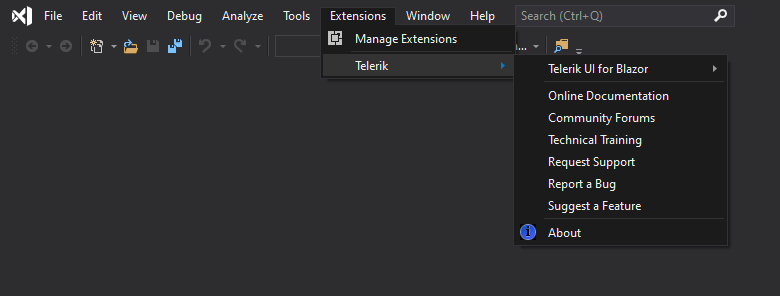

# Visual Studio Integration Overview

The Progress&reg; Telerik&reg; UI for Blazor Visual Studio (VS) Extensions enhance the experience in developing Blazor web applications with Telerik UI for Blazor.

As their primary advantage, the VS extensions facilitate the [creation of projects](). They can also give you notifications to [get the latest version]().

The Telerik UI for Blazor VS extensions support Visual Studio 2019 Preview. You can get them from the:

* [Visual Studio Marketplace](https://marketplace.visualstudio.com/items?itemName=TelerikInc.TelerikBlazorVSExtensions)
* [Telerik UI for Blazor MSI installer]()

To access the VS extensions, go to the **Extensions** > **Telerik** > **Telerik UI for Blazor** menu.

## See Also

* [Creating New Projects with Visual Studio]()
* [Downloading the Latest Telerik UI for Blazor Versions]()
