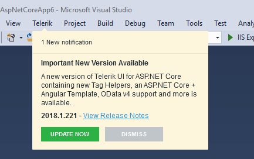

# Download New Versions

The Progress&reg; Telerik&reg; UI for Blazor Visual Studio (VS) extensions enable you to keep your projects updated.

The Latest Version Retrieval tool automatically checks for the latest Telerik UI for Blazor distribution which is available for you on the Telerik website. Once a day, upon loading a project with Telerik UI for Blazor components, the extensions query the Telerik website for a new version of Telerik UI for Blazor. When a new version is detected, a notification is displayed that lets you download it.

Clicking the **Update Now** button starts the Latest Version Acquirer tool which prompts for your Telerik credentials on its first page. If you do not have a [www.telerik.com](https://www.telerik.com) account, you can create one through the **Create an account for free** link.

1. Log in with your Telerik credentials

    >tip To avoid having to enter your Telerik credentials multiple times, use the **Save my password** checkbox. The persistence is securely done and the credentials are saved in a per-user context. Other users on the machine do not have access to your stored credentials.

    

    >tip You can go to the [release notes of Telerik UI for Blazor](https://www.telerik.com/support/whats-new/blazor-ui/release-history) to get information on the latest available versions and what they bring.

1. In the dialog that appears, click the **Download** button and follow the next steps.

    

1. To access the latest version of Telerik UI for Blazor that you just downloaded go to [New Project Wizard]().

    >tip The **Download** and **Get Latest** buttons of the **New Project Wizard** launch the **Latest Version Acquirer** tool. If you are coming from them, you will be returned to that context, so you can choose the newer version now.

    
    
    
>tip The **Latest Version Acquirer** tool downloads a `.zip` file which contains the latest Telerik UI for Blazor packages. It is saved in the `%APPDATA%\Telerik\Updates` folder by default. If you find the list of the offered packages too long and you do not need the older versions, close VS and use the Windows Explorer to delete these distributions.

## See Also

* [Visual Studio Extensions Overview]()
* [Creating New Projects with Visual Studio]()
