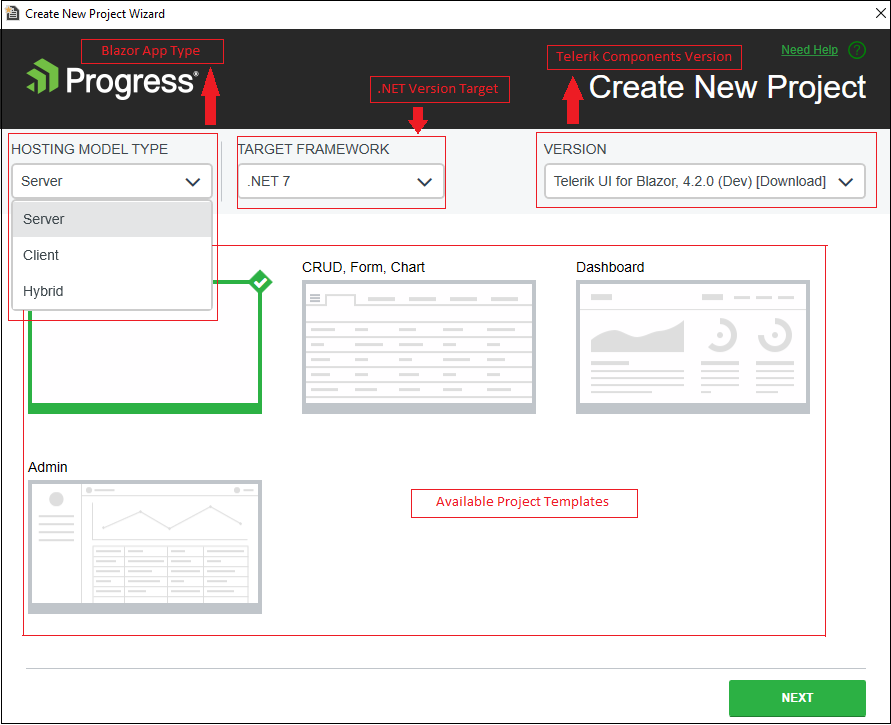
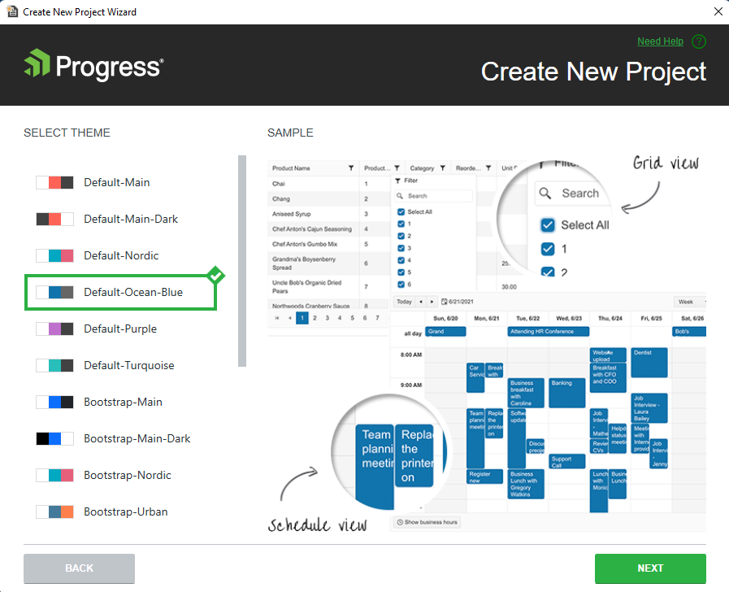
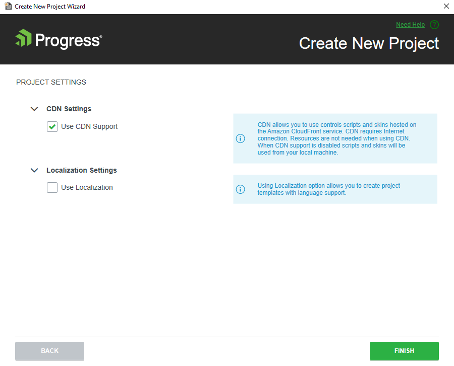

# Creating New Projects

This article demonstrates how to use the Telerik Visual Studio extensions to create a new project that is pre-configured for the Progress&reg; Telerik&reg; UI for Blazor components.

To create a new Telerik UI for Blazor application, use the Create New Project wizard. The wizard detects all installed versions of Telerik UI for Blazor and lists them in the **Version** combobox&mdash;this feature enables you to start your project with the desired version. To make sure the components are up to date, you can also [get the latest version]().

The Create New Project Wizard automates a set of steps that you otherwise must perform manually.

The wizard adds the following client assets to your project:
* [Telerik stylesheet](#css-theme-and-javascript-files)
* [JS Interop file](#css-theme-and-javascript-files)

The wizard also configures the project to use the Telerik UI for Blazor components by adding the following utilities:
* [Required `@using` directives](#namespaces) to the `~/_Imports.razor` file.
* [`TelerikLayout.razor` component](#telerikrootcomponent) at the root level of the DOM.
* Registration of the [Telerik services](#service).

## Getting the Wizard

To use the **Create New Telerik Project** wizard, install the Telerik UI for Blazor Visual Studio Extension. @[template](/_contentTemplates/common/general-info.md#vsx-download)

## Starting the Wizard

To start the wizard, use either of the following options:

* [The Extensions Menu](#extensions-menu)
* [The VS Extensions Menu](#project-menu)

### Extensions Menu

1. Open the **Extensions** menu.
1. Click **Telerik** > **Telerik UI for Blazor** > **Create New Project**.
1. Follow the instructions.

### Project Menu

1. Click **File** > **New** > **Project**.
1. Find and click the **Telerik C# Blazor Application** option (you can use the search, or filter by Blazor templates).
1. Follow the instructions.

## Using the Wizard

In the order of their appearance, the Create New Project wizard presents the following screens with options that will assist you to configure your new app:

1. On the first screen, you can select a location and a name for your project.

2. On the second screen, you can choose:

   * A WebAssembly, server-side, or Hybrid Blazor app.
   * The .NET version you want to use.
   * The Telerik UI for Blazor version.
   * One of the [predefined Telerik project](#predefined-project-templates) templates.

   

3. On the third screen, you can choose from different [themes]().

   

4. On the final screen, you need to decide the following:

   * Whether to import the required Telerik UI stylesheet and JS Interop file by suing the [static assets](/blazor-ui/getting-started/what-you-need#using-static-assets) or the [CDN method](/blazor-ui/getting-started/what-you-need#using-cdn).
   * Whether to use localization in the project or not.

   

### Predefined Project Templates

The Create New Project wizard provides the following project templates:

* **Blank**&mdash;A blank solution based on the Microsoft template with added Telerik UI components (NuGet package reference, assets, service, and the `TelerikRootComponent`).
* **CRUD, Form, Chart**&mdash;A small app that showcases the Telerik UI Data Grid, Chart, and forms validation. The Grid also uses a basic CRUD service which is a common pattern for data updates in real applications.
* **Dashboard**&mdash;A basic dashboard layout that uses the TileLayout component for customizable dashboards, and showcases several ways individual blocks (tiles) can fetch data.
* **Admin**&mdash;A small app that shows a dashboard for admin. The app uses some of the main Telerik UI components like the [Data Grid](), [Chart](), [TileLayout](), [Form](), and more.

## See Also

* [Telerik UI for Blazor Visual Studio Extensions Overview]()
* [Downloading the Latest Telerik UI for Blazor Versions]()
* [Getting Started with Client-Side Apps]()
* [Getting Started with Server-Side Apps]()
* [Workflow for Using the UI Components for Blazor]()
