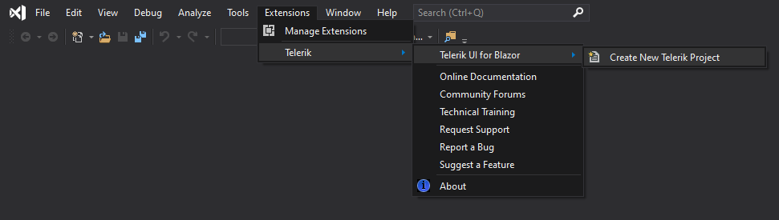
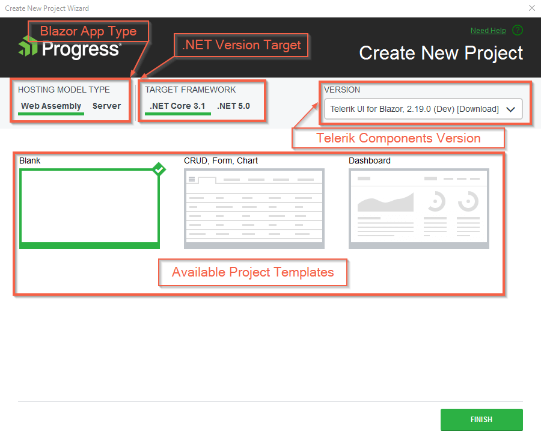

# Create New Projects

This article demonstrates how to use the Telerik Visual Studio Extensions to create a new project that is pre-configured for the Progress&reg; Telerik&reg; UI for Blazor components.

To create a new Telerik UI for Blazor application, use the **Create New Project** wizard. The wizard detects all installed versions of Telerik UI for Blazor and lists them in the **Version** combobox&mdash;this enables you to start your project with the desired version. You can also [get the latest version]() to make sure the components are up to date.

## Get the Wizard

To use the **Create New Telerik Project** wizard, install the Telerik UI for Blazor Visual Studio Extensions. @[template](/_contentTemplates/common/general-info.md#vsx-download)

## Start the Wizard

To start the wizard, use either of the following approaches:

* The **Extensions** menu:

    1. Open the **Extensions** menu.
    1. Click **Telerik** > **Telerik UI for Blazor** > **Create New Project**.
    1. Follow the wizard.

* The **Project** menu:

    1. Click **File** > **New** > **Project**.
    1. Find and click the **Telerik C# Blazor Application** option (you can use the search, or filter by Blazor templates).
    1. Follow the wizard.
    

The **Create New Project** wizard presents two screens:

1. On the first screen, you can select a location and name for your app.

1. On the second screen, you can choose:

   * A WebAssembly or server-side Blazor app.
   * The .NET version you want to use.
   * The Telerik UI for Blazor version.
   * One of the predefined Telerik project templates.

The following project templates are available:

* **Blank** - This is a blank solution based on the Microsoft template, but with added Telerik components (NuGet package reference, assets, service, the TelerikRootComponent).

* **CRUD, Form, Chart** - A small app that showcases the Telerik Grid, Chart, and forms validation. The grid also uses a basic CRUD service&mdash;a common pattern for data updates in real applications.

* **Dashboard** - A basic dashboard layout that uses the TileLayout component for customizable dashboards and showcases several ways individual blocks (tiles) can fetch data.

The wizard automates several steps for you that you can also perform manually. To get a better understanding of what the wizard does for you, see either of the following articles (they provide the same information in different formats):

* [Getting Started with Client-side apps]()
* [Getting Started with Server-side apps]()
* [Overview of what you need]()

## See Also

* [Visual Studio Extensions Overview]()
* [Downloading the Latest Telerik UI for Blazor Versions]()
* [Getting Started with Client-side apps]()
* [Getting Started with Server-side apps]()
* [Overview of what you need]()

