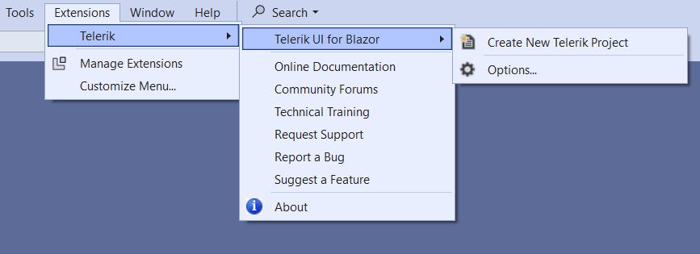
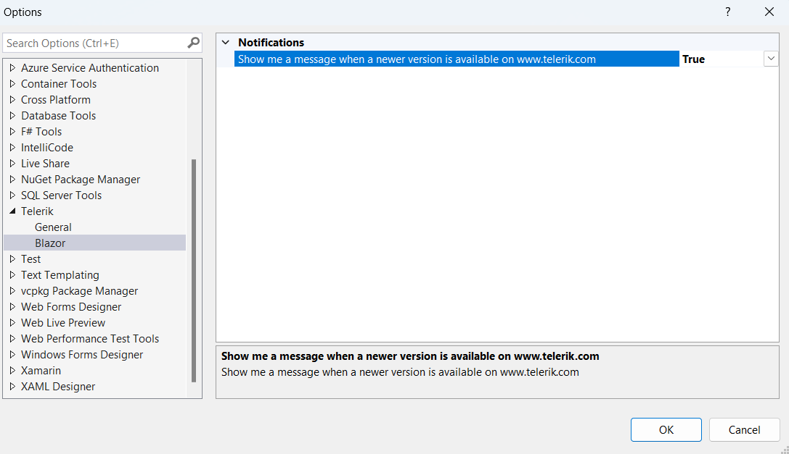
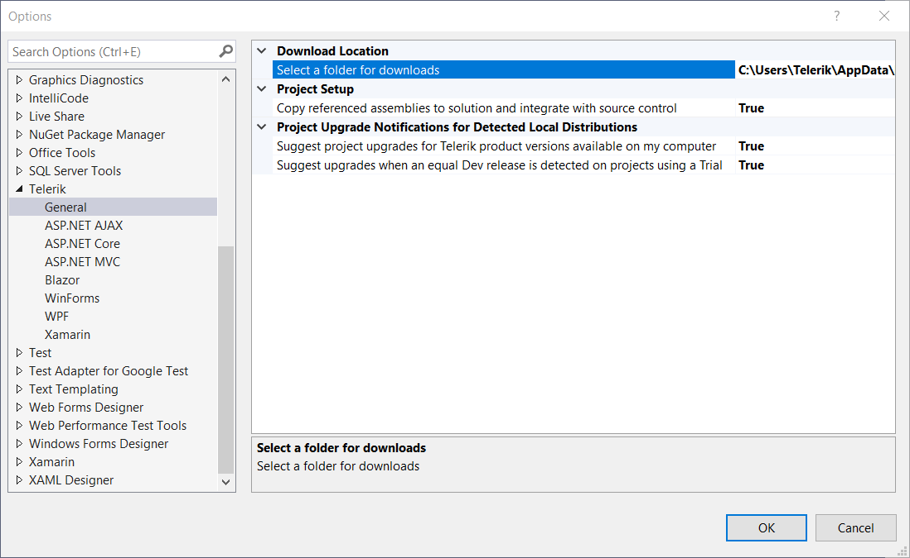

# Options

The **Options** dialog enables you to configure the Telerik Visual Studio Extensions to best suit your needs.

The dialog can be accessed through **Visual Studio** > **Extensions** > **Telerik** > **Telerik UI for Blazor** > **Options...**



The **Options** dialog contains two sets of configurations that affect the Telerik UI for Blazor Visual Studio Extension:

* [Notifications](#notifications-options)
* [General](#general-options)

The settings under the **General** category affect all installed Telerik Visual Studio Extensions—including those for other development platforms.

## Notifications Options

This setting controls whether a message will be displayed to indicate when a newer version of Telerik UI for Blazor  is available:



## General Options

The **General Options** window includes the following configurations:




### Download Location

This setting allows you to select the folder for downloading the Telerik UI for Blazor package. The default path is:

````C#.skip-repl
C:\Users\[username]\AppData\Roaming\Telerik\Updates
````

### Project Setup

* **Copy referenced assemblies to solution and integrate with source control**—When enabled, the referenced assemblies will be copied to the solution when using Telerik wizards. `True` by default.

### Project Upgrade Notifications for Detected Local Distributions

* **Suggest project upgrades for Telerik product versions available on my computer**—`True` by default.

* **Suggest upgrades when an equal Dev release is detected on projects using a Trial**—`True` by default.

## See Also

* [Creating New Projects with Visual Studio](slug:getting-started-vs-integration-new-project )
* [Updating Projects with Visual Studio](slug:getting-started-vs-integration-upgrade-project )
