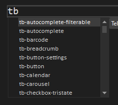

# Blazor Code Snippets

The Telerik Visual Studio extension provides a handy feature for increased developer productivity – code snippets for fast UI component reference and configuration. 

## Get the Extension

To use the **Telerik UI for Blazor Code Snippets**, install the Telerik UI for Blazor Visual Studio Extension. @[template](/_contentTemplates/common/general-info.md#vsx-download)

## Add a Code Snippet to a .razor page

1. Use the `tb` shortcut that stands for Telerik Blazor and select a snippet from the dropdown menu.
    1. Alternatively, type the component name, and the available snippets will appear in a dropdown menu. 
1. Use a `Tab` sequence to populate the available attributes of the component.

>caption Add a code snippet to your .razor page

## Available Code Snippets

@[template](/_contentTemplates/common/general-info.md#code-snippets-table)
