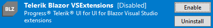

# Troubleshooting

This article provides solutions for common issues you may encounter while working with the Telerik UI for Blazor Visual Studio (VS) extensions.

## The Telerik sub-menu is Missing from the Extensions Menu

**Cause** The Visual Studio extensions are disabled or not correctly installed.

**Solution** Depending on whether the extension is disabled or not correctly installed, use either of the following approaches.

If the extension is disabled:

1. Open Visual Studio.
1. From the menu bar, select **Extensions** > **Manage Extensions**.
1. Open the **Installed** tab.
1. Search for **Telerik Blazor VSExtensions** and make sure they are **Enabled**.

    

If the extensions are not correctly installed:

1. Open Visual Studio.
1. From the menu bar, select **Extensions** > **Manage Extensions**.
1. Open the **Online** tab.
1. Search for **Telerik Blazor VSExtensions**
1. Download and install the extensions.

If after you apply the described approaches the issue persists, contact the Support Team at Progress after you generate Visual Studio [ActivityLog](https://docs.microsoft.com/en-us/visualstudio/ide/reference/log-devenv-exe?view=vs-2019) file:

1. Under **Administrative rights**, open the [**Developer Command** prompt](https://docs.microsoft.com/en-us/dotnet/framework/tools/developer-command-prompt-for-vs) for Visual Studio.
1. Execute the `devenv /log %userprofile%\desktop\ActivityLog.xml` command to start Visual Studio and create logs on your Desktop.
1. Reproduce the issue.
1. Attach the `Activitylog` files when you contact our support.

## See Also

* [Visual Studio Extensions Overview]()
* [Creating New Projects with Visual Studio]()
* [Downloading the Latest Telerik UI for Blazor Versions]()
