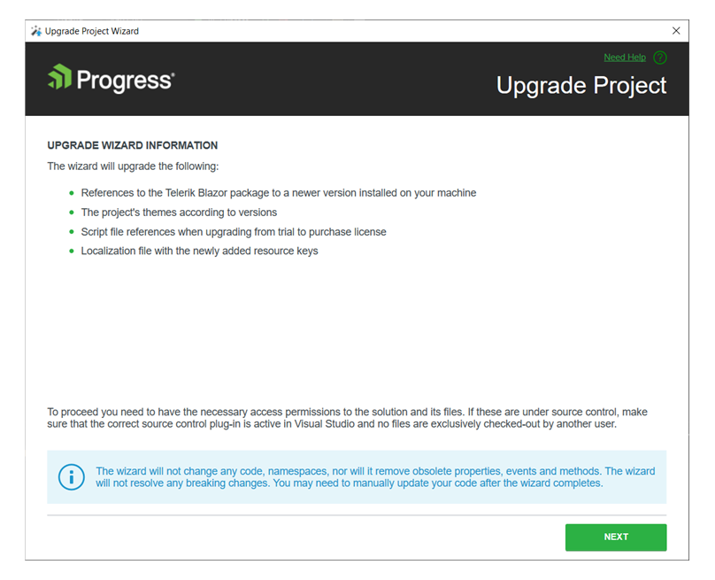
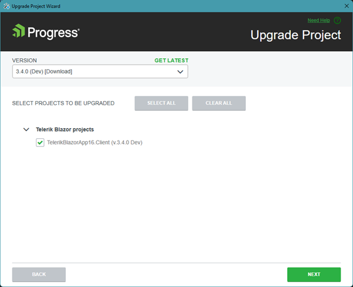
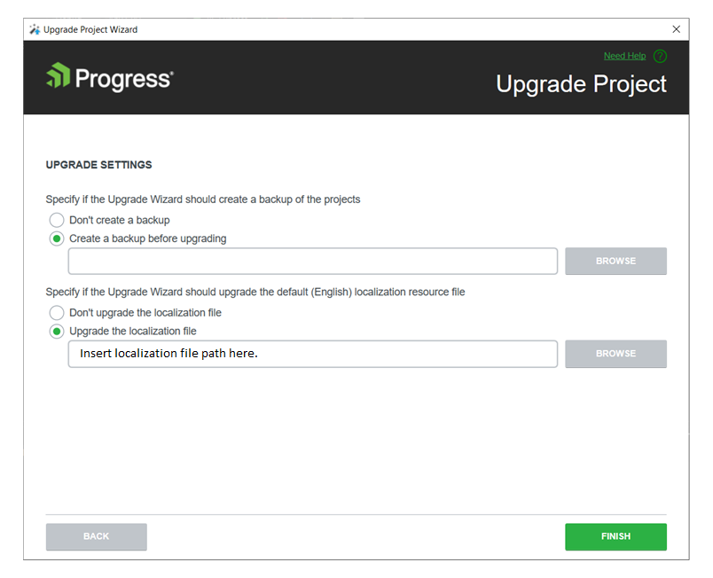

# Upgrading Projects

This article demonstrates how to use the [Telerik Visual Studio Extension]() to upgrade a project that is pre-configured for the Progress&reg; Telerik&reg; UI for Blazor components.

## The Basics

The Upgrade Project Wizard upgrades the version of an existing Telerik UI for Blazor applications. To open the wizard, right Click on the **Project in the Solution Explorer -> Telerik UI for Blazor -> Upgrade Wizard**.

## Files for Upgrade

The **Information Page** of the Upgrade Project Wizard describes the files and assemblies that are going to be upgraded.

* The Telerik Blazor Upgrade Wizard will do the following: 

    1. Update the version of the referenced Blazor NuGet package. It will also update the package source in the solution-based NuGet config file.
    1. It will update the version of the theme references.
    1. It will update all local script and style and NuGet package references in case client upgrades from Trial to Dev version.
    1. It will add the new keys in the default (English) localization file.

## Projects for Upgrade

On the next page, the Upgrade Wizard lists all projects from the solution in which is used the Telerik UI for Blazor. This enables you to choose the projects that will be updated and the version to which they will be upgraded.

>It is recommended to upgrade all projects to the selected version.

  

## Upgrade Localization File

When **Upgrade the localization file** option is selected, the Upgrade Wizard will add new localization keys from the default (English) localization file in the distribution we upgrade to. The option is selected by default if there is a **Resources\TelerikMessages.resx** file in the current project. In this case, **Resources\TelerikMessages.resx** file is selected in the file browser.

>If the selected file is missing or read-only, the page state is not valid. In this case, the **Finish** button will display a tooltip when clicked, indicating a page error.

  

## Create Backup

You can create a backup before running the upgrade wizard by selecting the **Create a backup before upgrading** option.

> If **Create a backup before upgrading** option is selected, and the **Backup location** is empty, the Next button is disabled.

>When the project and solution are placed in the same directory, the default backup location is set to the **%USERPROFILE%\Documents** folder. This is because otherwise the zipped folder is automatically added as a project item for SDK projects.

  

## Upgrade Log

In case one of the options ([Create a backup before upgrading](#create-backup) or [Upgrade the localization file](#upgrade-localization-file)) is selected, an **Upgrade Log** will be opened in your default browser at the end of the upgrade. The log can show the backup location, an entry for each localization key added or a localization upgrade error. Each upgrade log file is in HTML format. The file name contains the date and time of the upgrade.

  

## See Also

* [Visual Studio Extensions Overview]()
* [Downloading the Latest Telerik UI for Blazor Versions]()
* [Getting Started with Client-Side Apps]()
* [Getting Started with Server-Side Apps]()
* [Workflow for Using the UI Components for Blazor]()

