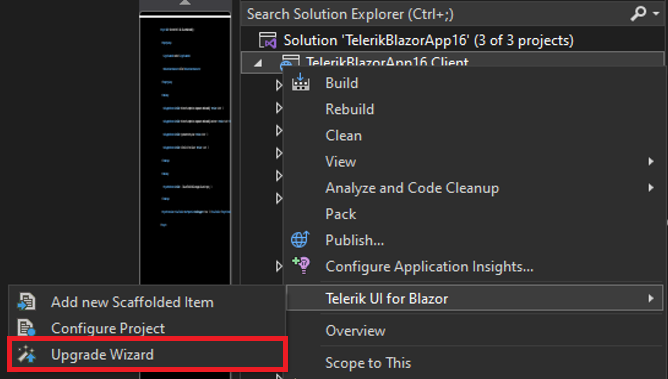

# Upgrading Projects

This article demonstrates how to use the [Telerik Visual Studio Extension](slug:getting-started-vs-integration-overview) to upgrade a project that is pre-configured for the Progress&reg; Telerik&reg; UI for Blazor components.

## Basics

The **Upgrade Project Wizard** upgrades the version of existing Telerik UI for Blazor applications. To open the wizard, right-click on the **Project in the Solution Explorer -> Telerik UI for Blazor -> Upgrade Wizard**.

## Files for Upgrade

The **Upgrade Information** step of the Upgrade Project Wizard describes the files and assemblies that will be upgraded.

The Telerik Blazor Upgrade Wizard will do the following:

* Update the version of the referenced Blazor NuGet package. It will also update the package source in the solution-based NuGet config file.
* Update the version of the theme reference, but only when using CDN. Otherwise, [update the theme manually](slug:getting-started-vs-integration-new-project#step-3-select-theme).
* It will add the new keys in the default (English) localization file.

## Projects for Upgrade

The next page of the Upgrade Wizard lists all projects from the solution that use Telerik UI for Blazor. Choose the projects that you want to upgrade and the version to which they will be upgraded.

>tip We recommend selecting all projects that reference UI for Blazor and upgrading them to the same product version.

## Upgrade Localization File

If localization is enabled in the application, you can select the **Upgrade the localization file** option. The Upgrade Wizard will add new localization keys from the default (English) localization file that UI for Blazor distributes.

The option is selected by default if there is a `Resources\TelerikMessages.resx` file in the current project. In this case, `Resources\TelerikMessages.resx` file is selected in the file browser. 

## Create Backup

You can create a backup before running the upgrade wizard by selecting the **Create a backup before upgrading** option.

>When the project and solution are placed in the same directory, the default backup location is set to the `%USERPROFILE%\Documents` folder.

## Upgrade Log

In case one of the options ([Create a backup before upgrading](#create-backup) or [Upgrade the localization file](#upgrade-localization-file)) is selected, an **Upgrade Log** will open at the end of the upgrade. The log can show the backup location, an entry for each localization key added or a localization upgrade error. Each upgrade log file is in HTML format. The file name contains the date and time of the upgrade.

## Troubleshooting

The **Finish** button will display a tooltip, indicating a page error when:

* The **Upgrade the localization file** option is selected and the pointed directory is empty or the file is read-only.
* The **Create a backup before upgrading** option is selected, and the backup location is empty.

## See Also

* [Visual Studio Extensions Overview](slug:getting-started-vs-integration-overview)
* [Downloading the Latest Telerik UI for Blazor Versions](slug:getting-started-vs-integration-latest-version)
* [Getting Started with Client-Side Apps](slug:getting-started/client-side)
* [Workflow for Using the UI Components for Blazor](slug:getting-started/what-you-need)
