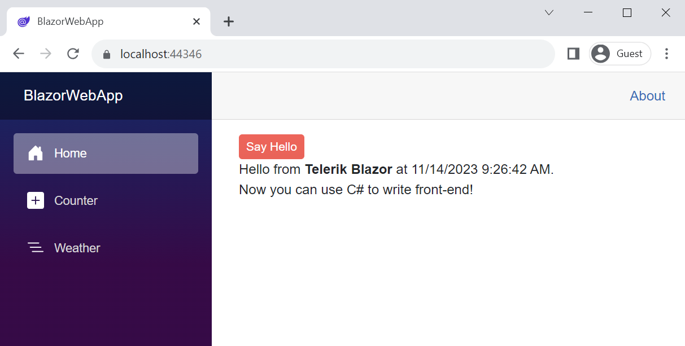

# First Steps with UI for Blazor in a Web App

This article explains how to use the Telerik UI for Blazor components in a <a href = "https://learn.microsoft.com/en-us/aspnet/core/blazor/project-structure?view=aspnetcore-8.0#blazor-web-app" target="_blank">.NET 8 Blazor Web App</a> project template. You will create a new application from scratch, learn how to add the UI for Blazor components to a project, and finally, add a UI component to a view.

@[template](/_contentTemplates/common/get-started.md#prerequisites-download)

## Step 1: Create a New Project

1. Open Visual Studio and select **Create a new project**.

1. Select the [**Blazor Web App**](https://learn.microsoft.com/en-us/aspnet/core/blazor/project-structure?view=aspnetcore-8.0#blazor-web-app) project type, enter a name for your project, and then click **Next**.

1. Select the desired [Interactive render mode](https://learn.microsoft.com/en-us/aspnet/core/blazor/components/render-modes?view=aspnetcore-8.0#render-modes) and Interactivity location (*Global* or *Per page/component*). See the [notes below](#interactivity-considerations) while choosing Interactivity location.

1. Click **Create**.

### Interactivity Considerations

Take into account the following notes when choosing the *Interactivity location* of your Telerik Blazor app:

* We recommend **Global** interactivity location for easier setup and usage of the Telerik components.
* Most Telerik Blazor components require interactivity. They will not respond to user actions and the Blazor framework will not refresh their UI in static render mode. Telerik Blazor components with JavaScript rendering (Barcodes, Charts, Gauges, Maps, and QR Codes) will not render in static mode at all.
* The `Account` section in the Blazor Web App template with identity is static by design. Most Telerik Blazor components will not work in this section.
* The [`TelerikRootComponent` requires interactivity as well](#net-8-notes). Normally, this component should be in a layout file. Layout files are interactive only if the *Interactivity location* is *Global*. If the *Interactivity location* is set to *Per page/component*, then there are three options, which are demonstrated in this [.NET 8 Blazor Web App sample project on GitHub](https://github.com/telerik/blazor-ui/tree/master/rootcomponent/BlazorWebAppServer):
    * Enable global interactivity at runtime when the user navigates to a page (component) with Telerik components inside. To do this, [set the `@rendermode` conditionally in `App.razor`](https://learn.microsoft.com/en-us/aspnet/core/blazor/components/render-modes?view=aspnetcore-8.0#set-the-render-mode-by-component-instance). Blazor Web Apps with identity use the same approach to disable interactivity in the `Account` section.
    * Add a `TelerikRootComponent` on all interactive `.razor` pages, instead of using it in the layout component. A possible side effect may be [wrong popup position](#wrong-popup-position).
    * Have a regular layout (`MainLayout.razor`) for static pages and one empty layout (`EmptyLayout.razor`) for interactive pages with Telerik components. Copy the contents for `MainLayout.razor` to a standard non-layout `.razor` file and use it to wrap the page-specific content. Replace `@Body` with `@ChildContent` in the copied layout content. This approach and code duplication require more effort to maintain, but avoids possible issues with popup position.
* Blazor Web Apps with *WebAssembly* or *Auto* render mode, and *Per page/component* interactivity, have their layout files and interactive `.razor` components in separate projects. This restricts the ability to change the used layout file from the `.razor` component. This point is related to the possible usage of different layout files, depending on the current interactivity location or the availability of a `TelerikRootComponent`.
* Only **child** `.razor` components of the `TelerikRootComponent` have access to the Telerik `DialogFactory` cascading parameter.
* Blazor Web Apps with *WebAssembly* or *Auto* render mode can use `InteractiveServer` mode in `.razor` files in their "server" project.

Refer to the Microsoft documentation for more render mode details:

* [ASP.NET Core Blazor render modes](https://learn.microsoft.com/en-us/aspnet/core/blazor/components/render-modes?view=aspnetcore-8.0)
* [Video: Intro to Blazor in .NET 8 - SSR, Stream Rendering, Auto](https://www.youtube.com/watch?v=walv3nLTJ5g)

@[template](/_contentTemplates/common/get-started.md#add-nuget-feed)

## Step 3: Install the Telerik UI for Blazor Components

1. Right-click the Blazor Server project in the solution and select **Manage NuGet Packages**.

1. Install the Telerik Blazor NuGet package:

  1. Select the `telerik.com` **Package source** that you [added earlier](#step-2-add-the-telerik-nuget-feed-to-visual-studio). As this is a private NuGet feed, you must authenticate with your [Telerik account](https://www.telerik.com/account/) username and password.
  1. Select the **Browse** tab, find the NuGet package, and click **Install**. Commercial license holders must install `Telerik.UI.for.Blazor`. Trial users must install `Telerik.UI.for.Blazor.Trial`.

## Step 4: Enable the Blazor UI Components

To enable the Telerik UI for Blazor components, you must add several client-side dependencies to the application, include the required `@using` statements, add the `TelerikRootComponent` component, and register the Telerik Blazor service.

### 4.1. Add the Telerik UI for Blazor Client Assets

1\. Add the `telerik-blazor.js` file to your `App.razor` file as a [static asset](#using-static-assets) or from a [CDN](#using-cdn).

**HTML**

@[template](/_contentTemplates/common/js-interop-file.md#js-interop-file-snippet)

2\. To select the appearance and color scheme for the Telerik Blazor components, add the [theme stylesheet]() in your `App.razor` file. Reference it as a [static asset](#static-assets) or from a [CDN](#cdn).

**HTML**

@[template](/_contentTemplates/common/js-interop-file.md#theme-static-asset-snippet)

3\. (Optional) To enable the use of static assets in your project, add the `app.UseStaticFiles();` line to the `Program.cs` of your Blazor Server project (by default, this line is already present). This step is required only if your application uses static assets.

**C#**
@[template](/_contentTemplates/common/js-interop-file.md#enable-static-assets-snippet)

### 4.2. Include @using Statements

In the `~/_Imports.razor` file, add the `@using` directives below. This configures the project to recognize the Telerik components in all files. You can register one or both icon namespaces, depending on the [icon type you use]().

**_Imports.razor**
    
    @using Telerik.Blazor
    @using Telerik.Blazor.Components
    @using Telerik.FontIcons
    @using Telerik.SvgIcons

### 4.3. Add the TelerikRootComponent

Add a `TelerikRootComponent` component as a top-level component in the app and make sure it wraps all content. Normally, `TelerikRootComponent` is placed in a layout component, for example, `MainLayout.razor`. `TelerikRootComponent` requires enabled [interactive mode](https://learn.microsoft.com/en-us/aspnet/core/blazor/components/render-modes?view=aspnetcore-8.0), which is true for layout components only if the application's *Interactivity location* is *Global*.

> .NET 8.0 introduced [new render modes for the Blazor components](https://learn.microsoft.com/en-us/aspnet/core/blazor/components/render-modes?view=aspnetcore-8.0). The default render mode is static and not interactive, so you need to make this change explicitly in your app. Make sure to review sections [Interactivity Considerations](#interactivity-considerations) and [`TelerikRootComponent` .NET 8 Notes](#net-8-notes) if you are adding Telerik components to an existing .NET 8 Blazor web application.

The `TelerikRootComponent` placement in the app depends on the selected *Interactivity location* during app creation:

* [Global](#431-apps-with-global-interactivity-location)
* [Per page/component](#432-apps-with-interactivity-location-set-to-per-pagecomponent)

### 4.3.1 Apps with Global Interactivity Location

You can set the render mode for the entire app as suggested in the [Blazor documentation](https://learn.microsoft.com/en-us/aspnet/core/blazor/components/render-modes?view=aspnetcore-8.0#apply-a-render-mode-to-the-entire-app). This will spare the need to set the render mode in every page and component.

<div class="skip-repl"></div>

````App.razor
<!DOCTYPE html>
<html lang="en">

<head>
    @* ... *@

    <HeadOutlet @rendermode="@InteractiveServer" />
</head>

<body>
    <Routes @rendermode="@InteractiveServer" />
    @* ... *@
</body>

</html>
````
````MainLayout.razor
@inherits LayoutComponentBase

<TelerikRootComponent>

    <div class="page">
        <div class="sidebar">
            <NavMenu />
        </div>
        <main>
            <div class="top-row px-4">
                <a href="https://learn.microsoft.com/aspnet/core/" target="_blank">About</a>
            </div>

            <article class="content px-4">
                @Body
            </article>
        </main>
    </div>
</TelerikRootComponent>

<div id="blazor-error-ui">
    An unhandled error has occurred.
    <a href="" class="reload">Reload</a>
    <a class="dismiss">🗙</a>
</div>
````
````Home.razor
@page "/"
  
@* Telerik UI for Blazor components here *@

````

### 4.3.2 Apps with Interactivity Location set to Per page/component

Instead of setting the interactive render mode for the entire app, you can also set it only for specific pages and components. This is useful if you want to have different render modes in the app. In this case, make sure that the `TelerikRootComponent` is part of a component hierarchy that is interactive.

The Telerik components in `Home.razor` below are wrapped by a `TelerikContainer.razor` component, which includes the `TelerikRootComponent` and can be reused, so that the `TelerikRootComponent` is defined only once in the whole app.

Also check this [.NET 8 Blazor Web App sample project on GitHub](https://github.com/telerik/blazor-ui/tree/master/rootcomponent/BlazorWebAppServer), which shows different ways to use the `TelerikRootComponent` and Telerik UI for Blazor in a static Blazor app.

<div class="skip-repl"></div>

````TelerikContainer.razor
@*
    The TelerikContainer allows you to use Telerik Blazor components in the interactive parts of a static app.
    Place the TelerikContainer in interactive Razor components, which are children of static parents.

    The main purpose of the TelerikContainer component is to reuse a
    TelerikRootComponent with the same settings. If you do not have any parameters for the TelerikRootComponent,
    then you do not need a TelerikContainer.
*@

<TelerikRootComponent IconType="@IconType.Svg"
                      EnableRtl="false">
    @ChildContent
</TelerikRootComponent>

@code {
    [Parameter]
    public RenderFragment? ChildContent { get; set; }
}
````
````Home.razor
@page "/"

@rendermode InteractiveServer

<TelerikContainer>
    @* <TelerikContainer> must be recognized as a Razor component.
        Depending on its location, you may need a @using statement in this file or in _Imports.razor. *@

        <p>This part of the page is inside a TelerikRootComponent and can contain Telerik Blazor components.</p>

        <p>
            Notice the usage of a TelerikContainer component.
            Its main purpose is to reuse a TelerikRootComponent with the same settings.
            If the TelerikRootComponent does not set any parameters,
            then you do not need a TelerikContainer.
        </p>

    @* Telerik UI for Blazor components here *@

</TelerikContainer>
````

### 4.4. Register the Telerik Blazor Service

In a Blazor Web App project with interactive render mode Server, you register services in the `Program.cs` file of your project.

For interactive render modes WebAssembly and Auto, register the service in the `Program.cs` file of both the server and client project.

**C#**
@[template](/_contentTemplates/common/js-interop-file.md#register-telerik-service-server)

Now your Blazor Server project can use the Telerik UI for Blazor components.

## Step 5: Add a Component to a View

The final step in this tutorial is to use a Telerik UI for Blazor component in a view and run it in the browser.

1. In the `~/Components/Pages/Home.razor` view, add a `TelerikButton` component.


    **RAZOR**
    
        <TelerikButton>Say Hello</TelerikButton>
        
1. Optionally, hook up a click handler that will show a message. The resulting view will look like this:

    **RAZOR**
    
        @page "/"
        
        <TelerikButton OnClick="@SayHelloHandler" ThemeColor="primary">Say Hello</TelerikButton>
        
        <br />
        
        @helloString
        
        @code {
           MarkupString helloString;
        
           void SayHelloHandler()
           {
               string msg = string.Format("Hello from <strong>Telerik Blazor</strong> at {0}.<br /> Now you can use C# to write front-end!", DateTime.Now);
               helloString = new MarkupString(msg);
           }
        }

1. Run the app in the browser by pressing `F5`. You should see something like this:

    

Well done! Now you have your first Telerik UI for Blazor component running in your Blazor Web App.

## See Also

* [Using .NET 8 Blazor Sections inside Telerik Components]()
