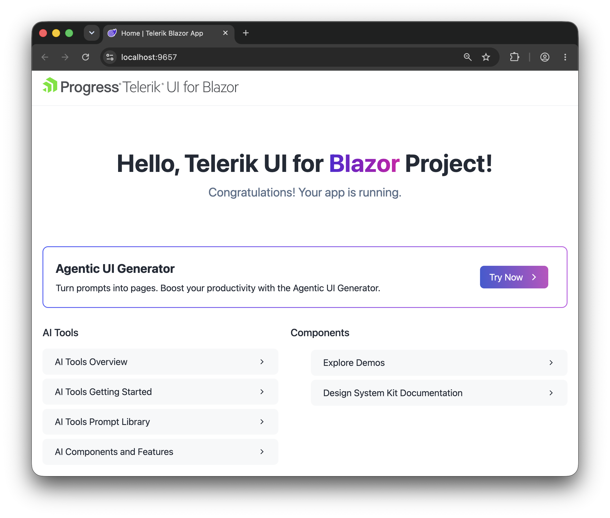

# First Steps with Telerik UI for Blazor

This article explains how to use the Telerik UI for Blazor components in web or hybrid Blazor applications. You will set up your Telerik development environment, create a new application from scratch, and finally, add a UI component to a Razor file.

@[template](/_contentTemplates/common/get-started.md#prerequisites-tip)





## Prerequisites

@[template](/_contentTemplates/common/get-started.md#prerequisites-download)

## Set Up Telerik Development Environment

The fastest way to set up your Telerik development environment is to use the [Telerik CLI](slug:installation-cli) .NET tool. Run the following commands in your preferred command shell (Visual Studio Terminal, cmd, PowerShell, Bash, macOS Terminal, or other).

>tip If you have already set up your Telerik development environment and it doesn't need updating, skip to [Create New Blazor App](#create-new-blazor-app).

1. Install Telerik CLI
    ````SH.skip-repl
    dotnet tool install -g Telerik.CLI
    ````

1. Run the Telerik CLI `setup` command:
    ````SH.skip-repl
    telerik setup blazor
    ````

The [`setup` command performs multiple actions](slug:installation-cli#set-up-telerik-environment) to configure your Telerik development environment:

* Create your Telerik account or log in if you already have one.
* Activate a Telerik UI for Blazor trial if you don't have an active license.
* Download your Telerik license key.
* Configure the Telerik NuGet package source.
* Install the Telerik UI for Blazor MCP server.
* Install the Telerik UI for Blazor project templates.

## Create New Blazor App

This section assumes that you have successfully installed the [Telerik UI for Blazor project templates](slug:installation-project-templates) in the [previous step](#set-up-telerik-development-environment).

To create a new Telerik Blazor app, use your preferred approach:

<TabStrip>
<TabStripTab title=".NET CLI">

Use the .NET CLI `dotnet new` command to create a new Blazor Web App or WebAssembly Standalone App, depending on your preferences:

* Create a Blazor Web App with interactive Server render mode 
    ````SH.skip-repl
    dotnet new telerik-blazor -o TelerikBlazorWebApp1 -int Server
    ````

* Create a Blazor WebAssembly Standalone App
    ````SH.skip-repl
    dotnet new telerik-blazorwasm -o TelerikBlazorWasmApp1
    ````

</TabStripTab>
<TabStripTab title="Visual Studio or VS Code">

Create a new app by using one of the following project templates:

* Telerik Blazor Web App
* Telerik Blazor WebAssembly Standalone App

</TabStripTab>
<TabStripTab title="Telerik CLI">

Run the following Telerik CLI command to create a new Telerik Blazor app interactively:

````SH.skip-repl
telerik create blazor
````

</TabStripTab>
</TabStrip>

> A [Telerik Blazor Hybrid App template](slug:getting-started/hybrid-blazor) is also available, but it's outside the scope of this tutorial.

> To manually add Telerik UI for Blazor to an existing Blazor app, follow the [Workflow Details](slug:getting-started-workflow-details) article.

Upon successful run in a web browser, the new Telerik Blazor app looks like this:



## Add Telerik Component

Add a `TelerikButton` component in `Home.razor`:

@[template](/_contentTemplates/common/get-started.md#add-component-sample)

Well done! Now you have your first Telerik UI for Blazor component running in your Blazor app, showcasing the power of front-end development with Blazor.

@[template](/_contentTemplates/common/get-started.md#next-steps-after-getting-started)

## See Also

* [Workflow Details for Telerik UI for Blazor](slug:getting-started-workflow-details)
* [Using Blazor Sections inside Telerik Components](slug:common-kb-net8-sections)
* [Getting Started Videos for Blazor](https://www.youtube.com/watch?v=aaRAZYaJ4xc&list=PLvmaC-XMqeBYPTwcm478vs8Rujq2tiVJo)
