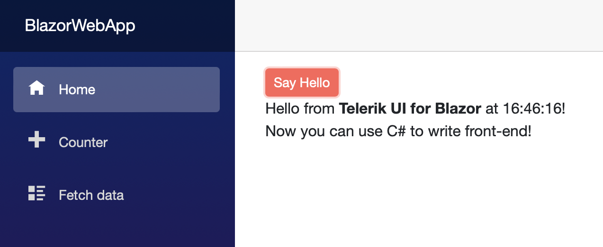

# First Steps with UI for Blazor in a Web App

This article explains how to use the Telerik UI for Blazor components in a <a href = "https://learn.microsoft.com/en-us/aspnet/core/blazor/project-structure?view=aspnetcore-8.0#blazor-web-app" target="_blank">.NET 8 Blazor Web App</a> project template. You will create a new application from scratch, learn how to add the UI for Blazor components to a project, and finally, add a UI component to a view.

@[template](/_contentTemplates/common/get-started.md#prerequisites-tip)

## Prerequisites

@[template](/_contentTemplates/common/get-started.md#prerequisites-download)

## Step 1: Create a New Project

1. Open Visual Studio and select **Create a new project**.

1. Select the [**Blazor Web App**](https://learn.microsoft.com/en-us/aspnet/core/blazor/project-structure?view=aspnetcore-8.0#blazor-web-app) project type, enter a name for your project, and then click **Next**.

1. Select the desired [Interactive render mode](https://learn.microsoft.com/en-us/aspnet/core/blazor/components/render-modes?view=aspnetcore-8.0#render-modes) and **Global** Interactivity location. Global interactivity ensures easier setup and usage of the Telerik components.

1. Click **Create**.

> Most Telerik Blazor components require interactivity. They will not respond to user actions and the Blazor framework will not refresh their UI in static render mode. Telerik Blazor components with JavaScript rendering (Barcodes, Charts, Gauges, Maps, and QR Codes) will not render in static render mode at all.
>
> The `Account` section in the Blazor Web App template with identity is static by design. Most Telerik Blazor components cannot work in this section.

@[template](/_contentTemplates/common/get-started.md#add-nuget-feed)

## Step 3: Install the Telerik UI for Blazor Components

1. Right-click the Blazor Server project in the solution and select **Manage NuGet Packages**.

1. Install the Telerik Blazor NuGet package:

  1. Select the `telerik.com` **Package source** that you [added earlier](#step-2-add-the-telerik-nuget-feed-to-visual-studio). As this is a private NuGet feed, you must authenticate with your [Telerik account](https://www.telerik.com/account/) username and password.
  1. Select the **Browse** tab, find the NuGet package, and click **Install**. Commercial license holders must install `Telerik.UI.for.Blazor`. Trial users must install `Telerik.UI.for.Blazor.Trial`.

## Step 4: Enable the Blazor UI Components

To enable the Telerik UI for Blazor components, you must add several client-side dependencies to the application, include the required `@using` statements, add the `TelerikRootComponent` component, and register the Telerik Blazor service.

### 4.1. Add the Telerik UI for Blazor Client Assets

1\. Add the `telerik-blazor.js` file to your `App.razor` file as a [static asset](#using-static-assets).

**HTML**

@[template](/_contentTemplates/common/js-interop-file.md#js-interop-file-snippet)

2\. To select the appearance and color scheme for the Telerik Blazor components, add the [theme stylesheet as a static asset](#using-a-theme) in your `App.razor` file.

**HTML**

@[template](/_contentTemplates/common/js-interop-file.md#theme-static-asset-snippet)

### 4.2. Include @using Statements

In the `~/_Imports.razor` file, add the `@using` directives below. This configures the project to recognize the Telerik components in all files. You can register one or both icon namespaces, depending on the [icon type you use]().

**_Imports.razor**
    
    @using Telerik.Blazor
    @using Telerik.Blazor.Components
    @using Telerik.SvgIcons
    @using Telerik.FontIcons

### 4.3. Add the TelerikRootComponent

Use a single [`TelerikRootComponent`]() component as a top-level component in the app.

@[template](/_contentTemplates/common/get-started.md#root-component-main-layout)

> The `TelerikRootComponent` requires an [interactive render mode](https://learn.microsoft.com/en-us/aspnet/core/blazor/components/render-modes). Layout components are interactive only in applications with **Global** Interactivity location. This section 4.3 applies only to apps with **Global** interactivity. If your app is using **Per page/component** interactivity, then check [Using TelerikRootComponent in apps with per component interactivity]() instead.

### 4.4. Register the Telerik Blazor Service

In a Blazor Web App project with interactive render mode Server, you register services in the `Program.cs` file of your project.

For interactive render modes WebAssembly and Auto, register the service in the `Program.cs` file of both the server and client project.

**C#**
@[template](/_contentTemplates/common/js-interop-file.md#register-telerik-service-server)

Now your Blazor Server project can use the Telerik UI for Blazor components.

## Step 5: Add a Component to a View

The final step in this tutorial is to use a Telerik UI for Blazor component in a view and run it in the browser.

1. In the `~/Components/Pages/Home.razor` view, add a `TelerikButton` component.

    **RAZOR**
    
        <TelerikButton>Say Hello</TelerikButton>
        
1. Optionally, hook up a click handler that will show a message. The resulting view will look like this:

    **RAZOR**
    
        @page "/"
        
        <TelerikButton OnClick="@SayHelloHandler"
                       ThemeColor="@ThemeConstants.Button.ThemeColor.Primary">Say Hello</TelerikButton>
        
        
 @HelloString 

        
        @code {
           private MarkupString HelloString { get; set; }
        
           private void SayHelloHandler()
           {
               string msg = string.Format("Hello from <strong>Telerik UI for Blazor</strong> at {0}.  Now you can use C# to write front-end!", DateTime.Now);
               HelloString = new MarkupString(msg);
           }
        }

1. Run the app in the browser by pressing `F5`. You should see something like this:

    

Well done! Now you have your first Telerik UI for Blazor component running in your Blazor Web App.

## See Also

* [Workflow Details for Telerik UI for Blazor]()
* [Using .NET 8 Blazor Sections inside Telerik Components]()
* [Getting Started Videos for Blazor](https://www.youtube.com/watch?v=aaRAZYaJ4xc&list=PLvmaC-XMqeBYPTwcm478vs8Rujq2tiVJo)
* [First Steps with Blazor Server]()
* [First Steps with Blazor WebAssembly]()
