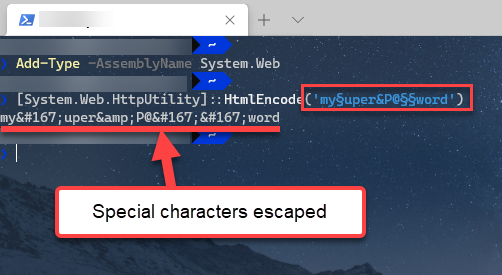

# Telerik Private NuGet Feed

This article explains how to add the private Telerik NuGet feed to your system. You can use it to obtain the Telerik UI for Blazor components.

#### There are several approaches to set up the Telerik NuGet feed

* [Video Tutorial - Visual Studio](#video-tutorial---visual-studio)

* [Manual Steps - CLI](#manual-steps---cli)

* [Nuget Config File](#nuget-config-file)

This article also offers some troubleshooting information in case you encounter problems:

* [Troubleshooting](#troubleshooting)
    * [I do not see the Telerik Packages](#i-do-not-see-the-telerik-packages)
    * [Error 401 Logon failed.](#error-401-login-failed)

For issues with automated builds, CI and CD, see the [CI, CD, Build Server]() article.

## Video Tutorial - Visual Studio

The following video explains how you can add the Telerik NuGet feed. If you prefer to do this yourself, follow the rest of this article.

<iframe width="560" height="315" src="https://www.youtube.com/embed/c3m_BLMXNDk" frameborder="0" allow="accelerometer; autoplay; encrypted-media; gyroscope; picture-in-picture" allowfullscreen></iframe>

## Manual Steps - CLI

To add the Telerik private NuGet feed, follow the steps below:

1. Download the [latest NuGet executable](https://dist.nuget.org/win-x86-commandline/latest/nuget.exe). If you cannot use the `exe` (for example on Mac or Linux), you can [use a nuget.config](#nuget-config-file) file.
1. Open a Command Prompt and change the path to where the `nuget.exe` is downloaded.
1. Execute the command from the example below.

### Store Credentials in Clear Text for the Telerik NuGet feed

The command from the example below stores the password in clear text in the `%AppData%\NuGet\NuGet.config` file. If you are unable to connect to the feed using encrypted credentials, use this alternative approach.

>caption Store Plain-text Credentials for the Telerik NuGet feed (make sure to *remove the new lines*, they are here for readability)

```
dotnet nuget add source https://nuget.telerik.com/nuget 
--name TelerikOnlineFeed 
--username <YOUR TELERIK ACCOUNT EMAIL HERE> 
--password <YOUR PASSWORD HERE> 
--store-password-in-clear-text
```

If you have already stored a token instead of storing the credentials as clear text, update the definition in the `%AppData%\NuGet\NuGet.config` file by using the command below.

>caption Update Plain-text Credentials for the Telerik NuGet feed (make sure to *remove the new lines*, they are here for readability)

```
dotnet nuget update source "TelerikOnlineFeed" 
--source "https://nuget.telerik.com/nuget" 
--username <YOUR TELERIK ACCOUNT EMAIL HERE> 
--password <YOUR PASSWORD HERE> 
--store-password-in-clear-text
```

### Store Encrypted Credentials

The ASP.NET Core tooling does not fully support encrypted credentials. If you add the feed through the Visual Studio dialog (Tools > NuGet Package Manager > Package Manager Settings > Package Sources), the credentials will be stored in the Windows Credential Manager and will be encrypted there, instead of being stored in plain text in the `nuget.config` file.

## Nuget Config File

NuGet feeds and other settings can be stored in a `nuget.config` file. You can read more about it in the [Nuget Config File - Package Sources](https://docs.microsoft.com/en-us/nuget/reference/nuget-config-file#packagesources) article.

Make sure you are familiar with how such configurations work. The [Common NuGet Configurations](https://docs.microsoft.com/en-us/nuget/consume-packages/configuring-nuget-behavior#creating-a-new-config-file) article is a reference document you can use.

To use a `nuget.config` file for the Telerik feed, you need to:

1. Ensure you have the relevant config file: `%AppData%\NuGet\NuGet.Config`. You can create a new one by via the [dotnet new command](https://docs.microsoft.com/en-us/dotnet/core/tools/dotnet-new) by calling `dotnet new nugetconfig`.

2. Add the Telerik feed to it, and make sure to use plain-text credentials, because the .NET Core tooling does not fully support encypted credentials. Here is an example of how your config file can look like:

    **nuget.config**
    
        <?xml version="1.0" encoding="utf-8"?>
        <configuration>
         <packageSources>
            <!--To inherit the global NuGet package sources remove the <clear/> line below -->
            <clear />
            <add key="nuget" value="https://api.nuget.org/v3/index.json" />
            <add key="telerik" value="https://nuget.telerik.com/nuget" />
         </packageSources>
         <packageSourceCredentials>
            <telerik>
              <add key="Username" value="your telerik account email" />
              <add key="ClearTextPassword" value="your plain text password" />
           </telerik>
         </packageSourceCredentials>
        </configuration>

## Next Steps

@[template](/_contentTemplates/common/get-started.md#after-install)

## Troubleshooting

This section lists problems related to the Telerik NuGet feed and their solutions:

* [I do not see the Telerik Packages](#i-do-not-see-the-telerik-packages)
* [Error 401 Logon failed.](#error-401-login-failed)

### I do not see the Telerik Packages

There are two common reasons for the Telerik packages to be missing in the Telerik Online Feed:

* There is a network issue. For example, a proxy, firewall or other similar software blocks requests to our server.
* Your license is tied to a different account than the one used for the feed credentials.

To check if this is a networking issue, open the following URL in your browser and enter your `telerik.com` credentials: <a href="https://nuget.telerik.com/nuget/Search()?$filter=IsAbsoluteLatestVersion&searchTerm=%27Blazor%27&includePrerelease=true&$skip=0&$top=100&semVerLevel=2.0.0" target="_blank">https://nuget.telerik.com/nuget/Search()?$filter=IsAbsoluteLatestVersion&searchTerm=%27Blazor%27&includePrerelease=true&$skip=0&$top=100&semVerLevel=2.0.0</a>. You should see an XML result with the list of packages you can access and you should see the `Telerik.UI.for.Blazor` package with the version appropriate to your license.

If you can access the feed in the browser, but you do not see the packages in Visual Studio, the most likely problem is wrong credentials that are not associated with a license. Make sure that your credentials are correct and that there isn't a `nuget.config` file in the project that is bringing in invalid credentials - project-level config files override the global settings.

Here is a sample process of removing stored credentials from Windows so you can re-add the correct ones:

1. Remove saved credentials in <a href="https://support.microsoft.com/en-us/help/4026814/windows-accessing-credential-manager" target="_blank">Windows Credential Manager</a>. They will appear as nuget.telerik.com and/or VSCredentials_nuget.telerik.com entries.
2. Remove the Telerik Nuget package source from Visual Studio.
3. If you have added the Telerik  package source by nuget CLI, then try to remove it from the CLI:
    * <a href="https://docs.microsoft.com/en-us/dotnet/core/tools/dotnet-nuget-list-source" target="_blank">dotnet nuget list source</a> 
    * <a href="https://docs.microsoft.com/en-us/dotnet/core/tools/dotnet-nuget-remove-source" target="_blank">dotnet nuget remove source</a>
4. Check if there are any credentials stored in `%AppData%\NuGet\Nuget.Config` and if so you have to remove them.
5. Try to reset Visual Studio user data. You can read how to do that <a href="https://stackoverflow.com/questions/43550797/how-to-force-nuget-to-ask-for-authentication-when-connecting-to-a-private-feed" target="_blank">here</a>.
6. Restart Visual Studio.
7. Enter the Telerik nuget package source again through Visual Studio or CLI. If you are using the feed in .NET Core application, [store your credentials as plain text](#store-credentials-in-clear-text-for-the-telerik-nuget-feed).


### Error 401 login failed

If your password contains a special character, those characters need to be escaped or it may fail authentication resulting in *Error 401 login failure* from the NuGet server. A common character that needs to be escaped is the ampersand `&`, but it can be as unique as the section character `§`.

#### Solutions

1. Change the password so that it only includes characters that do not need to be escaped
2. Escape the special characters before storing it as server credentials. For example, `my§uper&P@§§word` encodes to `my&sect;uper&amp;P@&sect;&sect;word`. 

We **strongly** discourage using a online encoder utility for a password. You can use Powershell command instead, here's one example:

```
Add-Type -AssemblyName System.Web
[System.Web.HttpUtility]::HtmlEncode('my§uper&P@§§word')
```




## See Also

* [What You Need To Install]()
* [Get Started with Client-side Blazor]()
* [Get Started with Server-side Blazor]()
* [Blog Post: Azure DevOps and Telerik NuGet Packages](https://www.telerik.com/blogs/azure-devops-and-telerik-nuget-packages)
* [CI, CD, Build Server]()

