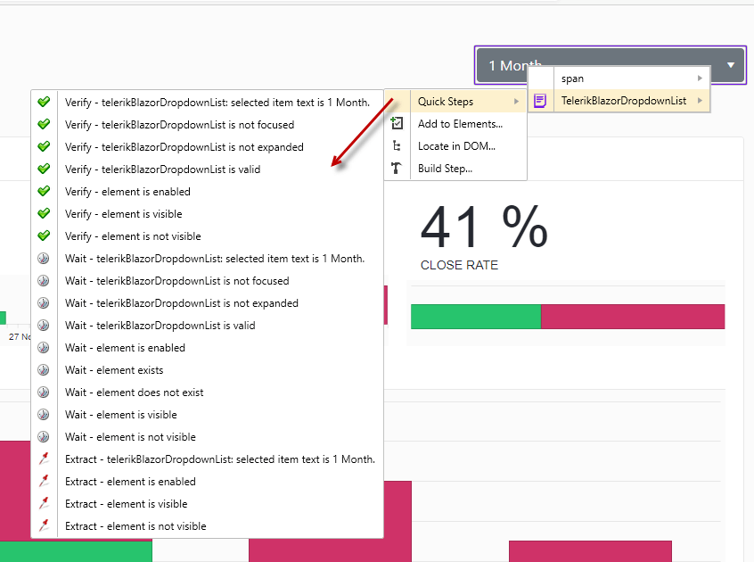

# Testing With Test Studio

The <a href="https://www.telerik.com/teststudio" target="_blank">__Telerik Test Studio__</a> testing tool provides <a href="https://docs.telerik.com/teststudio/features/recorder/translators" target="_blank">__Translators__</a> for most of the components in the __Telerik UI for Blazor__ suite. You can use them to record automated UI functional tests for your Blazor applications out-of-the-box and without the need of complex coded scripts.

The Translators in Test Studio are extensions, which expose internal elements and properties of the supported Telerik controls for automating actions and verification steps in the tests. The tools, which will help you to take full advantage of the power of Telerik controls, are built-in in the <a href="https://docs.telerik.com/teststudio/features/recorder/compact-recording-toolbar" target="_blank">__Test Studio compact recording toolbar__</a>.

Test Studio supports translators for the following Telerik UI Blazor components:

```
TreeView, TimePicker, TextBox, TabStrip, Pager, NumericTextBox, Menu, List, ListView, Grid, DropdownList, DatePicker, DateTimePicker, DateInput, Drawer, Button, ComboBox, AnimationContainer, Window
```

Any of these can be switched on/off from the <a href="https://docs.telerik.com/teststudio/features/project-settings/translators" target="_blank">test Project Setting</a> menu:


>note Test Studio was built with extensibility in mind, so new translators can be easily plugged in for more UI controls.
> 
> The translators will __always be up-to-date__ as Telerik is committed to maintaining them in parallel with Telerik controls changes.

## Using the Telerik Blazor UI Translators

<a href="https://docs.telerik.com/teststudio/getting-started/first-test#start-a-recording-session" target="_blank">Start a recording session</a> against the Blazor application you need to automate. <a href="https://docs.telerik.com/teststudio/features/recorder/compact-recording-toolbar#hover-over-highlighting" target="_blank">Enable the highlighting</a> from the Compact recording tool and hover over the mouse on a given Blazor control in the page - a specific purple highlighting border appears around the element, along with a context menu indicating more specific translator in progressive order. You can see the translators for a Grid cell shown below, the menu items are:

- TelerikBlazorGridDataCell
- TelerikBlazorGridDataItem
- HTMLTable
- TelerikBlazorGrid


As you mouse over the items in the highlighting menu, you will see different step options for the corresponding element. In the example below, you can see the <a href="https://docs.telerik.com/teststudio/features/recorder/advanced-recording-tools/element-steps/verifications/quick-verification" target="_blank">Quick Step</a> tasks available for a Blazor DropdownList control - verification, wait and extract tasks for the highlighted element.



## The Advantage of the Built-In Translators

With the help of the Test Studio translators' specific variables and tasks for a given UI component, you will save significant amount of time when automating complex scenarios and building the respective verifications. An example for a more specific test scenario is to verify if a grid is grouped by a given criterion or not - __Test Studio recorder provides such verification__ for the Telerik UI for Blazor Grid as a quick step in the highlighting menu.


