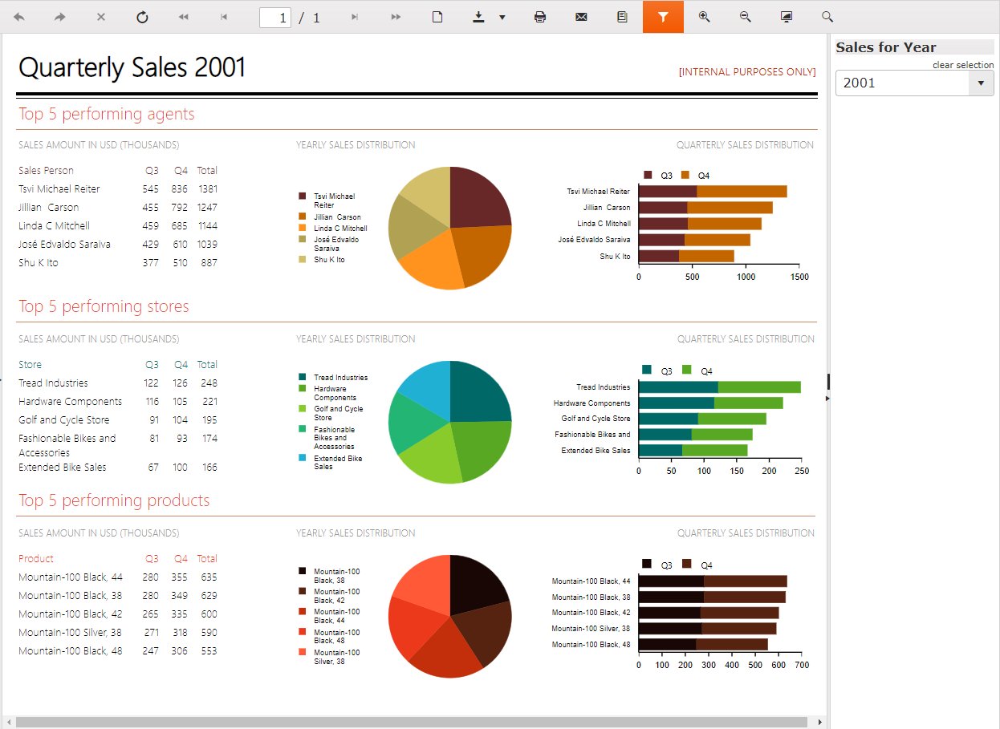
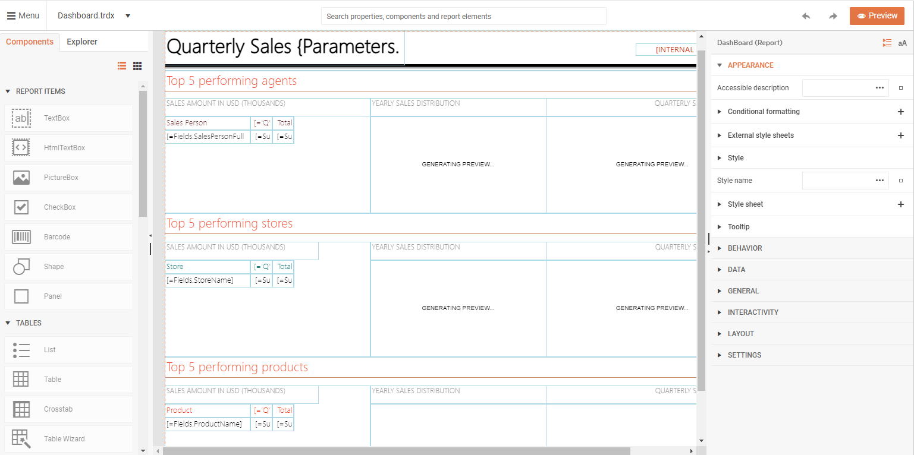

# Blazor Reporting

To effectively integrate Blazor Reporting functionalities into your Blazor application, you can leverage the capabilities provided by [Telerik Reporting](https://www.telerik.com/products/reporting). This integration offers several components tailored for Blazor, enhancing your application's reporting features.





* [Telerik Blazor Report Viewer](#telerik-blazor-report-viewer)
* [Telerik Native Blazor Report Viewer](#telerik-native-blazor-report-viewer)
* [Telerik Blazor Report Designer Component](#telerik-blazor-report-designer)

## Telerik Blazor Report Viewer

The [Telerik Blazor Report Viewer Component](https://docs.telerik.com/reporting/embedding-reports/display-reports-in-applications/web-application/blazor-report-viewer/overview) allows you to embed Blazor Reporting previews directly within your Blazor application. Built upon the robust HTML5 Report Viewer, this component offers extensive customization options. See this report viewer component into action in the [Dashboard Report Demo](https://demos.telerik.com/reporting/dashboard). Key functionalities include:

* Preview the pages of the resulting report document on screen;
* Print the report;
* Export the report into various formats (e.g., PDF, Word, Excel);
* Search in the report content;
* Use any other interactive features that the Telerik Reporting product offers.

>caption Dashboard Report Demo

## Telerik Native Blazor Report Viewer

The [Telerik Native Blazor Report Viewer Component](https://docs.telerik.com/reporting/embedding-reports/display-reports-in-applications/web-application/native-blazor-report-viewer/overview) is a report viewer built with **native Blazor components** from our Telerik UI for Blazor library (requires a valid license). This report viewer brings a fluent user experience that blends with the rest of your Blazor application using the same input controls and styling mechanism. The initial version of this viewer supports all the core functionality needed for previewing and exporting report documents.

## Telerik Blazor Report Designer

The [Telerik Blazor Report Designer Component](https://docs.telerik.com/reporting/how-to-blazor-web-report-designer) empowers you to embed a Report Designer tool within your Blazor application. This feature enables end users to edit existing reports or create new report definitions from scratch, enhancing the versatility of your Blazor Reporting capabilities. Experience this component in action through the [Web Report Designer Demo](https://demos.telerik.com/reporting/designer).

By integrating these components, you can significantly enhance the Blazor Reporting functionalities of your application, providing users with comprehensive tools for report viewing, customization, and creation.

>caption Web Report Designer Demo

## See Also

* [Dashboard Report Demo](https://demos.telerik.com/reporting/dashboard)
* [Web Report Designer Demo](https://demos.telerik.com/reporting/designer)
* [Blazor Grid Integration Sample](https://demos.telerik.com/blazor-ui/reporting-integration/grid-report)
