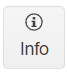
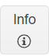

## Environment

<table>
    <tbody>
        <tr>
            <td>Product</td>
            <td>Button for Blazor</td>
        </tr>
    </tbody>
</table>


## Description

This KB article answers the following questions:

* How can I show an icon in a Telerik UI for Blazor Button on the right side of the text instead of on the left side?
* How can I show an icon in a Telerik UI Blazor Button on the top and bottom side of the text?
* How can I also include more than one icon in the Button?

## Solution

You can change the position of the [icons]() and add more icons in the buttons by the following approaches:

* Nesting the `TelerikIcon` in the `TelerikButton` content.
* Use CSS to position an icon either above or below the text content.

>caption Reposition the Button icon and add more than one icon to the component





````CSHTML
@*This button has two icons, one on the left and one on the right side of the text*@
<TelerikButton Class="my-button">
    <TelerikSvgIcon Icon="@SvgIcon.InfoCircle" />
    Info
    <TelerikSvgIcon Icon="@SvgIcon.InfoCircle" />
</TelerikButton>

@* This button has an icon on top of the text. *@
<TelerikButton Class="icon-top" Icon="SvgIcon.InfoCircle">Info</TelerikButton>

@* This button has an icon on bottom of the text. *@
<TelerikButton Class="icon-bottom" Icon="SvgIcon.InfoCircle">Info</TelerikButton>

<style>
    .my-button {
        height: 50px;
    }

    .icon-top {
        flex-wrap: wrap;
        width: 50px;
        height: 50px;
    }

    .icon-bottom {
        flex-wrap: wrap-reverse;
        width: 50px;
        height: 50px;
    }
</style>
````
