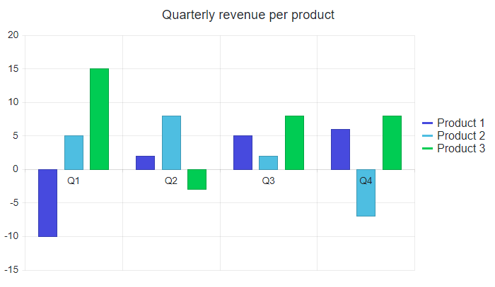
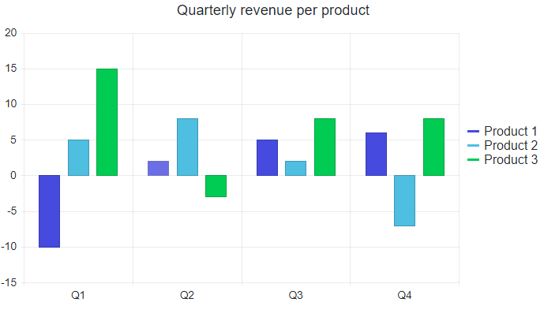

## Environment
<table>
	<tbody>
		<tr>
			<td>Product</td>
			<td>Chart for Blazor</td>
		</tr>
	</tbody>
</table>


## Description

I am having a Chart with negative value. This causes the labels of the X-Axis to be overlapped by the chart series and make them unreadable.

>caption Labels overlapped by the chart series. Problematic example.




## Solution

You can control the point where the axes cross each other by using the `AxisCrossingValue` parameter. To move the labels of the categorical axis to the bottom of the Chart you have to set a very low value of the `AxisCrossingValue` parameter for the value axis (`ChartValueAxis`). 


>caption Move the X-Axis labels to the bottom of the Chart

````CSHTML
@* This example shows how to move the X-Axis labels to the bottom of the Chart by setting the AxisCrossingValue to a low value *@

<TelerikChart Width="700px">
    <ChartValueAxes>
        <ChartValueAxis AxisCrossingValue="@crossingValues"></ChartValueAxis>
    </ChartValueAxes>

    <ChartSeriesItems>
        <ChartSeries Type="ChartSeriesType.Column" Name="Product 1" Data="@series1Data">
            <ChartSeriesStack Enabled="true" Group="separateGroup1"></ChartSeriesStack>
        </ChartSeries>
        <ChartSeries Type="ChartSeriesType.Column" Name="Product 2" Data="@series2Data">
            <ChartSeriesStack Enabled="true" Group="separateGroup2"></ChartSeriesStack>
        </ChartSeries>
        <ChartSeries Type="ChartSeriesType.Column" Name="Product 3" Data="@series3Data">
            <ChartSeriesStack Enabled="true" Group="separateGroup3"></ChartSeriesStack>
        </ChartSeries>
    </ChartSeriesItems>

    <ChartCategoryAxes>
        <ChartCategoryAxis Categories="@categories"></ChartCategoryAxis>
    </ChartCategoryAxes>

    <ChartTitle Text="Quarterly revenue per product"></ChartTitle>
    <ChartLegend Position="ChartLegendPosition.Right">
    </ChartLegend>
</TelerikChart>

@code {
    // very low value for the crossing value moves the axis to the bottom of the Chart
    public object[] crossingValues = new object[] { int.MinValue };

    public List<object> series1Data = new List<object>() { -10, 2, 5, 6 };
    public List<object> series2Data = new List<object>() { 5, 8, 2, -7 };
    public List<object> series3Data = new List<object>() { 15, -3, 8, 8 };
    public string[] categories = new string[] { "Q1", "Q2", "Q3", "Q4" };
}
````

>caption The result from the code snippet above

