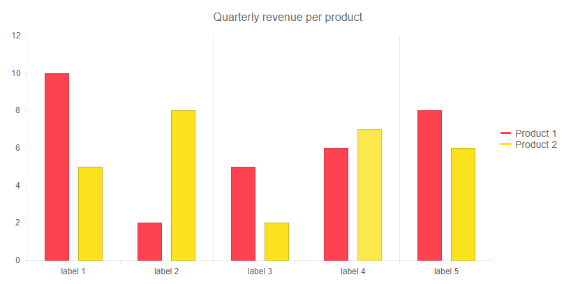

## Environment
<table>
	<tbody>
		<tr>
			<td>Product</td>
			<td>Chart for Blazor</td>
		</tr>
	</tbody>
</table>


## Description

I have a Chart that has to visualize a big volume of data. This makes the grid lines clustered and the Chart hard to read and follow.

## Solution

The general approach to customize the Chart is to apply settings using nested tags. In the case of the grid lines the parent tag is `<ChartCategoryAxis>` or `<ChartValueAxis>` for [categorical charts](#series-types) and `<ChartXAxis>` and `<ChartYAxis>` for [numerical charts](#series-types).

You can control the `MajorGridLines` for both axes from their respective nested tags - `<ChartCategoryAxisMajorGridLines />` (the vertical grid lines) and `<ChartValueAxisMajorGridLines />` (the horizontal grid lines).

You can apply the following settings:
* `Step` - skip the rendering of every `n-th` line.
* `Visible` - toggle whether the grid lines are visible.
* `Skip` - skip the rendering of the first `n` lines, where `n` is the `double` number passed to the parameter.
* You can also control other visual settings of the lines like their `Color`, `Width` and `DashType`.

For a [`Date Axis` Chart]() you can set the `BaseUnit` parameter of the `<ChartCategoryAxis>` tag according to the data of your application to further control the granularity of the grid lines

>caption Customize the grid lines of a Categorical Chart

````CSHTML

@* This example shows how to render every second grid line for the category axis and disable the lines for the value axis *@

<TelerikChart>
    <ChartSeriesItems>
        <ChartSeries Type="ChartSeriesType.Column" Name="Product 1" Data="@series1Data">
        </ChartSeries>
        <ChartSeries Type="ChartSeriesType.Column" Name="Product 2" Data="@series2Data">
        </ChartSeries>
    </ChartSeriesItems>

    <ChartCategoryAxes>
        <ChartCategoryAxis Categories="@xAxisItems">
            <ChartCategoryAxisMajorGridLines Step="2" />
        </ChartCategoryAxis>
    </ChartCategoryAxes>

    <ChartValueAxes>
        <ChartValueAxis>
            <ChartValueAxisMajorGridLines Visible="false" />
        </ChartValueAxis>
    </ChartValueAxes>

    <ChartTitle Text="Quarterly revenue per product"></ChartTitle>

    <ChartLegend Position="ChartLegendPosition.Right">
    </ChartLegend>
</TelerikChart>

@code {
    public List<object> series1Data = new List<object>() { 10, 2, 5, 6, 8 };
    public List<object> series2Data = new List<object>() { 5, 8, 2, 7, 6 };
    public string[] xAxisItems = new string[5];

    protected override void OnInitialized()
    {
        for (int i = 0; i < 5; i++)
        {
            xAxisItems[i] = $"label {i + 1}";
        }
    }
}

````

>caption The result from the code snippet above




## Notes

You can also see the Knowledge base article regarding [overlapping labels]() to further improve the layout of the Chart.
