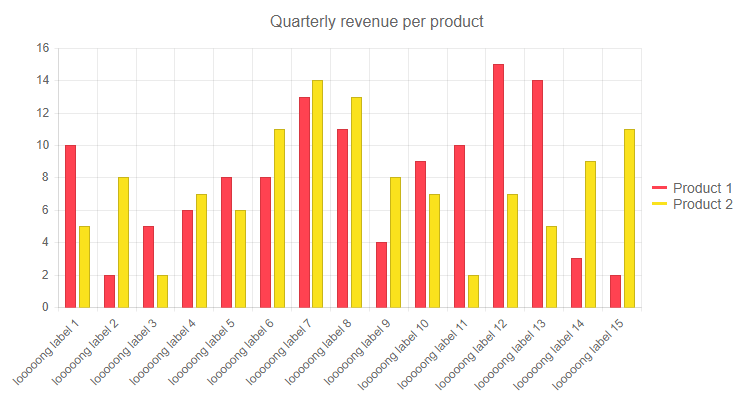
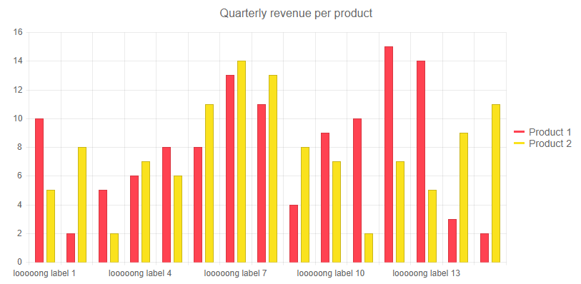

## Environment
<table>
	<tbody>
		<tr>
			<td>Product</td>
			<td>Chart for Blazor</td>
		</tr>
	</tbody>
</table>


## Description

I am having a Chart with big load of data. The labels are overlapping and thus - unreadable.


## Solution

The general approach to customize the Chart is to apply settings using nested tags. In the case of the `Labels` the parent tag is `<ChartCategoryAxisLabels>` for [categorical charts](#series-types) and `<ChartXAxisLabels>` and `<ChartYAxisLabels>` for [numerical charts](#series-types).


To **rotate** the `Labels` to a desired degree you can use the `Angle` setting of the `<ChartCategoryAxisLabelsRotation />`, nested tag of `<ChartXAxisLabelsRotation />`, or `<ChartYAxisLabelsRotation />` respectively for categorical and numerical charts.

To **skip** the rendering of every n-th label, when the data in your application allows it, you can use the `Step` setting of the `<ChartCategoryAxisLabels>` or `<ChartXAxisLabels>`. Applying that would notify the chart to skip every n-th label, for example if set to `2` only the even labels would be rendered.

>caption Rotate the Chart Labels

````CSHTML

@* This example shows how to rotate the labels of a Categorical Chart by a certain angle *@

<TelerikChart>
    <ChartSeriesItems>
        <ChartSeries Type="ChartSeriesType.Column" Name="Product 1" Data="@series1Data">
        </ChartSeries>
        <ChartSeries Type="ChartSeriesType.Column" Name="Product 2" Data="@series2Data">
        </ChartSeries>
    </ChartSeriesItems>

    <ChartCategoryAxes>
        <ChartCategoryAxis Categories="@xAxisItems">
            <ChartCategoryAxisLabels>
                <ChartCategoryAxisLabelsRotation Angle="-45" />
            </ChartCategoryAxisLabels>
        </ChartCategoryAxis>
    </ChartCategoryAxes>

    <ChartTitle Text="Quarterly revenue per product"></ChartTitle>

    <ChartLegend Position="ChartLegendPosition.Right">
    </ChartLegend>
</TelerikChart>

@code {
    public List<object> series1Data = new List<object>() { 10, 2, 5, 6, 8, 8, 13, 11, 4, 9, 10, 15, 14, 3, 2 };
    public List<object> series2Data = new List<object>() { 5, 8, 2, 7, 6, 11, 14, 13, 8, 7, 2, 7, 5, 9, 11 };
    public string[] xAxisItems = new string[15];

    protected override void OnInitialized()
    {
        for (int i = 0; i < 15; i++)
        {
            xAxisItems[i] = $"looooong label {i + 1}";
        }
        base.OnInitialized();
    }
}

````

>caption The result from the code snippet above




>caption Skip rendering every n-th label

````CSHTML

@* This example shows how render only every third label *@

<TelerikChart>
    <ChartSeriesItems>
        <ChartSeries Type="ChartSeriesType.Column" Name="Product 1" Data="@series1Data">
        </ChartSeries>
        <ChartSeries Type="ChartSeriesType.Column" Name="Product 2" Data="@series2Data">
        </ChartSeries>
    </ChartSeriesItems>

    <ChartCategoryAxes>
        <ChartCategoryAxis Categories="@xAxisItems">
            <ChartCategoryAxisLabels Step="3">
            </ChartCategoryAxisLabels>
        </ChartCategoryAxis>
    </ChartCategoryAxes>

    <ChartTitle Text="Quarterly revenue per product"></ChartTitle>

    <ChartLegend Position="ChartLegendPosition.Right">
    </ChartLegend>
</TelerikChart>

@code {
    public List<object> series1Data = new List<object>() { 10, 2, 5, 6, 8, 8, 13, 11, 4, 9, 10, 15, 14, 3, 2 };
    public List<object> series2Data = new List<object>() { 5, 8, 2, 7, 6, 11, 14, 13, 8, 7, 2, 7, 5, 9, 11 };
    public string[] xAxisItems = new string[15];

    protected override void OnInitialized()
    {
        for (int i = 0; i < 15; i++)
        {
            xAxisItems[i] = $"looooong label {i + 1}";
        }
    }
}

````

>caption The result from the code snippet above


