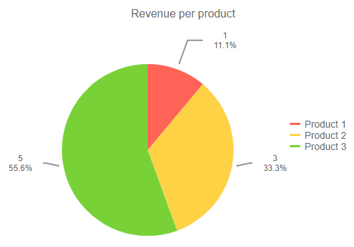

## Environment
<table>
    <tbody>
	    <tr>
	    	<td>Product</td>
	    	<td>Charts for Blazor</td>
	    </tr>
    </tbody>
</table>


## Description
When you use templates to customize the appearance of the labels, you may need to implement some application logic there or to implement complex formatting of the numbers.

This article shows how to format the percent in a label for a pie or donut chart to have a desired number of decimals and to be a number between 0 and 100, instead of the default number between 0 and 1 that has many decimal places:



## Solution
To customize the percentage display, you need to

1. Use a custom [template](#templates) to show the `percentage` field.

2. Implement the desired rounding/formatting function in a JavaScript file (in the example below, we will call it `template-helpers.js` and it resides in the `wwwroot` folder).

3. Reference that file in your root component (`_Host.cshtml` for a server-side app, or `index.html` for a client-side app).

4. Call the custom formatting function from the template and pass the needed arguments to it. It must return the string you want shown in the template.

````Razor
This is only one example, you can implement different functions and logic

<TelerikChart>
    <ChartSeriesItems>
        <ChartSeries Type="ChartSeriesType.Pie" Data="@pieData"
                            Field="@nameof(MyPieChartModel.SegmentValue)" CategoryField="@nameof(MyPieChartModel.SegmentName)">
            <ChartSeriesLabels Visible="true" Template="@segmentTemplate" />
        </ChartSeries>
    </ChartSeriesItems>

    <ChartTitle Text="Revenue per product" />

    <ChartLegend Position="ChartLegendPosition.Right" />
</TelerikChart>

@code {
    //this is where we call our custom rounding function
    string segmentTemplate = "#=value#\n#= round(percentage * 100, 1)#%";

    //below is just some data to feed the display
    public class MyPieChartModel
    {
        public string SegmentName { get; set; }
        public double SegmentValue { get; set; }
    }

    public List<MyPieChartModel>
    pieData = new List<MyPieChartModel>
    {
            new MyPieChartModel
            {
                SegmentName = "Product 1",
                SegmentValue = 1
            },
            new MyPieChartModel
            {
                SegmentName = "Product 2",
                SegmentValue = 3
            },
            new MyPieChartModel
            {
                SegmentName = "Product 3",
                SegmentValue = 5
            }
    };
}
````
````JavaScript
//From https://www.jacklmoore.com/notes/rounding-in-javascript/
function round(value, decimals) {
	return Number(Math.round(value + 'e' + decimals) + 'e-' + decimals);
}
````
````Index
<head>
    <!-- there may be other content here -->
    
	<script src="~/template-helpers.js"></script>
	
	<!-- there may be other content here -->
</head>
````

