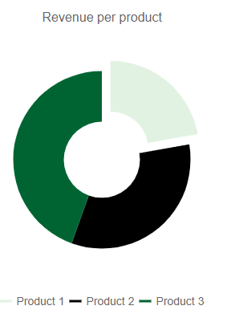

## Description

I would like to mark a Chart Series [on click](#onseriesclick).


## Solution

You can use the `ColorField` and the `ExplodeField` to visually distinguish the clicked series of the chart. In the handler for the `OnSeriesClick` event you should handle the color change and the toggling of the exploded field.

>caption Mark a Chart Series On Click

````CSHTML

@* Visually distinguish a clicked chart series *@

<TelerikChart OnSeriesClick="@OnSeriesClickHandler" Transitions="false">
    <ChartSeriesItems>
        <ChartSeries Type="ChartSeriesType.Donut"
                     Data="@donutData"
                     Field="@nameof(MyDonutChartModel.SegmentValue)"
                     CategoryField="@nameof(MyDonutChartModel.SegmentName)"
                     ExplodeField="@nameof(MyDonutChartModel.isExploadedField)"
                     ColorField="@nameof(MyDonutChartModel.RGBAColor)">
        </ChartSeries>
    </ChartSeriesItems>

    <ChartTitle Text="Revenue per product"></ChartTitle>

    <ChartLegend Position="ChartLegendPosition.Bottom">
    </ChartLegend>
</TelerikChart>

@code {
    void OnSeriesClickHandler(ChartSeriesClickEventArgs args)
    {
        string item = (args.DataItem as MyDonutChartModel).SegmentName;
        MyDonutChartModel dataModel = donutData.Where(x => x.SegmentName == item).FirstOrDefault();

        dataModel.isExploadedField = !dataModel.isExploadedField;


        //Apply your own coloring logic depending on the needs of the layout
        if (dataModel.isExploadedField)
        {
            dataModel.RGBAColor = "rgba(104, 192, 108, 0.3)";
        }
        else
        {
            dataModel.RGBAColor = "rgba(104, 192, 108, 1)";
        }
    }

    public class MyDonutChartModel
    {
        public string SegmentName { get; set; }
        public double SegmentValue { get; set; }
        public bool ShouldShowInLegend { get; set; } = true;
        public bool isExploadedField { get; set; }
        public string RGBAColor { get; set; }
    }

    public List<MyDonutChartModel> donutData = new List<MyDonutChartModel>
    {
        new MyDonutChartModel
        {
            SegmentName = "Product 1",
            SegmentValue = 2,
            isExploadedField = true,
            RGBAColor = $"rgba(104, 192, 108)"
        },
        new MyDonutChartModel
        {
            SegmentName = "Product 2",
            SegmentValue = 3,
            isExploadedField = false,
            RGBAColor = $"rgba(0, 0, 0)"
        },
        new MyDonutChartModel
        {
            SegmentName = "Product 3",
            SegmentValue = 4,
            isExploadedField = false,
            RGBAColor = $"rgba(0, 100, 50)"
        }
    };
}

````

>caption The result of the code snippet above


